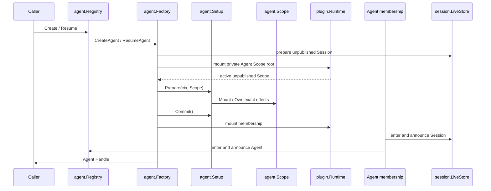

# Agent 领域

`agent/` 定义 live Agent 能力、Agent Registry、durable Inbox 投影与未发布 Agent 的组合契约。权威领域设计见[14 Agent Registry、Inbox 与实时事件模块设计](../zh-CN/14-agent-registry-inbox-and-events.md)，Turn/Step 驱动由[15 Agent Loop 与请求驱动模块设计](../zh-CN/15-agent-loop-and-request-driver.md)拥有；实施状态与验证证据只见[08 实施进度](../zh-CN/08-implementation-progress.md)。

## 职责边界

| 文件 | 职责 |
| --- | --- |
| `agent.go` | `Agent` 能力、状态、Inbox target 与 maintenance 契约 |
| `factory.go` | Registry 消费侧的 Factory、Create/Resume 参数和调用方 Handle |
| `registry.go` | live Agent membership、创建委派、initiator ownership 与生命周期发布 |
| `setup.go` | 未发布 Agent 的 `Setup`、`Scope`、exact `Effect` 与 Plugin 组合适配器 |
| `inbox.go` | 从 append-only Session log 重建并提交 next-turn / next-step 消息 |
| `events.go` | Agent 领域 Event、Waterfall 输入输出和调用入口 |
| `model_selection.go` | prompt assembly 与 LLM request 之间的单步模型选择快照 |
| `cancellation.go` | caller、parent、dispose 与 hook 的 typed cancellation cause |

本包不构造 concrete Agent，不驱动 Turn/Step，不读取部署配置，也不依赖 LLM Provider、Tool 实现、持久化 adapter、HTTP、WebSocket 或 UI。`agentloop` 实现 Registry 所消费的 `Factory`；Registry 不反向认识 `agentloop`。

## 创建与可见性

`Setup` 由调用方为每次 Create/Resume 提供一个新实例；Agent Loop 消费它，但不实现它。`Scope` 由 concrete Agent Provider 实现，负责把 Plugin 或普通 `Effect` 纳入同一结构生命周期。`Setup.Commit` 成功后才能挂载 membership，因此 Prepare、Commit 或 publication 任一步失败都不会返回可见 Agent。

Registry 的 `Enter` 只保留 exact Agent instance 和 initiator ownership；`Announce` 才发布 `agent/created`。调用方释放 `Handle` 时，Agent tree 先停止 work、移除 membership，再逆序释放 Scope effect 和 Plugin 子树。创建请求被取消时，业务准备停止，但已取得的结构资源使用非取消上下文完整回滚，不能留下不可见的挂载树。

`Agent.ID()` 是 durable Session identity；`agent.Same` 判断两个接口是否指向同一个进程内 Agent 实例。它不引入第二个 `InstanceID`。Factory 注册同样由 Registry 返回的 exact `FactoryRegistration` 撤销，不要求 Factory 假装成 Plugin。

## Event 与 Waterfall

- 状态、Inbox、Session start、Turn stopping 与 Agent error 都是有业务名称的 typed Event；发布者只构造领域事实，实际监听者查找、scope 过滤、排序和分发由 `plugin.Runtime` 完成。
- `PreStepNotice -> PreStepDecision`、`RequestNotice -> RequestResolution` 和 `RequestErrorNotice -> RequestErrorAction` 是三个独立 Waterfall 契约。Middleware 属于业务 Plugin 的 Manifest，Agent Loop 只调用 typed terminal。
- Event 不保存历史。需要恢复的模型可见输入和 Inbox 状态必须来自 append-only Session log，不能依赖进程内监听结果。

## 失败与取消

- Factory 未挂载、Agent id 冲突、Session/Agent announcement 被拒绝或子树激活失败都会让创建失败；已进入的 membership 按逆序回滚。
- best-effort observer failure 由 owner 的 failure reporter 收敛，不能改写已经提交的 Session fact。
- `CancelCause` 表达业务取消来源；调用 `Cancel` 不等于销毁 Plugin。结构销毁由 Runtime lifecycle 和 `Handle.Dispose` 负责。
