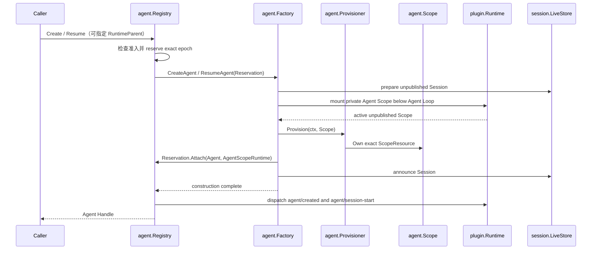

# Agent 领域

`agent/` 定义 live Agent 能力、Agent Registry、durable Inbox 投影与未发布 Agent 的组合契约。权威领域设计见[14 Agent Registry、Inbox 与实时事件模块设计](../zh-CN/14-agent-registry-inbox-and-events.md)，Turn/Step 驱动由[15 Agent Loop 与请求驱动模块设计](../zh-CN/15-agent-loop-and-request-driver.md)拥有；实施状态与验证证据只见[08 实施进度](../zh-CN/08-implementation-progress.md)。

## 职责边界

| 文件 | 职责 |
| --- | --- |
| `agent.go` | `Agent` 能力、状态、Inbox target 与 maintenance 契约 |
| `factory.go` | Registry 消费的 `Factory`、`Reservation`、`Lifecycle` 与 Create/Resume 参数 |
| `handle.go` | exact live Agent、关闭通知与销毁能力 |
| `registry.go` | Registry 应用服务、Factory 注册、创建/恢复准入及面向消费者的窄接口 |
| `lifecycle_coordinator.go` | exact Agent epoch、运行期父子关系、可见性、发布与 child-first teardown |
| `lifecycle_status.go` | Registry 内部的 epoch、发布、子节点准入和关闭状态 |
| `plugin.go` | 将 Registry 的窄能力发布到 Plugin Runtime，并在所有依赖停止后关闭 Registry |
| `scope_runtime.go` | Agent 业务到私有运行 Scope 的消费侧端口 |
| `provisioning.go` | Plugin-neutral 的 `ScopeResource`、`Scope`、`Provisioner` 与 `Provisioning` |
| `initiator.go` | 同一调用链内的 Agent 因果归属，不表示结构所有权或授权 |
| `inbox.go` | 从 append-only Session log 重建并提交 next-turn / next-step 消息 |
| `events.go` | Agent 领域 Event、Waterfall 输入输出和调用入口 |
| `model_selection.go` | prompt assembly 与 LLM request 之间的单步模型选择快照 |
| `cancellation.go` | caller、parent、dispose 与 hook 的 typed cancellation cause |

本包不构造 concrete Agent，不驱动 Turn/Step，不读取部署配置，也不依赖 LLM Provider、Tool 实现、持久化 adapter、HTTP、WebSocket 或 UI。`agentloop` 实现 Registry 所消费的 `Factory`；Registry 不反向认识 `agentloop`。

## 创建与可见性

调用方通过 `Provisioner` 配置未发布 Scope，Agent Loop 消费这个接口，并由私有 Scope adapter 实现 `Scope`。业务资源通过 `Scope.Own` 转移结构所有权；需要安装 Plugin 的调用方使用 `agent/scopedplugin` adapter，不把 `plugin.Plugin` 带入 Agent 业务接口。若配置还需要发布边界复核或 resident 生命周期，则 `Provisioner` 返回一次调用独占的 `Provisioning`；没有剩余事务时返回 nil。只有 `Provisioning.Commit`、Session 发布和 Agent 发布都成功，调用方才会取得可见 Agent。

Registry 直接拥有 exact Agent epoch 与 `RuntimeParent` 关系，不再通过第二套 Agent tree、membership Plugin 或布尔状态拼装生命周期。调用方释放 `Handle` 时，Registry 先关闭运行期后代和当前 epoch 的工作准入，退休已发布事件，再通过 `AgentScopeRuntime.Teardown` 释放私有 Scope。Runtime 主动卸载 Scope 时，`Lifecycle.BeginTeardown/FinishTeardown` 把同一结构事实回报 Registry；两条入口收敛到同一个 epoch 状态机。

`RegistryService` 自己持有进程级创建准入标志。`Create/Resume` 在同一临界区完成“检查准入、选择 Factory、reserve epoch”，因此 `Shutdown` 或 Factory 关闭后不会出现先取到旧 Factory、再绕过关闭标志的新 reservation。`FactoryRegistration.Close` 是终止型操作：它移除 exact Factory、关闭后续 Create/Resume，并通过 `Reservation.ClosingSignal` 取消仍在 materializing/attached 阶段的构造。`RegistryPlugin.Dispose` 作为业务服务所有者执行最终 `Shutdown`，不要求 Agent Loop 反向关闭 Registry。

`Agent.ID()` 是 durable Session identity；`agent.Same` 判断两个接口是否指向同一个进程内 Agent 实例。它不引入第二个 `InstanceID`。`FactoryRegistration` 自身就是 exact 注册身份，不再增加只作指针 token 的 `factoryEntry`。

## Event 与 Waterfall

- 状态、Inbox、Session start、Turn stopping 与 Agent error 都是有业务名称的 typed Event；发布者只构造领域事实，实际监听者查找、scope 过滤、排序和分发由 `plugin.Runtime` 完成。
- `PreStepNotice -> PreStepDecision`、`RequestNotice -> RequestResolution` 和 `RequestErrorNotice -> RequestErrorAction` 是三个独立 Waterfall 契约。Middleware 属于业务 Plugin 的 Manifest，Agent Loop 只调用 typed terminal。
- Event 不保存历史。需要恢复的模型可见输入和 Inbox 状态必须来自 append-only Session log，不能依赖进程内监听结果。

## Maintenance 边界

`RunMaintenance(ctx, operation)` 是 Agent 自己的窄 use-case admission，不是通用 Task/Runner 框架。调用者直接传入一个同步 operation；具体 Agent 只在 live、accepting、true idle 且没有 wake request 时切换到 maintenance activity，并传入由该 activity 拥有的 Context。

maintenance 期间 Turn driver 不会同时执行；新 Inbox work 可以设置 wake request，在 operation 返回、activity 恢复 idle 后由 AgentLoop 启动。caller cancellation、Agent dispose 和 operation error 使用原有 Context/error 边界收敛，Registry 不介入也不重试。当前 Compaction `CompactNow` 是该 seam 的直接 Consumer。

## 失败与取消

- Factory 未注册、Registry 已关闭准入、Agent id 冲突、Session/Agent announcement 被拒绝或子树激活失败都会让创建失败；未发布 Scope 和 epoch 按结构顺序回滚。
- best-effort observer failure 由 owner 的 failure reporter 收敛，不能改写已经提交的 Session fact。
- `CancelCause` 表达业务取消来源；调用 `Cancel` 不等于销毁 Plugin。结构销毁由 Runtime lifecycle 和 `Handle.Dispose` 负责。
