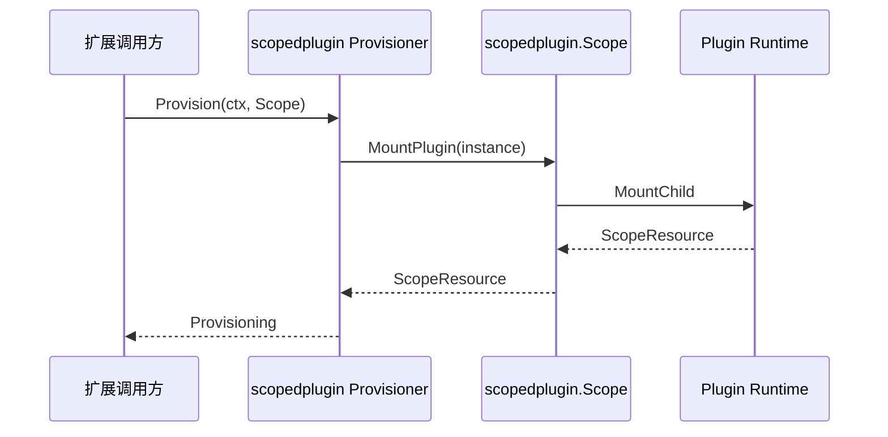

# Agent Scoped Plugin

`agent/scopedplugin` 是 `agent.Scope` 与 Plugin Runtime 之间的适配包。它允许需要安装 Plugin 的扩展显式依赖 `scopedplugin.Scope`，同时保持 `agent` 业务契约不依赖 `plugin.Plugin`。

## 职责

- `Scope` 在 `agent.Scope` 基础上提供 `MountPlugin`。
- `Mount` 把一个 Plugin 安装结果封装为 `agent.Provisioner`。
- `MountPlugins` 按声明顺序安装多个 Plugin；任一安装失败时，逆序释放本次已经取得的资源。
- 成功安装的资源通过统一的 `agent.ApplyProvisioning` 转移给 Agent Scope。

本包不创建 Agent，不拥有 Agent 或 Session 生命周期，不控制 Registry 准入，也不执行 Plugin Runtime 的全局停机。

跨包的 Agent 构造和生命周期契约见[Agent 构造事务与调用流程设计](../../zh-CN/Agent构造事务与调用流程设计.md)，实施证据统一记录在[实施进度](../../zh-CN/08-implementation-progress.md)。
