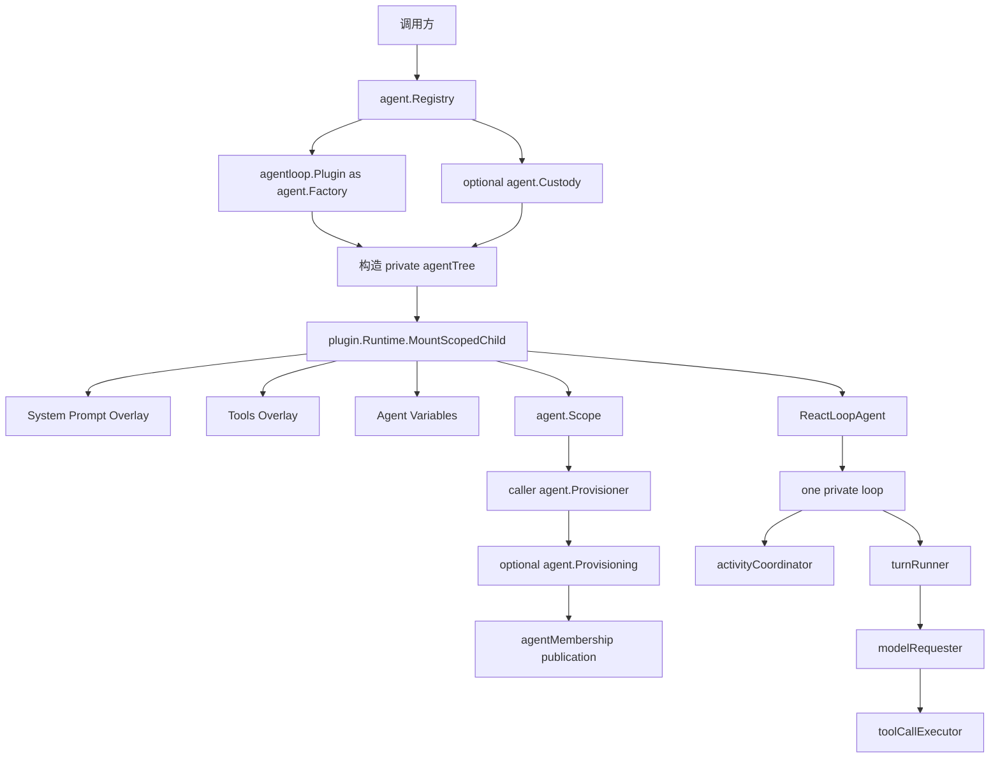
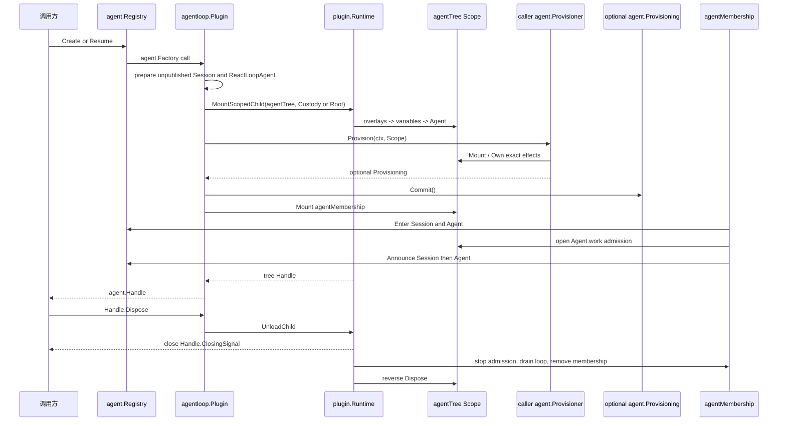

# Agent Loop 模块

`agentloop/` 是默认 concrete Agent Provider：根 `Plugin` 实现 `agent.Registry` 所拥有的 `agent.Factory` 契约；每个 `ReactLoopAgent` 拥有且只拥有一个私有执行循环。权威设计见[15 Agent Loop 与请求驱动模块设计](../zh-CN/15-agent-loop-and-request-driver.md)，实施状态与跨模块证据只见[08 实施进度](../zh-CN/08-implementation-progress.md)。

## 职责与文件划分

| 路径 | 职责 |
| --- | --- |
| `plugin.go` | 根 Agent Loop Plugin、Factory 实现与 Create/Resume 用例入口 |
| `factory/` | raw JSON 的严格解码、配置校验、默认值和根 Plugin 构造 |
| `prepared_agent.go` | active 但未发布的 Agent 创建事务及 Provision/publish 顺序 |
| `tree.go` | 私有 Agent Scope root、基础 Plugin 和组合期 effect ownership |
| `construction.go` | 根 Plugin 的创建准入与停机时 in-flight join |
| `agent.go` | `ReactLoopAgent` 能力 Plugin 与对私有 loop 的命令委派 |
| `loop.go` | 一个 Agent 的单一私有 loop，组合 activity 与 Turn runner |
| `activity.go` | work 准入、wake/cancel、maintenance 和 idle convergence |
| `turn.go` | Turn/Step 状态机、Prompt preparation、Session fact 与 durability boundary |
| `request.go` | request waterfall、LLM route、header/context fact 与模型 attempt |
| `tool_calls.go` | bounded Tool body concurrency、barrier、model-order commit 与 failure drain |
| `membership.go` | Provisioning 提交后的 Agent/Session publication 与 teardown |
| `lifecycle.go` | caller Handle 对一棵 exact Runtime tree 的销毁权与关闭通知 |
| `runtime_context.go`、`runtime_context_router.go` | Session surface 的运行时上下文投影与精确路由 |
| `events.go` | Agent/Inbox 实时事件发布和 post-commit observer failure containment |
| `variables.go` | Agent Scope 的 provider、model 与 cwd Prompt variable Plugin |
| `turn.go`、`startup.go` | durable Turn 恢复和配置声明的一次性启动事务 |

本模块不拥有 Agent Registry/Inbox contract、Session fact/surface 语义、LLM Provider、Tool policy/result、System Prompt Registry、存储 Adapter、HTTP/RPC/WebSocket 或 UI。恢复只消费 `session/persistence.Persistence` capability，不依赖 SQLite、sqlc 或具体 Backend。

## 两层运行模型

根 `Plugin` 只负责全局 Factory 生命周期、Session runtime-context Event 路由和无显式 Custody 的 Agent 树所有权，不提供第二个 `Loop` Service。调用绑定 `agent.Custody` 时，Factory 把 Agent tree 挂到该结构 owner 下，但创建事务、membership 和执行循环仍由 Agent Loop 实现。执行能力只存在于具体 `ReactLoopAgent`；`loop`、activity、Turn、request 与 Tool scheduler 都是该 Agent 私有对象。

## 创建、发布与销毁

`newPreparedAgent` 先创建 ReactLoopAgent 并把 `agentTree` 挂入 Runtime；此时基础 Overlay 与 Agent 已 active，但 Registry 和 Session 都不可见。Overlay 必须先于 `ReactLoopAgent` 激活，使 Agent 捕获本 Scope 的 System Prompt 与 Tools runtime。随后调用方的 `Provisioner` 配置同一 Scope；若返回 `Provisioning`，Agent Loop 先把它交给 tree、再执行 publication commit，最后才挂载 `agentMembership`、开放 work 并完成 Enter/Announce。

Agent Loop 不实现 `agent.Provisioner`：它是 provisioning 的用例协调者和 `agent.Scope` provider。Subagent、测试或其他调用方分别提供自己的 Provisioner；若 Agent Loop 同时实现 Provisioner，就会把“创建事务所有者”和“领域贡献提供者”重新混在一个对象里。

创建失败时 `preparedAgent` 用非取消上下文卸载整棵树，保证取消不会中断结构回滚。`constructionGate` 只管理根 Plugin 是否接受新创建以及停机时等待多少个 Create/Resume；它不保存 live Agent 集合。live membership 由 Agent Registry 拥有，结构 teardown 由 Runtime tree 和 exact caller Handle 收敛；任一方先开始都会关闭同一个 `ClosingSignal`，另一方只 join，不再发起竞争性的 topology mutation。

配置声明只能在 `plugin.Runtime.Start` 返回后通过 `StartConfiguredAgents` 启动，因为 Runtime 在静态启动事务中不接受动态 mount。该调用是一锤子启动事务；任一声明失败会逆序销毁本批次已创建 Agent，失败后不能对同一 Plugin 重跑。

## Turn、失败与取消

- 每个 Agent 同时只有一个 `idle`、`maintenance` 或 `running` activity；`WhenIdle` 会跟随已锁存的 successor work，不能观察到伪空闲窗口。
- `Followup`、`Steer` 和 `Inject` 只修改 Inbox；activity owner 在边界唤醒同一个 loop，不为输入建立独立执行器。
- Turn 从 `turn/start` 开始并以 typed `turn/end` 收口；`turn/end` 提交后必须等待 `session.LiveStore.Flush`，之后才能进入后继 Turn 或 idle。
- `prepareStep` 每步都读取当前 Inbox、重新执行 System Prompt provider/Waterfall，再发布 `agent/pre-step`；只有各 Registry 的不可变注册视图可复用，动态 Prompt 结果不跨 Step 缓存。
- Tool body 可以在上限内并发；Prepare、Finalize、result/context commit 始终保持模型顺序。调度器内部失败停止补充任务并 drain 已启动 body，不伪造 Tool result。
- 第一个 typed cancel cause 是 durable authority。销毁会停止新 work、取消当前 activity、清空 Inbox，并在释放扩展和依赖前等待已启动 Tool body 与 durability boundary 收敛。
- Event observer failure 不回滚已提交事实；它通过 `RuntimeOptions.ObserverError` 汇报。Session、Prompt、LLM、Tool scheduler 或 flush 的 contract error 则进入 Agent/Turn 失败路径。

## Provisioning 组合规则

调用方通过 `agent.CreateOptions.Provisioner` 或 `agent.ResumeOptions.Provisioner` 配置 Scope。Provisioner 可用 `Scope.Mount` 安装 Plugin，或用 `Scope.Own` 转移普通 effect；失败前未转移的资源必须自行回滚。只有需要 publication validation 或跨 residency 持有资源时才返回 `Provisioning`，普通 `agent.MountPlugins` 完成结构挂载后返回 nil。Provisioner 可以依赖 `Scope.Agent()` 返回的 exact Agent，但不能驱动未发布 Agent，也不能接管 loop、Registry membership 或 Session durable decision。

Retry、Guard、Approval、Subagent、Workflow 和 compaction 必须沿已有 owner-defined Service/Event/Waterfall seam 接入。若能力要求 Agent Loop 认识数据库表、Echo frame、Provider credential 或页面状态，应先修正依赖方向。
