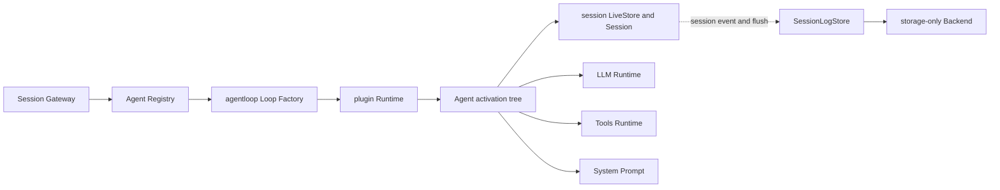
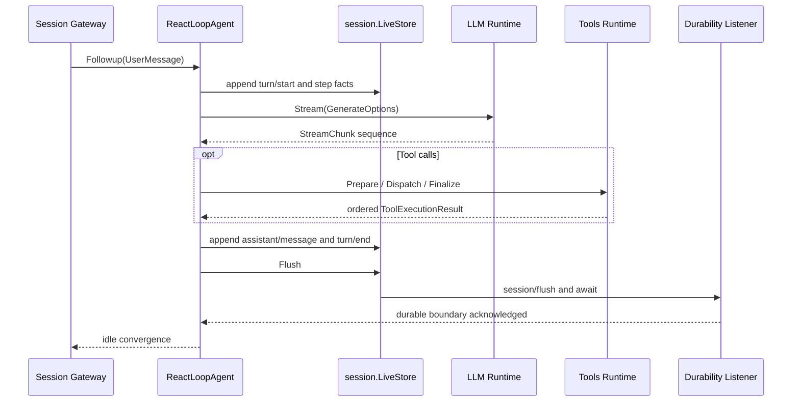

# Agent Loop 模块

`agentloop/` 实现默认 concrete Agent driver。权威设计见[15 Agent Loop 与请求驱动模块设计](../zh-CN/15-agent-loop-and-request-driver.md)；Session、LLM、Tools、System Prompt 和持久化契约分别由各自领域拥有，实施状态与测试证据只见[08 实施进度](../zh-CN/08-implementation-progress.md)。

## 职责

| 路径 | 职责 |
| --- | --- |
| `loop.go` | `Loop` Service、Agent Factory、fresh/resume preparation 与完整子树挂载 |
| `lifecycle.go` | Runtime tree Handle 的 caller-facing lifecycle |
| `membership.go` | Commit 阶段的 Agent/Session membership 和发布/撤销顺序 |
| `variables.go` | Agent-scope 的 provider、model 与 cwd Prompt variable Plugin |
| `agent.go` | concrete Agent activity、Inbox wake/cancel、Turn/Step driver 与 idle convergence |
| `request.go` | request waterfall、exact LLM route、header/context facts 与模型 attempt |
| `tool_calls.go` | bounded Tool body concurrency、barrier、model-order finalize 与 failure drain |
| `runtime_context.go` | System Prompt runtime context 的 Session surface 投影 |

本模块不拥有 Agent Registry/Inbox contract、Session seq/surface/persistence、LLM Provider、Tool policy、HTTP/RPC/WebSocket 或 Web UI。特别是它不导入 SQLite；持久化只通过 `session.LiveStore` 的既有 flush capability 进入。

## 依赖与主流程



```mermaid
sequenceDiagram
    participant Loop as LoopPlugin
    participant Runtime as plugin.Runtime
    participant Main as Main Plugin nodes
    participant Membership as Commit membership
    participant Registry as Agent and Session Registries

    Loop->>Runtime: MountScopedChild(ReactLoopAgent)
    Runtime->>Main: Apply overlays, variables, Agent, extensions
    Runtime->>Membership: Apply after every Main node is ready
    Membership->>Registry: Enter Session, then Agent
    Membership->>Registry: Announce Session, then Agent
    Runtime-->>Loop: root Handle
    Note over Runtime,Registry: no partial Agent or Session visibility on Main failure
    Loop->>Runtime: UnloadChild(root Handle)
    Runtime->>Membership: Dispose first
    Membership->>Registry: Remove Agent, release Session
    Runtime->>Main: Dispose in reverse activation order
```



## 状态、失败与取消

- 每个 Agent 同时只有一个 `idle`、`maintenance` 或 `running` activity；`WhenIdle` 跟随已经锁存的 successor work，不能观察到伪空闲窗口。
- `ReactLoopAgent` 自身就是一次 `MountScopedChild` 的根 Plugin。`LoopPlugin` 不逐个调用 `MountChild`，也不手工拼接 Scope；Runtime 根据它的 Manifest 校验并构造完整子树，业务扩展在 publication 之前全部完成激活。
- `agentMembership` 是 Agent Loop 业务生命周期 Plugin，不是 plugin framework 概念。它只在 Main 子树全部 ready 后进入 Commit；停机时又先于 Main 节点撤销 Registry membership。
- `Followup`、`Steer` 与 `Inject` 只写入 Inbox 并按各自 target 唤醒；driver 在 boundary claim，不为每条输入建立独立 goroutine。
- Turn 一旦开始必须追加一个 typed `turn/end`。正常 driver 在该 fact 提交后等待 `session.LiveStore.Flush`，再进入 successor Turn 或 idle。
- request、Tool scheduler、Session append 或 flush failure 进入 `agent/error`，不得伪造成功 Tool result 或跳过 boundary 收口。
- 取消使用第一个 typed cause，停止新 Tool dispatch，但等待已经启动的 body settle；调用方 Context 继续控制 request 和 flush 等待。

## 扩展规则

Retry、Guard、Approval、Subagent、Workflow 或 compaction 只能经已有 owner-defined Event/Service seam 进入。若新能力要求 Agent Loop 直接认识数据库、Echo frame、Provider credential 或页面状态，应先修正依赖方向，而不是在 driver 中增加 capability-specific branch。
