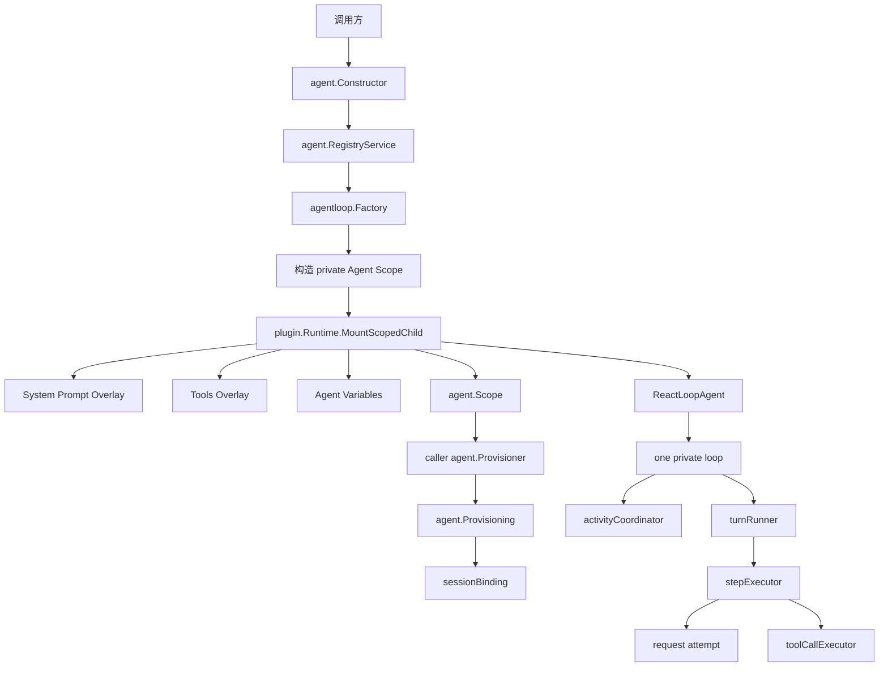
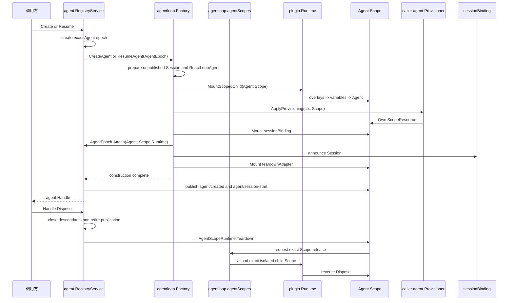

# Agent Loop 模块

`agentloop/` 是默认 Agent 构造实现：根 `Plugin` 向 Agent Registry 注册 `agent.Factory`；每个 `ReactLoopAgent` 拥有且只拥有一个私有执行循环。权威设计见[15 Agent Loop 与请求驱动模块设计](../zh-CN/15-agent-loop-and-request-driver.md)，实施状态与跨模块证据只见[08 实施进度](../zh-CN/08-implementation-progress.md)。

## 职责与文件划分

| 路径 | 职责 |
| --- | --- |
| `plugin.go` | 根 Agent Loop Plugin、Factory 构造、Session runtime-context Event 路由 |
| `registration_plugin.go` | commit 阶段的 Factory 注册 Plugin；先于普通 Agent Scope 关闭构造准入 |
| `factory/` | raw JSON 的严格解码、配置校验、默认值和根 Plugin 构造 |
| `construction.go` | `Factory` 的 Create/Resume 构造用例、Session Prepare/恢复及关闭信号跟随 |
| `prepared_agent.go` | 未发布 Agent 的 Scope 挂载、Provisioning、Session 发布和 Registry Attach 顺序 |
| `scope_preparation.go` | 未发布 Agent Scope 的构造事务接口与绑定顺序 |
| `agent_scopes.go` | AgentLoop 拥有的 Agent Scope 集合、精确 Plugin Handle 与卸载命令 |
| `scope_root.go` | 单个私有 Agent Scope Plugin、Scope Resource 与运行期端口适配 |
| `teardown_adapter.go` | 将 Plugin Scope 结构销毁转换为 `AgentTeardown` 开始回报 |
| `session_binding.go` | Session 发布、运行时上下文路由和 Session 释放 |
| `agent_runtime_adapter.go` | 将 Agent Loop 能力发布到 Agent 私有 Plugin Scope |
| `agent.go` | `ReactLoopAgent` 业务对象及其对私有 loop 的命令委派 |
| `loop.go` | 一个 Agent 的单一私有 loop，组合 activity 与 Turn runner |
| `activity.go` | work 准入、wake/cancel、maintenance 和 idle convergence |
| `turn.go` | Turn 状态机、Step 迭代、Turn 结束和 Flush boundary |
| `step.go` | Step 准备、`StepStarted/StepEnded` 事件对、输入提交和完整执行边界 |
| `request.go` | Step 内部的 request waterfall、LLM route、header/context fact、模型 attempt 与重试 |
| `tool_calls.go` | bounded Tool body concurrency、barrier、model-order commit 与 failure drain |
| `runtime_context.go`、`runtime_context_router.go` | Session surface 的运行时上下文投影与精确路由 |
| `events.go` | Agent/Inbox 实时事件发布和 post-commit observer failure containment |
| `variables.go` | Agent Scope 的 provider、model 与 cwd Prompt variable Plugin |
| `startup.go` | 配置声明的一次性启动事务 |

本模块不拥有 Agent Registry/Inbox contract、Session fact/surface 语义、LLM Provider、Tool policy/result、System Prompt Registry、存储 Adapter、HTTP/RPC/WebSocket 或 UI。恢复只消费 `session/persistence.Persistence` capability，不依赖 SQLite、sqlc 或具体 Backend。

## 两层运行模型

根 `Plugin` 负责组装 Factory 和路由 Session runtime-context Event，不拥有 Agent 生命周期状态，也不调用 Registry `Shutdown`。commit 阶段的 `registrationPlugin` 只管理一个 exact `FactoryRegistration`：普通节点全部启动后才开放构造，在动态 Agent Scope 之前关闭注册。Agent Registry 负责准入、精确 Agent epoch、运行期父子关系、发布与最终关闭；Agent Loop Factory 负责构造具体 Agent 与私有 Scope。执行能力只存在于具体 `ReactLoopAgent`；loop、activity、Turn、Step、request 与 Tool scheduler 都是该 Agent 私有对象。

## 创建、发布与销毁

`newPreparedAgent` 先创建 ReactLoopAgent，再把私有 Agent Scope 挂入 Runtime；此时基础 Overlay 与 Agent 已 active，但 Registry 和 Session 都不可见。Overlay 必须先于 `ReactLoopAgent` 激活，使 Agent 捕获本 Scope 的 System Prompt 与 Tools runtime。随后调用方的 `Provisioner` 配置同一 Scope，`sessionBinding` 完成 Session 发布，`AgentEpoch.Attach` 把 Agent 和 Scope Runtime 交给 Registry。Factory 返回后，Registry 才发布 Agent 生命周期事件并开放正常工作。

Agent Loop 不实现 `agent.Provisioner`：它是 provisioning 的用例协调者和 `agent.Scope` 的 Plugin 适配实现。Subagent、测试或其他调用方分别提供自己的 Provisioner；若 Agent Loop 同时实现 Provisioner，就会把“创建事务所有者”和“领域贡献提供者”重新混在一个对象里。

创建失败时 `preparedAgent` 用非取消上下文回滚 Agent Scope，保证取消不会中断结构释放。进程级创建准入与 exact epoch 由 `RegistryService` 及其 `LifecycleCoordinator` 管理；Agent Loop 只跟随 `AgentEpoch.ClosingSignal` 取消尚未完成的构造。Attach 返回的 `AgentTeardown` 仅供 Scope 回报结构销毁开始和完成；无论关闭来自 `Handle.Dispose` 还是 Plugin Runtime 的结构销毁，最终都收敛到同一个 exact epoch。

`agentScopeRoot` 不保存父 Plugin 或自己的 Plugin Handle，也不从自己的 `Teardown` 中直接 Dispose 自己。`agentloop.Plugin` 持有 `agentScopes`；后者是所有 Agent Scope Handle 的唯一结构 owner。`AgentScopeRuntime.Teardown` 只是把 exact Scope 关闭请求交给 `agentScopes`，由它以 AgentLoop Plugin 的身份命令 Runtime 卸载精确隔离 Scope；随后 Runtime 递归调用 Scope Plugin 的 `Dispose`。Scope Plugin 的 `Dispose` 只释放本 Scope resources、关闭 Agent 并回报 `AgentTeardown.FinishTeardown`。

这条同步卸载链只从 Plugin callback 外的 managed Agent close 进入。若关闭请求来自另一个 Plugin 的 `Dispose`，请求方只等待 exact Agent 建立 Closing cutoff，随后让当前 Runtime 操作返回；Coordinator 再继续进入 `agentScopes`。Runtime 整体关闭时则由 Runtime 直接反向 Dispose Agent Scope，并通过 `AgentTeardown` 回报 Registry。AgentLoop 不要求 Plugin Runtime 开放 Dispose 内拓扑重入。

Plugin Runtime 卸载 Agent Loop 时，先停止 commit 阶段的 `registrationPlugin`。`FactoryRegistration.Close` 从 Registry 移除该 exact Factory，取消并等待由它接纳但尚未完成的构造；既有 live Agent 继续由统一 lifecycle 管理，Registry 也可以接受替代 Factory 注册。Runtime 整体关闭时随后按结构停止 Agent Scope，最后 `RegistryPlugin.Dispose` 执行 Registry 的幂等 `Shutdown`，永久停止创建/恢复准入并兜底收敛全部 epoch。这个顺序把“Factory 注册生命周期”“Agent Scope 结构生命周期”和“Registry 业务生命周期”分开，而不创建第二套 Agent 生命周期接口。

配置声明只能在 `plugin.Runtime.Start` 返回后通过 `StartConfiguredAgents` 启动，因为 Runtime 在静态启动事务中不接受动态 mount。该调用是一锤子启动事务；任一声明失败会逆序销毁本批次已创建 Agent，失败后不能对同一 Plugin 重跑。

## Turn、失败与取消

- 每个 Agent 同时只有一个 `idle`、`maintenance` 或 `running` activity；`WhenIdle` 会跟随已锁存的 successor work，不能观察到伪空闲窗口。
- `Followup`、`Steer` 和 `Inject` 只修改 Inbox；activity owner 在边界唤醒同一个 loop，不为输入建立独立执行器。
- Turn 从 `turn/start` 开始并以 typed `turn/end` 收口；`turn/end` 提交后必须等待 `session.LiveStore.Flush`，之后才能进入后继 Turn 或 idle。
- `turnRunner` 只负责 Turn 状态机和 Step 迭代；它不直接提交 Step 事件，也不执行模型请求。
- `stepExecutor` 每步读取当前 Inbox、重新执行 System Prompt 注册项与 Waterfall、发布 `agent/pre-step`，并独占 `step/start` 到 `step/end` 的完整事件边界。被拒绝或没有实际工作的 Step 不会发布事件。
- `request.go` 只实现 Step 内部的模型请求构造、route/header/context 事实、流式响应提交和 attempt 重试；多个 retry attempt 仍属于同一个 Step。
- Tool body 可以在上限内并发；Prepare、Finalize、result/context commit 始终保持模型顺序。调度器内部失败停止补充任务并 drain 已启动 body，不伪造 Tool result。
- 第一个 typed cancel cause 是 durable authority。销毁会停止新 work、取消当前 activity、清空 Inbox，并在释放扩展和依赖前等待已启动 Tool body 与 durability boundary 收敛。
- Event observer failure 不回滚已提交事实；它通过 `RuntimeOptions.ObserverError` 汇报。Session、Prompt、LLM、Tool scheduler 或 flush 的 contract error 则进入 Agent/Turn 失败路径。

## Provisioning 组合规则

调用方通过 `agent.CreateOptions.Provisioner` 或 `agent.ResumeOptions.Provisioner` 配置 Scope。业务侧只依赖 `agent.Scope.Own` 转移 `ScopeResource`；需要安装 Plugin 的实现使用 `agent/scopedplugin.Scope.MountPlugin` 或 `scopedplugin.MountPlugins`。失败前未转移的资源必须自行回滚，成功取得的 `Provisioning` 由统一的 `agent.ApplyProvisioning` 完成 Own 和 Commit。Provisioner 可以依赖 `Scope.Agent()` 返回的 exact Agent，但不能驱动未发布 Agent，也不能接管 loop、Registry 生命周期或 Session durable decision。

Retry、Guard、Approval、Subagent、Workflow 和 compaction 必须沿已有 owner-defined Service/Event/Waterfall seam 接入。若能力要求 Agent Loop 认识数据库表、Echo frame、Provider credential 或页面状态，应先修正依赖方向。
