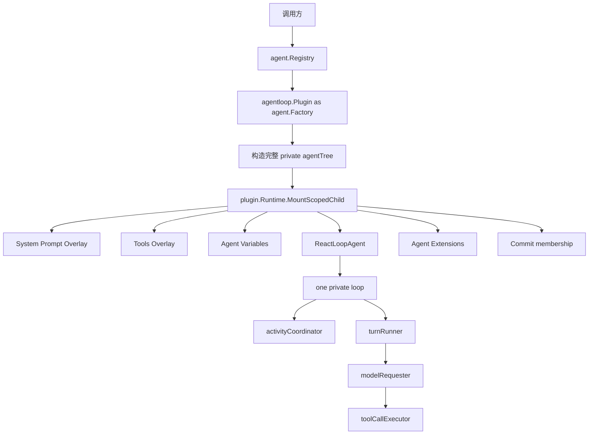
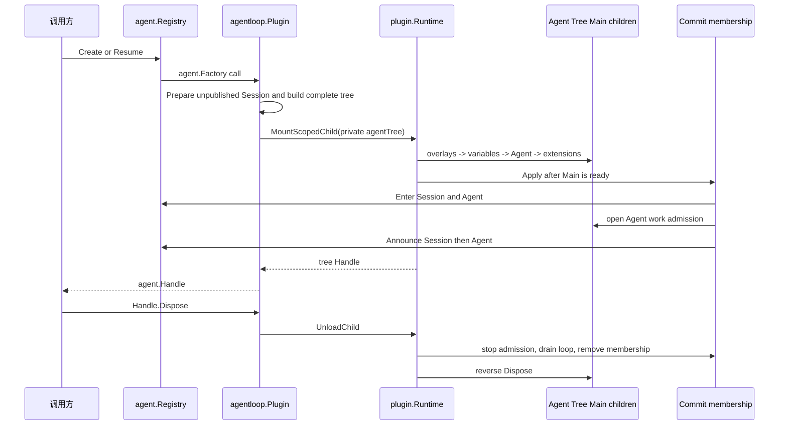

# Agent Loop 模块

`agentloop/` 是默认 concrete Agent Provider：根 `Plugin` 实现 `agent.Registry` 所拥有的 `agent.Factory` 契约；每个 `ReactLoopAgent` 拥有且只拥有一个私有执行循环。权威设计见[15 Agent Loop 与请求驱动模块设计](../zh-CN/15-agent-loop-and-request-driver.md)，实施状态与跨模块证据只见[08 实施进度](../zh-CN/08-implementation-progress.md)。

## 职责与文件划分

| 路径 | 职责 |
| --- | --- |
| `plugin.go` | 根 Agent Loop Plugin、Factory 实现、创建/恢复入口与全局停机准入 |
| `factory/` | raw JSON 的严格解码、配置校验、默认值和根 Plugin 构造 |
| `tree.go` | 在进入 Runtime 前构造完整的私有 Agent Plugin Tree |
| `agent.go` | `ReactLoopAgent` 能力 Plugin 与对私有 loop 的命令委派 |
| `loop.go` | 一个 Agent 的单一私有 loop，组合 activity 与 Turn runner |
| `activity.go` | work 准入、wake/cancel、maintenance 和 idle convergence |
| `turn.go` | Turn/Step 状态机、Prompt preparation、Session fact 与 durability boundary |
| `request.go` | request waterfall、LLM route、header/context fact 与模型 attempt |
| `tool_calls.go` | bounded Tool body concurrency、barrier、model-order commit 与 failure drain |
| `membership.go` | Commit 阶段的 Agent/Session publication 与 teardown |
| `lifecycle.go`、`lifecycles.go` | 单棵树的 caller Handle 与根 Plugin 的构造/停机准入 |
| `runtime_context.go`、`runtime_context_router.go` | Session surface 的运行时上下文投影与精确路由 |
| `events.go` | Agent/Inbox 实时事件发布和 post-commit observer failure containment |
| `variables.go` | Agent Scope 的 provider、model 与 cwd Prompt variable Plugin |
| `restoration.go`、`startup.go` | durable Turn 恢复和配置声明的一次性启动事务 |

本模块不拥有 Agent Registry/Inbox contract、Session fact/surface 语义、LLM Provider、Tool policy/result、System Prompt Registry、存储 Adapter、HTTP/RPC/WebSocket 或 UI。恢复只消费 `session/persistence.Persistence` capability，不依赖 SQLite、sqlc 或具体 Backend。

## 两层运行模型

根 `Plugin` 只负责全局 Factory 生命周期、Session runtime-context Event 路由和 Agent 树所有权，不提供第二个 `Loop` Service。执行能力只存在于具体 `ReactLoopAgent`；`loop`、activity、Turn、request 与 Tool scheduler 都是该 Agent 私有对象。

## 创建、发布与销毁

`agentTree` 在 Runtime 外一次性构造完成，但其校验、激活排序、失败回滚和逆序卸载全部由 Runtime 执行。Overlay 必须先于 `ReactLoopAgent` 激活，使 Agent 捕获本 Scope 的 System Prompt 与 Tools runtime；扩展随后向同一个 Scope 注册 Waterfall/Event。Main 阶段只完成依赖装配，不能提前提交 Agent work；只有 Commit 阶段的 `agentMembership` 在完成 Session/Agent Enter 后开放调用，并负责后续 Announce。

配置声明只能在 `plugin.Runtime.Start` 返回后通过 `StartConfiguredAgents` 启动，因为 Runtime 在静态启动事务中不接受动态 mount。该调用是一锤子启动事务；任一声明失败会逆序销毁本批次已创建 Agent，失败后不能对同一 Plugin 重跑。

## Turn、失败与取消

- 每个 Agent 同时只有一个 `idle`、`maintenance` 或 `running` activity；`WhenIdle` 会跟随已锁存的 successor work，不能观察到伪空闲窗口。
- `Followup`、`Steer` 和 `Inject` 只修改 Inbox；activity owner 在边界唤醒同一个 loop，不为输入建立独立执行器。
- Turn 从 `turn/start` 开始并以 typed `turn/end` 收口；`turn/end` 提交后必须等待 `session.LiveStore.Flush`，之后才能进入后继 Turn 或 idle。
- Tool body 可以在上限内并发；Prepare、Finalize、result/context commit 始终保持模型顺序。调度器内部失败停止补充任务并 drain 已启动 body，不伪造 Tool result。
- 第一个 typed cancel cause 是 durable authority。销毁会停止新 work、取消当前 activity、清空 Inbox，并在释放扩展和依赖前等待已启动 Tool body 与 durability boundary 收敛。
- Event observer failure 不回滚已提交事实；它通过 `RuntimeOptions.ObserverError` 汇报。Session、Prompt、LLM、Tool scheduler 或 flush 的 contract error 则进入 Agent/Turn 失败路径。

## 扩展规则

Agent 扩展通过 `agent.CreateOptions.Extensions` 或 `agent.ResumeOptions.Extensions` 进入同一私有 Scope，可按需监听 Agent Event、安装 Waterfall middleware、Prompt section 或 Tool。扩展可以依赖 exact `agent.Agent`，但不能接管 Agent 的 loop、Registry membership 或 Session durable decision。

Retry、Guard、Approval、Subagent、Workflow 和 compaction 必须沿已有 owner-defined Service/Event/Waterfall seam 接入。若能力要求 Agent Loop 认识数据库表、Echo frame、Provider credential 或页面状态，应先修正依赖方向。
