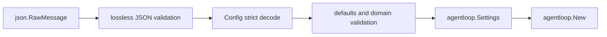

# Agent Loop Factory

`agentloop/factory` 是 Agent Loop 的入站构造边界。它拥有 raw JSON 的严格解码、默认值、配置校验和 `agentloop.Plugin` 构造；运行时 Agent 创建、执行和销毁仍由父包 `agentloop` 拥有。领域设计见[15 Agent Loop 与请求驱动模块设计](../../zh-CN/15-agent-loop-and-request-driver.md)，实施证据只见[08 实施进度](../../zh-CN/08-implementation-progress.md)。

## 输入与输出

Factory 接受一个 JSON object：

- `maxParallelToolCalls`：省略时为 `10`，显式值必须为正整数；
- `agents[]`：支持 `id`、`sessionId`、`provider`、`model`、`maxTokens`、`cwd`、`resumeSessionId`。

unknown field、重复 JSON field、显式 `null`、错误类型、非法并发上限、非安全 `maxTokens`、相对 `cwd`、冲突 identity 和重复 exact Session identity 都在 Plugin 构造前失败。raw JSON、wire DTO 和 omission/null 语义不会进入 `agentloop.Plugin`。

## 非职责与失败

本包不读取文件、环境变量或凭证，不选择 Session persistence，不启动 Runtime，也不调用 `StartConfiguredAgents`。这些步骤由 composition root 编排。`Create` 尊重调用 Context；解码或校验失败不会构造半初始化 Plugin，也没有需要回滚的运行时资源。
