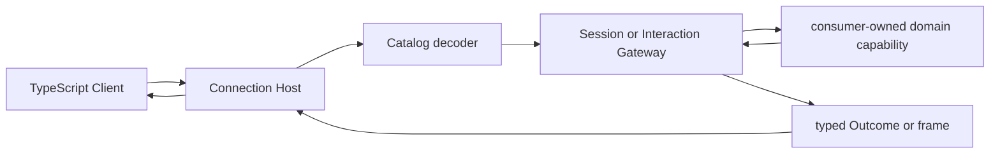

# API Proxy 子模块

`apiproxy` 是浏览器 wire 与 Go application/domain capability 之间的 anti-corruption boundary。权威设计见[`zh-CN/07-api-proxy-module.md`](../zh-CN/07-api-proxy-module.md)、[`zh-CN/16-session-api-gateway-and-live-frames.md`](../zh-CN/16-session-api-gateway-and-live-frames.md)与[`zh-CN/17-approval-user-questions-and-interaction-gateway.md`](../zh-CN/17-approval-user-questions-and-interaction-gateway.md)。

## 职责

- method-owned request decoder、typed `Outcome` 和 canonical RPC error；
- `host.describe` 与当前纳入的 `session.*` handlers；
- Session/Agent/interaction facts 到 Mux/Host frame 的 projection；
- pending response correlation 与 reconnect replay；
- per-subscriber ordering、high-water 和 shutdown。

本包不运行 Agent Turn、生成 title、计算 domain projection、执行 Tool、调用模型或承载 HTTP/WebSocket。Echo carrier 位于 `internal/connection`。

## 工作原理

Session list/history 只读取 projection capability，不包含 projection fold。`session.rename` 把 raw title 交给 `sessiontitle.TitleService`；成功只映射 `{title, seq}`。Projection change 被映射为 `session/projection`，value 必须存在且是合法 JSON。

## 上下游

- 上游：Connection dispatcher/event source、TypeScript wire requests。
- 下游：Agent Registry、Session Store、LLM、DefaultModel、SessionProjection、SessionTitle、Approval/UserQuestions。
- wire DTO 到此为止；下游包不依赖 RPC/frame 类型。

## 生命周期、错误、取消与背压

Gateway listener 和 hub 归 API Proxy Scope；subscriber 断开只取消该 stream，不取消 Agent Turn。显式 `session.cancel` 才进入 Agent cancellation。业务拒绝编码为 RPC error value，transport/内部故障返回技术 error。

每个 subscriber 有独立有序队列；Session event 的 high-water 只在 frame 成功生成后推进。已经 committed 的 Session/title/projection 派生通知不能因慢客户端或 frame 失败回滚。
