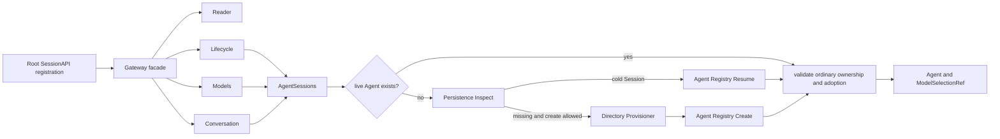

# API Proxy Session 子模块

`apiproxy/session` 拥有浏览器 Session API 的具体实现。它不是 `session` 领域的副本，也不定义 RPC DTO、frame 或持久化格式；路径表达的是“API Proxy 内的 Session capability implementation”。权威跨模块设计见 [`zh-CN/16-session-api-gateway-and-live-frames.md`](../../zh-CN/16-session-api-gateway-and-live-frames.md)。

## 职责

本子模块包含：

- `Gateway`：实现根 `apiproxy.SessionAPI` 的稳定 façade，只委派 method；
- `sessionReader`：`list`、`history` 与 search visibility；
- `sessionLifecycle`：`create`、`rename` 与 Workspace attach；
- `sessionModels`：model catalog、route validation 与 selection；
- `sessionConversation`：`prompt`、pending queue mutation 与 `cancel`；
- `SearchGateway`：固定 current user/assistant surface 的 Session Search adapter。

`AgentSessions` 负责：

- 按 Session ID 串行化并发创建或 cold resume；
- 在创建、恢复和幂等采用后重新校验 `cwd`、`agentPreset` 与 ordinary/subagent ownership；
- 为每个 live Agent 安装并持有 `ModelSelectionRef`；
- Agent dispose 时删除与该实例绑定的 selection 引用；
- 把 Directory Provisioner 作为创建新 Session 前唯一的文件系统边界。

本子模块消费根 `apiproxy` 的 typed request/result、canonical RPC error constructor 与 Session wire projector，但不拥有其协议定义。本子模块也不负责 Mux/Host frame、连接 subscriber、数据库读写实现或 Agent Loop。`sesspersist.Persistence` 只提供 cold inspection；恢复规则仍由 `AgentSessions` 调用 Agent Registry 的 `Resume` 完成。

## 工作原理

同一 Session ID 的并发调用共享一次 acquisition，但不共享 adoption decision。等待者拿到 Agent 后仍用自己的 `cwd` 和 `agentPreset` 再校验，避免先到请求替后到请求接受冲突配置。

## 上下游与生命周期

- 上游：根 `apiproxy.RegisterSessionAPI` 与 Assembly composition root。
- 下游：Agent Registry、Session LiveStore、Session Persistence、Default Model、Directory Provisioner。
- `AgentSessions` 跟随 API Proxy Plugin Scope；Agent dispose listener 也由该 Scope 撤销。
- 技术错误原样返回上游；`CWDConflictError`、`PresetConflictError` 与 `SubagentOwnershipError` 保留结构化事实，再由本子模块转换为根协议定义的 canonical RPC error。
