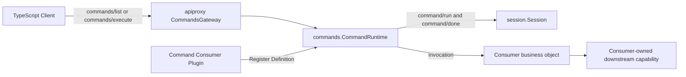
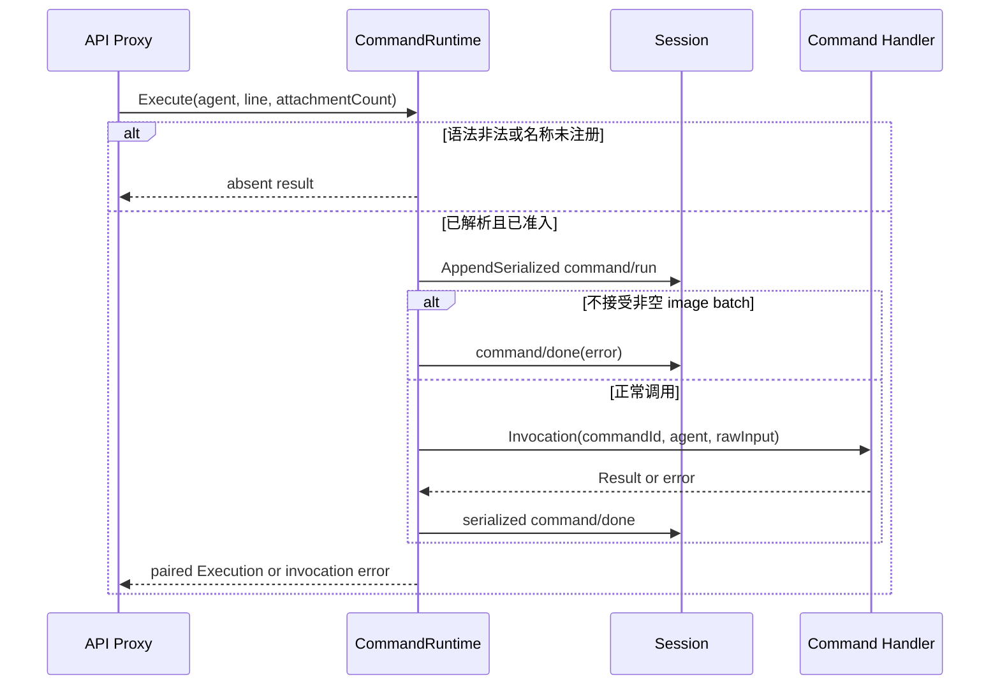

# Commands Service

状态：已实现；当前准入全局 Command 与 `/compact` 所需的最小 Remote 入口

本包对应 DeepSeek Harness `packages/commands` 的 Service Definition、全局 Registry、直接执行和 `command/*` 持久化生命周期。Compaction 的人工 Consumer 设计见[24 Context Compaction](../zh-CN/24-context-compaction.md)，实现证据见[25 Context Compaction 实现进度](../zh-CN/25-context-compaction-implementation-progress.md)，全仓总体状态见[08 实施进度](../zh-CN/08-implementation-progress.md)。

## 职责与非职责

本包拥有：

- `commands.Registry`、`Definition`、`Descriptor`、`Invocation`、`Result` 与可撤销 `Registration`；
- `/name` 语法解析、名称校验、全局注册冲突、稳定排序和直接执行；
- `command/run`、`command/done` 的 owner-defined Event 与一一配对；
- handler 准入、取消优先、panic containment、卸载停止准入和已准入调用排空；
- `Plugin` 对 `CommandRuntime` Service 的发布与关闭。

本包不拥有 HTTP/Typert DTO、Agent 创建或 Turn 调度、具体命令业务、Attachment 存储与解析、Session persistence adapter 或 Compaction 策略。当前实现只准入全局注册；源端 Agent scoped command shadowing、`commands-change` 通知和 image attachment admission 未进入本切片。

## 架构与上下游

- 上游入站 adapter 是 `apiproxy.CommandsGateway`；它解析 `{args:{agentId,...}}`、取得 ordinary Agent，再调用 `Registry`。
- 命令插件通过 `Register` 发布业务定义，不依赖 API Proxy 或 Connection。
- `CommandRuntime` 只依赖 Agent 提供的 Session，并把已解析的 `Invocation` 交给 handler。
- handler 自行消费所属领域能力；例如 `compaction/command.Compact` 只依赖 `compaction.Engine`。

## 执行与持久化契约

`command/run` 必须在 handler 之前提交；只有成功解析并命中已注册命令才写入。`command/done` 使用相同 `commandId`，成功结果可携带 `sourceEventSeq`。未识别命令返回 absent，不伪造空对象或持久化事件。当前组合未提供 image admission，因此任何非空 image batch 都在具体 handler 前形成稳定的 command error result。

Session append 由 Session 自己串行化。`CommandRuntime` 不持有 Session mutex，也不把 handler 的异步工作包进同步 producer 临界区；结束事件在 handler settle 后重新进入 Session producer 边界，避免与 Compaction 等其他 producer 交错重入。

## Plugin、取消与卸载

`Plugin` 只发布并关闭内部 `CommandRuntime`，不承载命令业务。每个 Consumer Plugin 持有自己的 `Registration`：

1. `Register` 完成后，新调用可以取得 entry admission；
2. `Unregister` 原子停止新调用；
3. `Wait` 等待所有已准入 handler 完成其领域清理；
4. Commands Plugin 最终 `Close` 撤销剩余注册并按 close context 排空。

调用 context 取消后，Remote 调用立即收敛为 `cancelled`，并以 error 形态写入配对的 `command/done`；已经启动的 handler 继续接收同一取消信号并完成自己的 close/flush 边界。handler panic、非法 Result 和 observer panic 都被 containment，不允许破坏 Registry 或跳过 lifecycle 收敛。

## 验证所有权

- `commands/runtime_test.go`：解析、注册、排序、事件配对、image 拒绝、错误、panic、取消、卸载与并发；
- `commands/factory/factory_test.go`：严格空配置和 Plugin 构造；
- `apiproxy/commands_api_test.go`：Remote wrapper、字段校验、image schema、absent result 和 RPC failure；
- `internal/assembly/command_compact_e2e_test.go`：真实 Go HTTP carrier 上的 list/execute、成功、失败与取消链路。
