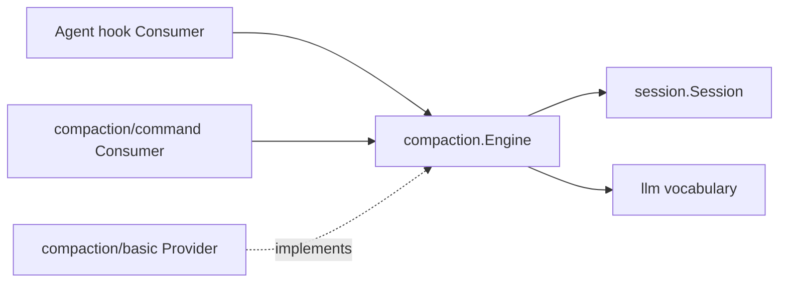
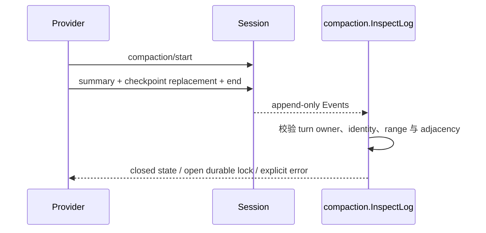

# Compaction Service Definition

状态：已实现并通过包级、Go 契约、真实 HTTP 集成与冷恢复验证

本包拥有 provider-neutral `compaction.Engine`、`CheckpointSource`、`compaction/*` Session Event、transaction result 和人工失败分类。跨模块目标设计见[24 Context Compaction](../zh-CN/24-context-compaction.md)，实现明细见[25 Context Compaction 实现进度](../zh-CN/25-context-compaction-implementation-progress.md)，全仓总体状态见[08 实施进度](../zh-CN/08-implementation-progress.md)。

## 职责与非职责

本包拥有：

- `CompactIfNeeded`、`CompactNow`、`CompactRegion` 的 Service Definition；
- `pressure` / `context-overflow` trigger；
- `compaction/start`、`summary`、`end`、`prune` 的 owner-defined EventKey；
- summary replacement checkpoint 的 `plugin=compact` provenance；
- Provider 和 Commands Consumer 共享的结果与错误分类。

本包不拥有 threshold、retention、summarization prompt、Token Meter replay、Tool result pruning、Agent hook 注册、Session persistence 或 `/compact` 的参数与文案映射；后者属于[`compaction/command`](./command/README.zh-CN.md)。

## 上下游

Definition 使用最小 `AgentContext`，不会让 Consumer 依赖 Basic Provider。人工路径接受能直接执行 `RunMaintenance` 的 `ManualAgentContext`，由 Agent 对象自己保证 Turn/maintenance admission；本包不定义宽泛的 Maintenance Task/Runner 框架。

## 运行与恢复契约

- `InspectLog` 从冷日志重建 open attempt，拒绝 owner、identity、summary 和 checkpoint 关系不一致；
- 最新 `session/end-seed` 清除继承自旧 lifecycle 的 orphan lock，但不隐藏当前 lifecycle 内的未闭合 attempt；
- tool-call/result pairing 按当前 Surface 位置而非 seq 数值判断；
- checkpoint source 经 Message codec lossless round-trip，已知 core form 的 malformed source 仍会失败；
- Event/config/result/checkpoint shape 由基于 `b150a55` 源契约编写的 Go golden 与表驱动用例覆盖。

本包不是 Plugin，不注册 Factory；具体 Provider Plugin 提供 `compaction.Engine`。
