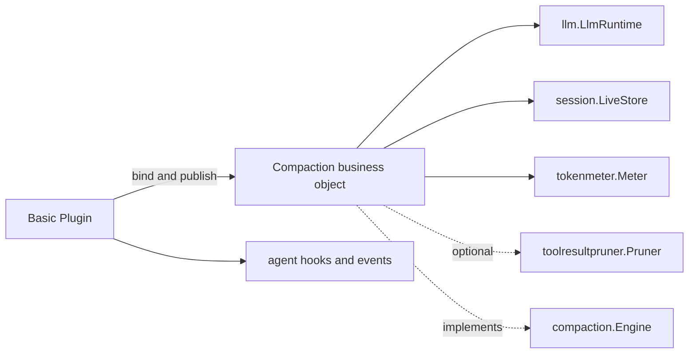
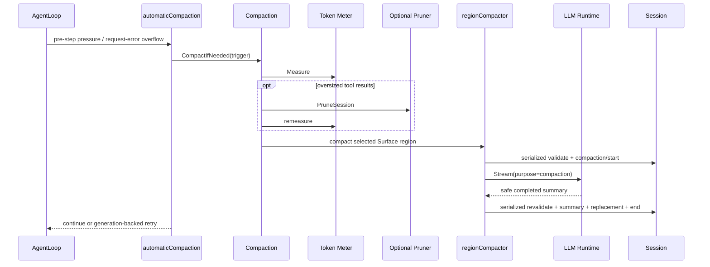

# Basic Compaction Provider

状态：已实现；已进入默认 composition

本包是 `compaction.Engine` 的 source-aligned 模型 Provider，拥有配置、自动压力策略、overflow recovery、区间事务和 summarizer。权威设计见[24 Context Compaction](../../zh-CN/24-context-compaction.md)，逐项进度见[25 Context Compaction 实现进度](../../zh-CN/25-context-compaction-implementation-progress.md)。

## 依赖与提供

`Plugin` 只拥有 Runtime 生命周期：声明依赖与 effect、在 `Apply` 时绑定依赖、发布 Service、在 `Dispose` 时释放 capability snapshot。`Compaction` 是业务 use case owner，拥有 policy 与人工调度，并实现 `compaction.Engine`。`automaticCompaction` 拥有跨 hook 的 overflow retry sequence；`pressureMiddleware`、`overflowMiddleware` 和 Plugin Event observer 只是 Runtime adapter，不再保留第二份策略或事务状态。

## 生命周期

- Factory 严格解码 owner-defined Config 并应用 source 默认值；
- Manifest 发布内部 `Compaction` 对象作为唯一 `compaction.Engine`，声明 `llm.LlmRuntime`、`session.LiveStore`、`tokenmeter.Meter` 三个 required Service 和一个 optional Pruner；
- `Apply` 只解析 Runtime 已准入的能力，再一次性绑定给 `Compaction`；
- Runtime 先撤销并 drain Waterfall/Event，再调用 `Dispose` 清除 capability snapshot；
- Factory 已注册到默认 Catalog，`DefaultSpecs` 在 Token Meter 和 Pruner 之后启用 Basic Provider。

## 运行流程

`Compaction` 负责 threshold/route/retained-tail policy 与 manual use case；`automaticCompaction` 只拥有跨 hook 的 overflow retry sequence；`regionCompactor` 拥有长事务；`llmSummarizer` 拥有辅助 LLM protocol。这些命名对象共享同一个 Provider 配置，不重复存储业务状态。

## 失败、取消与人工路径

- pressure 失败被自动 adapter 记录后继续 Turn；缺失 model capacity 按 route 去重告警；
- overflow 只处理 canonical `CONTEXT_WINDOW_EXCEEDED`，且只在 `ReplaceGeneration` 前进、未取消和 retry budget 未用尽时返回 retry；
- summary 的 error、aborted、`max-tokens`、空文本、image output 和不缩小结果都不会形成成功 checkpoint；
- `CompactNow` 直接通过 Agent `RunMaintenance` 取得空闲 admission，只校验 selected span 稳定，attempt 闭合后执行 `LiveStore.Flush`；
- `/compact` 已由独立 [`compaction/command`](../command/README.zh-CN.md) Consumer 实现；本包只提供 backend-neutral `CompactNow`，不解析命令或依赖 Commands/API Proxy。
