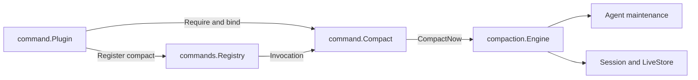
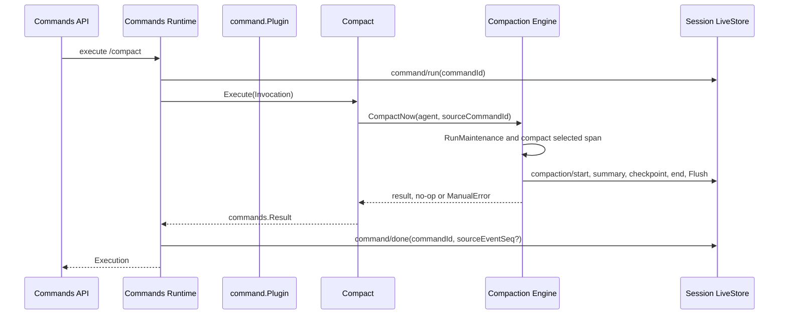

# `/compact` Command Consumer

状态：已实现；已进入默认 composition

本包对应 DeepSeek Harness `packages/compaction/command-compact`。它是 Commands 与 Compaction 之间的独立 Consumer：`Plugin` 负责注册和生命周期，`Compact` 业务对象负责参数校验、调用 `compaction.Engine` 和结果文案映射。权威契约见[24 Context Compaction](../../zh-CN/24-context-compaction.md)，逐项证据见[25 Context Compaction 实现进度](../../zh-CN/25-context-compaction-implementation-progress.md)。

## 职责与非职责

本包拥有：

- 全局 `compact` 命令的描述与无参数约束；
- `commands.Invocation.CommandID` 到 `Engine.CompactNow(..., sourceCommandId)` 的关联；
- no-op、成功和 typed manual failure 到用户可见 `commands.Result` 的稳定映射；
- Consumer Plugin 的依赖绑定、可撤销注册和已准入调用排空。

本包不解析 HTTP/Typert envelope，不实现 Commands Registry，不选择 Compaction Provider，不读取 Basic 配置，不执行 Token 计量、摘要、Surface replacement 或持久化。所有压缩业务仍由 backend-neutral `compaction.Engine` 拥有。

## 依赖与对象边界

`Plugin` 不实现命令业务，也不实现 `compaction.Engine`。`Compact` 不持有 Runtime handle；它只在 Plugin 激活期间绑定 Engine。这样注册 effect 与领域用例可以分别测试和替换，Factory 仍只构造 Plugin。

## 正常完成交互流程

成功时 `sourceEventSeq` 指向 `compaction/summary`，并通过 checkpoint source 的 `sourceCommandId` 保持两条 durable lifecycle 可追踪。没有安全区间时返回成功 no-op，且不写 `compaction/start`。多余参数返回 usage error，不调用 Engine。

## 失败、取消与卸载

- `busy`、`cancelled`、`changed`、`summary`、`commit`、`persistence` 映射为稳定的直接命令结果；未知错误继续作为技术错误上抛，由 Commands Remote 映射为 `internal`；
- request context 取消会传入 `CompactNow`，Compaction 负责关闭 attempt 和 flush，Commands 负责以相同 `commandId` 写入 error `command/done`；
- Dispose 先 `Unregister`，再等待已准入 handler 完成，最后释放 Engine 引用；超时不会假装释放成功；
- 非空 image batch 由 Commands Registry 在进入 `Compact` 前拒绝，本包不接触 attachment bytes。

## 验证所有权

- `compact_test.go`：参数、no-op、成功、全部 manual failure 和未知错误映射；
- `plugin_test.go`：依赖、注册、执行、dispose drainage 与释放顺序；
- `factory/factory_test.go`：严格空配置；
- `internal/assembly/command_compact_e2e_test.go`：真实 Go HTTP、DeepSeek SSE oracle、Session persistence、事件顺序、失败和取消。
