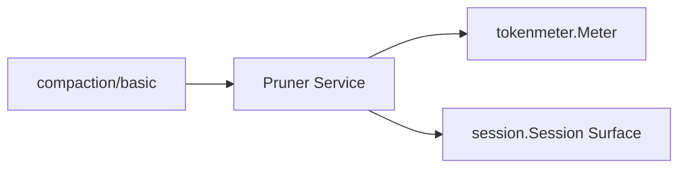
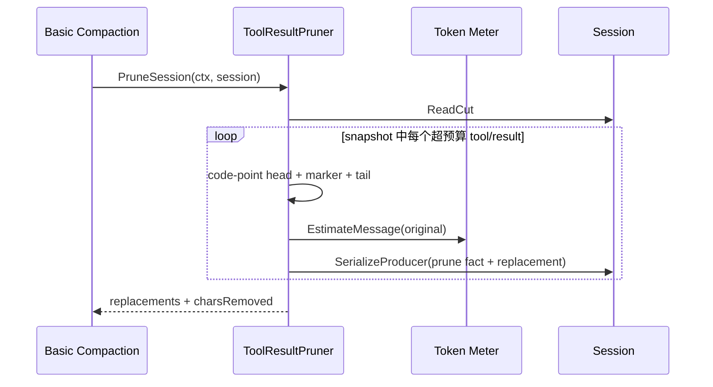

# Tool Result Pruner

状态：已实现；已进入默认 composition

本包提供可选 `toolresultpruner.Pruner` Service。它是 Basic Compaction 的无模型 companion，不是第二个 Compaction backend，也不是模型可调用 Tool。权威设计见[24 Context Compaction](../../zh-CN/24-context-compaction.md)，逐项进度见[25 Context Compaction 实现进度](../../zh-CN/25-context-compaction-implementation-progress.md)。

## 边界

本包拥有 Unicode code-point budget、head/marker/tail 形状、`compaction/prune` shadow price 和单个 `tool/result` replacement。Session 继续拥有 append 顺序、Surface mutation 和“replacement 只能改变 result content”的 invariant；Token Meter 拥有 token price。

## 配置与生命周期

Factory 严格接受 `thresholdChars`、`headChars`、`tailChars`，默认值为 `8192/4096/1024`，并验证 head + marker + tail 不超过 threshold。`Plugin` 只负责 Runtime 生命周期，发布内部 `ToolResultPruner` 业务对象；后者实现 `Pruner` 并拥有裁剪策略与 replacement orchestration。Plugin 只依赖 `tokenmeter.Meter`，在 `Apply` 后绑定给业务对象，Dispose 清除 dependency snapshot。Factory 已注册到默认 Catalog，`DefaultSpecs` 在 Basic Provider 之前启用它。

## 裁剪与提交流程

- 只统计 text block 的 Unicode code point，通过 Go rune 切分避免拆开 surrogate pair；非文本 block 原位保留；
- replacement 由 Session owner 校验，保留 Tool result 的 call ID、status、source 和扩展字段，只改 content；
- `compaction/prune` shadow price 与 replacement 在同一 `SerializeProducer` callback 中相邻提交；
- 整个 pass 在一次 producer serialization 内扫描，每个候选的 fact/replacement pair 立即 append；较晚候选失败时返回错误，不回滚较早的有效 replacement；
- 二次 pass 忽略已落入预算的结果，不产生重复 replacement；取消会在处理下一候选前收敛。
