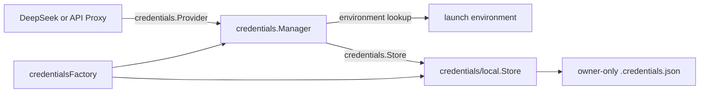

# Credentials 凭据能力

`credentials` 拥有凭据引用、来源优先级和对外 `Provider` 能力；`credentials/local` 只是一个 owner-only 文件存储实现。跨模块设计由[22 Credentials 与 API Key 管理](../zh-CN/22-credentials-and-api-key-management.md)拥有，当前完成度和验证证据只见[08 实施进度](../zh-CN/08-implementation-progress.md)。

## 职责

- `Ref` 校验稳定的环境变量式凭据引用，不携带秘密值；
- `Provider` 向 LLM 和 API Proxy 提供 `Resolve`、`Describe`、`Set`、`Unset`；
- `Manager` 决定启动环境与托管存储的优先级、只读状态和写入规则；
- `Store` 是 `Manager` 消费的 storage-only port，只执行 `Load`、`Save`、`Delete`；
- `local.Store` 把引用和值保存到 owner-only JSON 文档。

本模块不拥有 DeepSeek HTTP、Host RPC、浏览器组件、Settings namespace、Session、日志或 Plugin composition。`credentialsFactory` 位于 composition root；不存在 `credentialsLocalFactory`，local Store 也不是独立 Plugin 或 Service。

## 工作原理

`Resolve` 先读取启动进程环境。环境值存在时返回 `source=env`，并使该引用只读；否则读取 Store。`Describe` 只返回 `configured`、`source` 和 `writable`，永远不返回值。`Set` 与 `Unset` 在环境值遮蔽时拒绝执行，避免 Web 显示成功但下一次请求仍使用旧环境值。

DeepSeek Adapter 每个新请求通过 `Provider.Resolve` 解析 `apiKeyEnv` 指向的引用。同一已经开始的请求不更换 Key；后续请求立即看到已经提交的更新。

## local Store

默认组合把文件放在 Session 数据库同目录的 `.credentials.json`。Store 每次操作重新读取最新文档，在进程内用 mutex 串行化 read-modify-write；写入通过同目录临时文件、`Sync` 和原子 rename 提交。目录权限为 `0700`，文档权限为 `0600`，已有权限过宽的文档会被拒绝。

JSON 是 Goren local Store 的部署格式，不是 Host 协议。源 Harness 使用 YAML 以保留人工注释；当前 Goren Web 是唯一写入者，不需要 round-trip 保留注释，因此使用标准库 JSON，避免为秘密存储额外引入 YAML parser。格式差异不改变 `CredentialProvider` 或 `credentials.*` wire contract。

当前实现没有源 `credentials/updated` 事件、文件 watcher 或跨进程 writer lock。每次操作重新读取可以看到外部已提交替换，但同时运行的多个写进程不在当前并发保证内；在真实多进程写入需求进入前，不把进程内 mutex 描述为跨进程安全。

## 生命周期和失败边界

- Factory 在创建 Plugin 前严格校验 local 绝对路径并构造 Store、Manager；
- Plugin 只提供 canonical `credentials.Service`，卸载由 Scope 撤回 Service；
- context 取消在文件操作前返回，不产生业务成功；
- 空值必须使用 `Unset`，不能作为已配置 Key 保存；
- JSON 损坏、非法引用、空值或权限过宽都会失败，不以空 Store 覆盖原文档；
- secret 只能出现在 `Set` 入站参数、Store 私有文档和一次 `Resolved` 结果中，不进入 `Describe`、Session、错误详情或启动输出。
