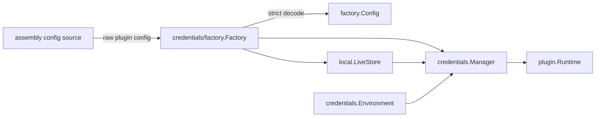

# Credentials 组合根

`credentials/factory` 拥有 Credentials Plugin 的配置解码和实例构造。详细契约见[22 Credentials 与 API Key 管理](../../zh-CN/22-credentials-and-api-key-management.md)，实施证据见[08 实施进度](../../zh-CN/08-implementation-progress.md)。

## 职责

- 严格解码并校验 `factory.Config`；
- 选择并构造 `credentials/local.LiveStore`；
- 注入只读的 `credentials.Environment`；
- 构造直接实现 Plugin 和 `credentials.Provider` 的 `credentials.Manager`。

本包不读取 CLI、环境变量或服务端配置文件，不挂载 Plugin，也不实现凭据优先级或文件 I/O。

## 构造流程

Factory 在 `Create` 返回前完成解码、路径校验、LiveStore 初始化和 Manager 构造。失败时不会向 Runtime 交付部分实例。
