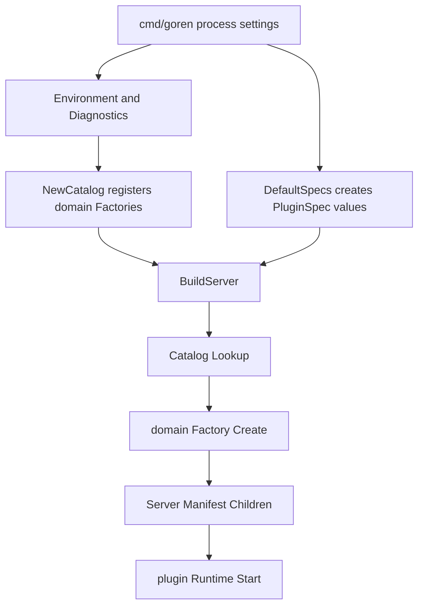

# Server Assembly

`internal/assembly` 是 Goren 进程的 composition root。权威边界见[09 Plugin Runtime 与 Server Assembly](../../zh-CN/09-plugin-runtime-and-server-assembly.md)，完成证据见[08 实施进度](../../zh-CN/08-implementation-progress.md)。

## 职责与非职责

本包负责：

- 把进程环境适配为各领域 Factory 所需的技术依赖；
- 注册 shipped、静态链接的 `plugin/factory.Catalog`；
- 形成默认 `PluginSpec` 部署声明；
- 通过领域 Factory 构造完整且尚未激活的 `Server` Plugin 树；
- 把多领域 contained failure 转给一个进程 diagnostics sink；
- 向 CLI 暴露启动后的 bound address。

本包不负责配置字段解码、业务 Service、Plugin 生命周期、依赖结算、Echo route、SQLite I/O、Agent Loop、Session 决策或 LLM Provider 逻辑。每项配置、默认值、验证和实例构造都属于对应领域 Factory；Runtime 自行负责 Start、回滚与 Shutdown。

## 构造流程

`PluginSpec.Config` 是 assembly 与 Factory 之间唯一的 raw JSON 边界。BuildServer 按 spec 查 Factory、调用 Create，并验证 Factory 名与返回 Plugin 的 `Manifest.Name` 一致。空 Plugin、非法 phase、重复 endpoint 或构造失败都会终止 Build；由于此时没有 Apply，不存在需要 Runtime 回滚的资源。

`Server` 只拥有拓扑。它通过 `Manifest.Children` 声明所有 Plugin 为同一 Server Scope；Connection 使用 `ActivationCommit`，其余使用 `ActivationMain`。Server 的 Apply/Dispose 不执行领域工作。

## 上下游与失败

- 上游：`cmd/goren` 提供工作目录、存储路径、监听地址、版本和进程 failure sink；
- 下游：`plugin/factory` 与各领域 Factory；构造完成后由 `plugin.Runtime` 接管；
- Factory Create 失败：Build 返回带 Factory 名的错误；
- Runtime Start 失败：Runtime 回滚完整 Server 树；
- contained async failure：`Diagnostics` 只适配错误类型与上下文，不重新决定领域策略；
- Shutdown：CLI 直接调用 Runtime，assembly 不维护第二套 Handle 列表。

默认 SQLite adapter 由 Session Persistence 和 Workspace Factory 以 opener 形式放入各自 Plugin，数据库在 Apply 中打开。SQLite 没有独立 Factory、Manifest 或 Service。
