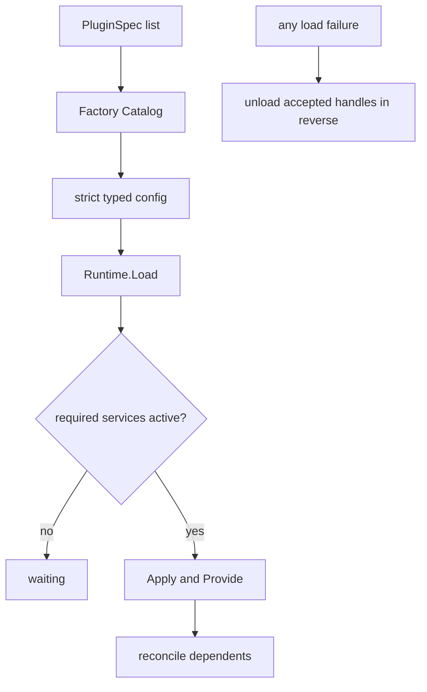

# Server Assembly 子模块

`internal/assembly` 是服务端 composition root：把静态链接的 Plugin Factory、typed config 与 consumer/provider dependency 连接起来。权威设计见[`zh-CN/09-plugin-runtime-and-server-assembly.md`](../../zh-CN/09-plugin-runtime-and-server-assembly.md)。

## 职责

- 注册 shipped Factory Catalog；
- 严格解码每个插件的 typed config；
- 声明 `Provides/Requires/Optional`；
- 构造 Provider/Consumer 并通过 Plugin Runtime 结算；
- 组合默认 server slice，失败时反向卸载本次已声明插件。

本包不拥有任何 domain 规则、wire codec、存储逻辑或动态脚本 evaluator。`!!js` 与 Typert generator 不进入 composition。

## 工作原理

Session Projection 提供 `sessionProjections`；Session Title 消费 `sessions` 与 `sessionProjections` 后提供 `sessionTitle`；API Proxy 再消费两者。Specs 可以故意乱序，依赖结算不能依赖文件或列表顺序。

## 上下游与生命周期

- 上游：`cmd/goren` 提供进程环境和 PluginSpec。
- 下游：`plugin.Runtime` 以及各 package 的构造函数。
- Factory 只做 config 与 wiring；业务 interface 由 Consumer/Definition package 拥有。

插件 Scope 负责 effect、service 和 listener 释放。Load transaction 中任一 create/load 失败都会反向卸载已经接受的 handle；运行时替换或 shutdown 仍由 Plugin Runtime 按依赖方向停止。
