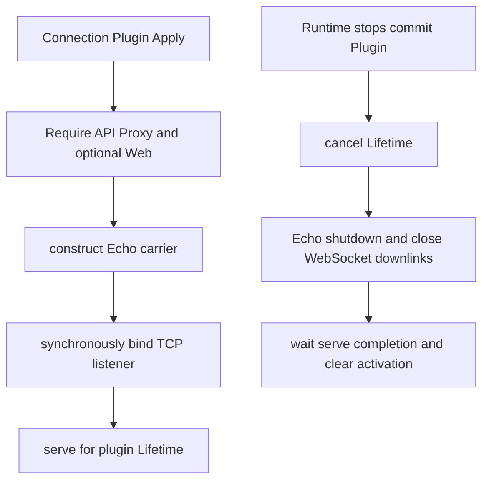

# Connection Host

`internal/connection` 是现有 TypeScript Client 对应的服务端 HTTP/WebSocket carrier，并作为 commit-phase Plugin 管理监听端口。协议责任见[06 Connection Host 模块设计](../../zh-CN/06-connection-host-module.md)，Plugin/assembly 边界见[09](../../zh-CN/09-plugin-runtime-and-server-assembly.md)。

## 职责与非职责

本包负责 Echo v5 HTTP carrier、strict envelope decode、trust fence、错误映射、Mux/Host WebSocket downlink、监听端口和连接排空。`Plugin` 依赖 `apiproxy.Service`，启用页面时再依赖 `web.Frontend`。

本包不拥有 RPC method 业务、Agent/Session、浏览器连接状态机、Plugin Factory Catalog 或 Web 页面内容。Echo 类型不越过本包。

## 生命周期

监听在 Apply 内同步完成，地址占用和权限错误会使 Runtime 启动回滚。Dispose 幂等；正常路径等待 graceful shutdown，deadline 到期时关闭 listener 和 active sockets，并聚合 cleanup 错误。WebSocket 断开只取消对应 stream，不停止共享 Runtime。

Factory 子包拥有 `listenAddress`、`trustedHosts`、`maxBodyBytes`、`gracefulTimeoutMillis` 和 `serveWeb` 的 strict Config；Connection Plugin 只接收已验证的 `PluginConfig`。
