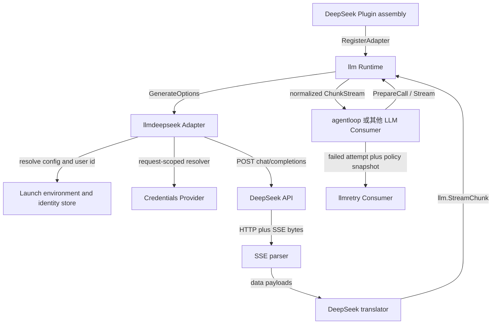
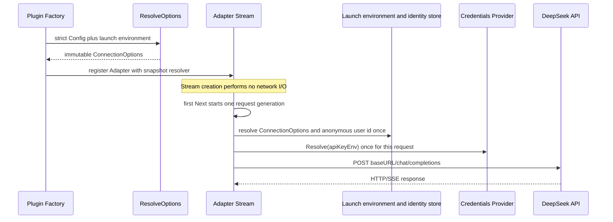
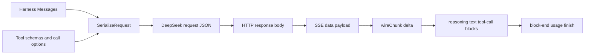
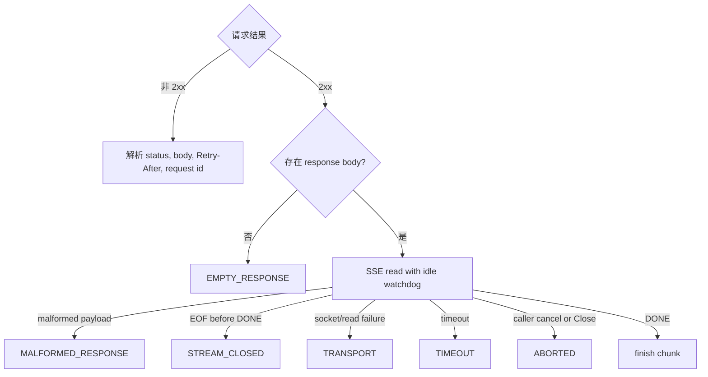

# DeepSeek Provider Adapter

`internal/llmdeepseek` 是 DeepSeek Harness `@deepseek-ai/dsh-llm-deepseek` 的 Go 对应模块。它把 provider-neutral `llm.GenerateOptions` 转换为 DeepSeek chat-completions 请求，再把 HTTP/SSE 响应归一化为 Harness `llm.StreamChunk`。

该包是仓库私有 outbound adapter，不是第二套 LLM Runtime，也不是通用 OpenAI-compatible SDK。公共 LLM contract、Adapter Registry 和 RetryPolicy 类型由 `llm` 拥有；默认重试执行由[`llmretry`](../../llmretry/README.zh-CN.md)拥有。跨模块稳定设计见[Harness LLM Runtime 与 DeepSeek Provider](../../zh-CN/13-harness-llm-runtime-and-deepseek-provider.md)，实施证据只见[实施进度](../../zh-CN/08-implementation-progress.md)。

## 1. 源实现映射

兼容基线固定为 `47f943859bef60e4160492346772ded9b24f765a`：

| TypeScript 源 | Go 位置 | 保留的责任 |
| --- | --- | --- |
| `packages/llm/llm-deepseek/src/index.ts` | `config.go`、`config_codec.go`、`config_resolve.go`、`model_catalog.go` | owner config、默认值、model metadata、Provider registration facts |
| `src/adapter.ts` | `adapter.go`、`stream.go`、`request.go`、`http_error.go` | lazy stream、HTTP、credential、timeout、错误和取消 |
| `src/serialize.ts` | `serialize.go`、`request_serialization.go` | Harness Message/ToolSchema 到 request wire 的单向映射 |
| `src/sse.ts` | `sse.go` | SSE framing、comment activity、`[DONE]` 和 idle timeout |
| `src/translate.ts` | `translate.go`、`response_mapping.go` | provider delta 到 StreamChunk、usage 和 finish 的状态机 |
| `src/types.ts` | `wire.go` | DeepSeek 私有 request/response DTO |
| `src/invariant.ts` | 各 owner 的 validation/codec | config、request 和 response 不变量 |

Go 不复制 TypeScript `fetch`、Cordis Service、Zod/Schemastery 或 OpenAI SDK。`net/http` 只作为 outbound transport primitive，通过 `RequestSender` 注入测试或其他 transport 实现。

## 2. 职责与非职责

本模块拥有：

- canonical route `deepseek-official` 的 direct chat-completions Adapter；
- DeepSeek typed config 的严格 decode、默认值和 immutable `ConnectionOptions` snapshot；
- model catalog、Provider metadata、exact model capability 与 Provider RetryPolicy snapshot；
- Message、ToolSchema、thinking/reasoning、stop 和 purpose header 的 wire serialization；
- API key reference 的请求时解析与 header-safe 校验；
- `POST {baseURL}/chat/completions`、HTTP status/error body、`Retry-After` 和 request ID 映射；
- SSE framing、idle watchdog、delta translation、usage、finish 和 response body lifecycle；
- Adapter replacement 时仍保持 in-flight request generation 一致。

本模块不拥有：

- Agent Turn/Step、请求重建、Tool execution 或 retry attempt；
- Adapter Registry、`llm/stream` waterfall 或 provider-neutral BlockAssembler；
- RetryPolicy 的 delay、jitter、次数预算和 durable retry event；
- Session append、surface、JSONL、SQLite/sqlc 或 crash repair；
- inbound Echo/HTTP、WebSocket、API Proxy、Web UI、SDK 或浏览器 Connection；
- 在线 model catalog 刷新。当前 catalog 是可替换的配置 metadata，不是网络事实源。

## 3. 包内结构

| 文件 / 组件 | 单一职责 |
| --- | --- |
| `config.go` | owner config、resolved connection value 与常量 |
| `config_codec.go` | omission/null/unknown field 的严格 JSON codec |
| `config_resolve.go` | 环境优先级、默认值、组合约束和 atomic validation |
| `model_catalog.go` | Provider metadata、model capability 和 RetryPolicy exposure |
| `adapter.go` | Adapter 构造、依赖注入和 lazy `Stream` 入口 |
| `stream.go` | 单次 stream generation、first `Next` 初始化、terminal 和 `Close` |
| `request.go` | credential/identity、request headers、send、timeout 和 SSE bridge |
| `http_error.go` | HTTP/provider error code、Retry-After 和 request ID |
| `serialize.go` | Message/content 到 provider message 的映射 |
| `request_serialization.go` | 完整 chat-completions body 和 thinking resolution |
| `wire.go` | 仅包内可见的 DeepSeek JSON DTO |
| `sse.go` | byte stream 到 SSE data payload |
| `translate.go` | payload 到 ordered StreamChunk 的有状态转换 |
| `response_mapping.go` | finish reason 与 token usage 的纯映射 |

解析和转换分层很重要：SSE parser 不理解 JSON payload，translator 不负责网络和 credential，provider wire DTO 不进入 `llm` 公共 contract。

## 4. 上下游交互

composition root 提供 `llm` Service 后再创建 DeepSeek Adapter，并把 route、configurable Provider metadata 与 Adapter registration 都绑定到 DeepSeek Plugin Scope。卸载只撤回该 Plugin 的 contributions，不销毁整个 LLM Runtime。

## 5. 配置与请求 generation

配置只保存 credential reference，不保存明文 API key。主要字段包括 `apiKeyEnv`、`baseURL`、`thinking`、`reasoningEffort`、`maxTokens`、`defaultContextWindow`、`models`、`streamIdleTimeoutMs` 和 `retryPolicy`。默认引用是 `DEEPSEEK_API_KEY`，由 composition 注入的 Credentials Provider 在每次请求开始时解析；默认 base URL 是 `https://api.deepseek.com`。Credentials precedence、LiveStore 与 Host API 由[22 Credentials 与 API Key 管理](../../zh-CN/22-credentials-and-api-key-management.md)拥有。

同一次 stream 在首次 `Next` 时只解析一次 connection、credential 和 identity，此后保持该 generation。配置 replacement 影响下一次 stream，不会让进行中的请求混用两个 endpoint、key 或 policy。

strict config 在 Plugin 创建前拒绝 unknown field、显式 `null`、空 credential reference、重复 model、越界整数、非法 thinking/effort 组合、非法 timeout 和 retry union。`baseURL` 的优先级是显式 config、启动环境 `DEEPSEEK_BASE_URL`、官方默认值；无法形成 HTTP request 的 endpoint 在第一次真实请求开始时失败。

## 6. Serialization 与流转换

请求固定 `stream=true` 和 `stream_options.include_usage=true`。system prompt 位于消息序列首部；text、reasoning replay、tool call 和 tool result 按 DeepSeek wire 规则映射。direct route 不接受 image；无法表达的内容在 I/O 前失败。

translator 按首次出现顺序为 reasoning、text 和每个 provider tool-call index 分配 Harness block index。delta 立即输出；`block-end`、最终 usage 和 finish 延后到 `[DONE]`，因此 incomplete stream 不会伪造完整 block。usage-only 尾块可以覆盖更早的 usage，prompt cache 与 reasoning token 使用独立字段，避免重复计数。

## 7. 错误、取消与资源生命周期

HTTP 和 provider error 被映射为结构化 `llm.LlmFailure`；Adapter 不解析自己的错误来重试。Runtime/Agent Loop 把失败送到 `agent/request-error`，再由 `llmretry` 执行 Provider policy。

请求 context、单次 `Next` context 和 `ChunkStream.Close` 都会取消 owned operation 并关闭 response body。terminal finish 或 error 只发生一次；之后的 `Next` 返回 exhausted。Adapter/Plugin 卸载不取消其他 Adapter 或整个 LLM Service。

## 8. 可复用 response recordings

`testdata/recordings/` 保存三类脱敏、确定性的原始 HTTP replay 输入：

- `text-success.http`：与固定 TS `textEvents` 一致的首块签名、text、usage、finish 和 `[DONE]`；
- `rate-limit.http`：429、JSON provider error、HTTP-date `Retry-After` 和 request ID；
- `partial-transport.http`：已经产生 partial content 后连接故障。

这些 recordings 由原有 Adapter 端到端测试直接读取，因此没有第二套重复断言。它们用于稳定复现 framing、header 和 failure boundary，不包含 credential、用户内容或真实 request ID，也不等同真实 DeepSeek endpoint 抓包或环境验收。新增 recording 必须保持原始 carrier 语义，并写入 package-local `testdata`，不能进入生产包或 Session 日志。

## 9. 扩展规则

- 新 DeepSeek wire field 先由固定源或真实脱敏响应证明，再进入私有 wire DTO 和 mapper；
- 新 Provider 实现自己的 `llm.Adapter` Plugin，不向本包增加 vendor switch；
- Credentials Service 已通过 resolver 接入；未来 Settings Service 只替换 live options 来源，不改变 Adapter 或 Agent—LLM contract；
- transport instrumentation 通过 `RequestSender` 或 request boundary 注入，不让 domain/runtime 依赖 HTTP DTO；
- RetryPolicy 仍随 Provider registration 暴露，执行逻辑不能回填本包；
- 真实 endpoint smoke 必须显式使用环境 credential、自跳过且单独记录，deterministic recording 不能提升为 `Environment Verified`。
