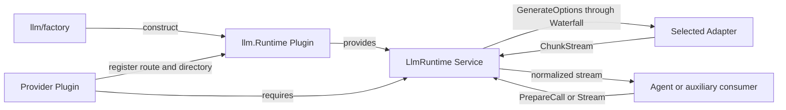

# LLM Runtime

`llm` 拥有 provider-neutral 的 Harness LLM Service。`Runtime` 本身就是 Plugin 和 `LlmRuntime` Service provider；它管理 Adapter route、configurable Provider 目录、模型发现、调用准备、`llm/stream` Waterfall、流失败归一化以及拓扑变更事件。稳定跨模块契约见[13 Harness LLM Runtime 与 DeepSeek Provider](../zh-CN/13-harness-llm-runtime-and-deepseek-provider.md)，实现证据只见[08 实施进度](../zh-CN/08-implementation-progress.md)。

## 职责边界

本包拥有 Message、ContentBlock、GenerateOptions、StreamChunk、FinishReason、RetryPolicy、Adapter 扩展接口和 `BlockAssembler`。它不拥有任何供应商 JSON/HTTP/SSE、credential 存储、Agent retry 编排、Session persistence 或 API Proxy wire projection。

调用方只依赖 `LlmRuntime`。Provider Plugin 实现最小 `Adapter`，按需实现 metadata、retry policy 或 model catalog 接口，并通过 `RegisterAdapter`/`RegisterConfigurableProviders` 取得自己拥有的 typed handle。注册 API 不接收 Plugin Scope；Provider 在 `Dispose` 中释放 handle，Runtime 只负责注册表不变量和拓扑事件。

## 运行模型

`PrepareCall` 把 route、effective config、RetryPolicy 和 Adapter registration identity 固定到一次 one-shot 调用；普通 `Stream` 在调用时读取 live route。`GenerateOptions -> StreamOutput` 是 `llm/stream` 的 typed Waterfall 合约。业务中间件只有调用下游 Action 才会进入 Adapter 边界。

Adapter route、目录和 discovery entry 都有独立 handle，支持 replace/release。重复 route、无效 metadata 或 topology invariant 失败不会产生部分提交。`llm/adapters-updated` 的非 invariant observer 失败由可选 `ObserverFailureReporter` 隔离报告；invariant 失败会回滚当前注册操作。

取消只终止当前调用或 stream，不撤销共享注册。`ChunkStream.Close`、terminal chunk 和上游错误都收敛到单一终止边界；Adapter 同步失败或中途错误被归一化为 Harness terminal stream。Plugin 卸载关闭注册变更并清空 Runtime 持有的引用。

## 依赖方向与扩展规则

- `llm/factory` 只依赖 `llm` 和 Plugin 构造契约；Assembly 只注册该 Factory。
- 仓库内置 Provider 位于 `internal/llm/<provider>`，只能依赖根 `llm` contract，不得反向进入 `llm`。
- Agent、Session 和 API Proxy 通过各自 consumer-owned interface 或 `LlmRuntime` 消费能力，不依赖具体 Provider。
- 新 Provider 不得复制 Message/Stream、RetryPolicy、Registry 或 Agent loop，也不得把供应商 wire DTO 暴露给消费者。
