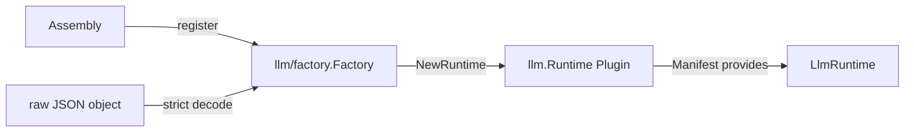

# LLM Runtime Factory

`llm/factory` 是 LLM 领域的构造边界。它拥有 canonical `@deepseek-ai/dsh-llm` Factory、空的 typed `Config`、严格 JSON object 解码和 `llm.Runtime` 构造；Assembly 只负责注册 Factory 和传入原始服务配置，不复制 LLM 创建逻辑。

Factory 拒绝非 object、未知字段、重复字段、多 JSON value 和已取消的创建 context。`ObserverFailureReporter` 是 Runtime 的可选技术协作者，只接收已隔离的非 invariant topology observer 失败；它不参与业务事件分发。

Factory 不挂载 Plugin、不解析其他领域配置、不选择 Provider，也不持有运行时生命周期。Plugin 的启动、依赖结算、回滚和卸载由[`plugin`](../../plugin/README.zh-CN.md)负责；LLM/Provider 稳定设计见[13](../../zh-CN/13-harness-llm-runtime-and-deepseek-provider.md)，实施证据只见[08](../../zh-CN/08-implementation-progress.md)。
