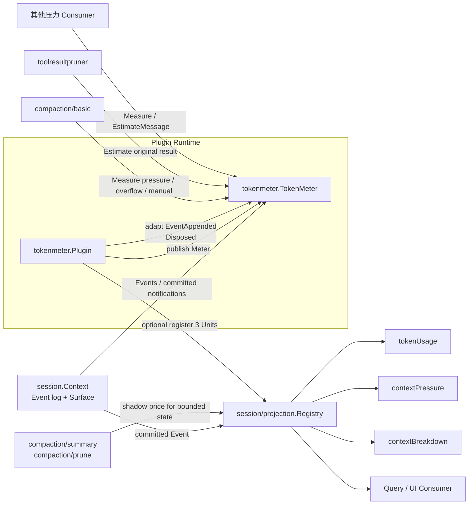
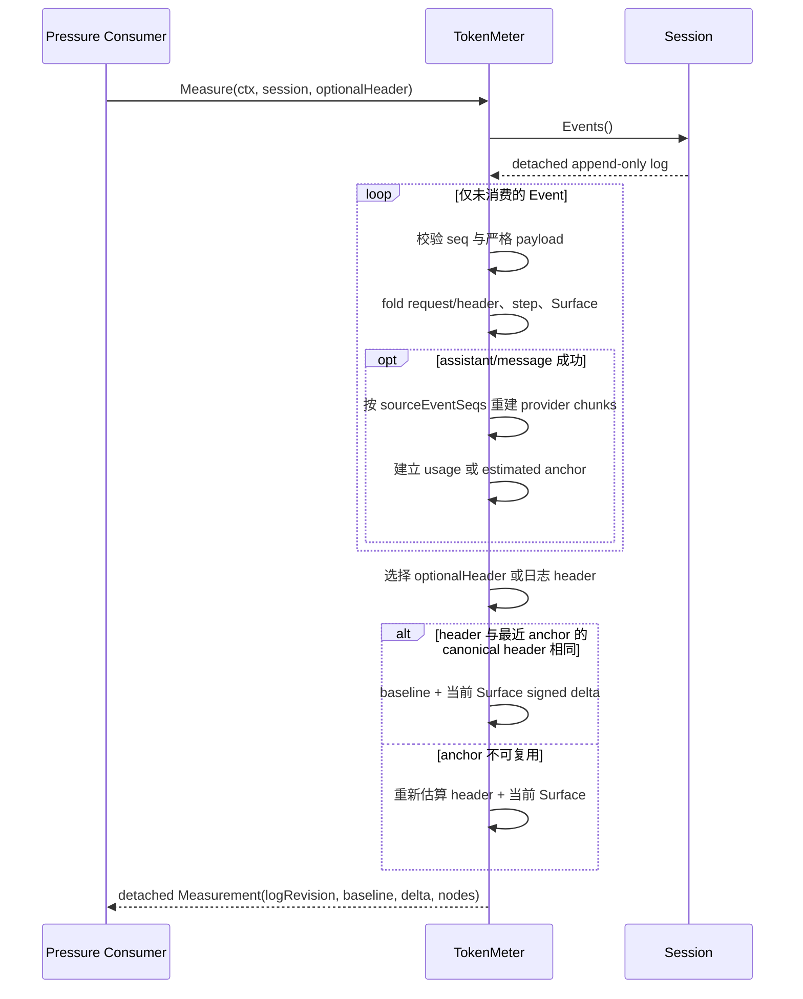
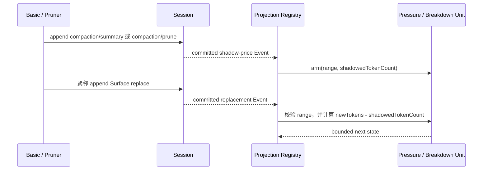
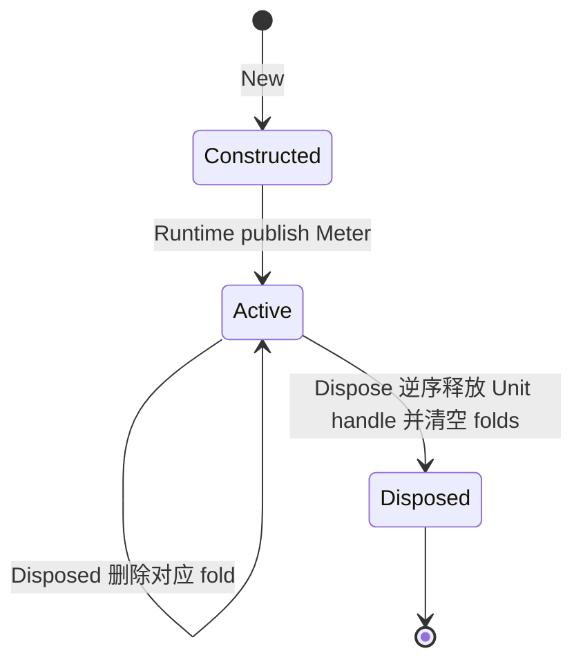

# Token Meter

状态：核心计量、replay fold 和三个可选 Projection 已实现；已进入默认 composition。`compaction/basic` 在 pressure/overflow/manual 策略中主动调用 `Meter.Measure`，`compaction/toolresultpruner` 使用 `EstimateMessage` 为被替换的 Tool result 记录 shadow price。

本包拥有 Host 级单例 `tokenmeter.Meter` Service。它把 append-only Session log、当前 Surface、最近一次模型 usage 和当前 request header 归一为同一口径的 token 压力快照，供 Compaction 等压力敏感的 Consumer 使用。

权威 Compaction 架构见 [24 Context Compaction](../../zh-CN/24-context-compaction.md)，逐项状态和验收 Gate 见 [25 Context Compaction 实现进度](../../zh-CN/25-context-compaction-implementation-progress.md)，全仓只在 [08 实施进度](../../zh-CN/08-implementation-progress.md)保留总体进度。

## 1. 主要解决的问题

Token Meter 解决的不是“把当前消息重新数一遍”这么简单，而是以下四个问题：

1. **统一 Compaction 的压力判断口径**：Basic Compaction、Tool Result Pruner 或未来其他 Consumer 不各自实现 tokenizer、usage 合并和 Surface 计价。
2. **把 Provider usage 与后续日志变化接起来**：Provider usage 只描述某次已经完成的模型调用；此后 Session 还可能 append 新消息或 replace 历史 Surface。Meter 以最近可复用的 usage/估算值为 baseline，再叠加之后的 signed Surface delta，得到当前压力。
3. **支持冷启动与 durable replay**：计量结果不依赖仅存在于内存中的 Agent 状态。Meter 可以从 Session Event log 重建 request header、Step、assistant provenance 和当前 Surface 价格。
4. **将业务判断与查询展示分开**：`Meter.Measure` 是 Compaction gating 的唯一计量权威；`tokenUsage`、`contextPressure`、`contextBreakdown` 是可重建的查询 Projection，不能反向驱动 Compaction。

它不提供精确的模型 tokenizer 结果，也不是账单、配额或成本记录。不同 Provider/模型的真实分词可能不同；本包优先保证跨 replay、replacement 和不同 Consumer 的稳定一致口径。

## 2. 职责与非职责

### 2.1 本包负责

- 发布单例 `Meter` Service；
- 从 Session log 增量 replay request header、Step、assistant success 和 Surface append/replace；
- 用固定 estimator 给 system prompt、Tool schema 和 Message 定价；
- 在满足条件时复用 Provider usage，无法安全复用时回退到固定估算；
- 返回绑定 `logRevision` 的 detached `Measurement`；
- 在可选 `session/projection.Registry` 存在时注册三个 Token Meter Projection Unit；
- 在 Session dispose 或 Plugin dispose 时释放可重建的内存状态。

### 2.2 本包不负责

- 不决定何时 Compaction、选取哪个压缩区间或是否重试模型请求；
- 不执行摘要、Tool Result 裁剪或 Surface mutation；
- 不拥有 LLM route、context window 配置、Provider tokenizer 或 usage 生成；
- 不持久化权威业务数据；Projection checkpoint 只是可丢弃、可重建的缓存；
- 不要求 Session Projection Registry 必须存在；没有 Registry 时核心 `Meter` 仍可独立工作。

## 3. 架构与模块交互



### 3.1 交互模块与契约

| 模块 | 谁主动调用谁 | 使用的契约 | 当前状态 |
| --- | --- | --- | --- |
| Plugin Runtime | Runtime 装载 `tokenmeter.Plugin`，Plugin 发布内部 `TokenMeter` | `plugin.Manifest`、`Apply`、`Dispose` | 已实现 |
| Session | Session commit 后由 Runtime 把 `EventAppended` 交给 Plugin；Plugin 转发给 `TokenMeter` | append-only Event、Surface operation、Session dispose | 已实现 |
| `compaction/basic` | Basic Provider 从 Runtime 获取 `Meter`，压缩策略主动调用 `Measure` | `Meter.Measure` | 已实现并默认启用 |
| `compaction/toolresultpruner` | Pruner 从 Runtime 获取 `Meter`，为原 Tool result 计算 shadow price | `Meter.EstimateMessage` | 已实现并默认启用 |
| 其他同步 Consumer | Consumer 主动调用 `Measure` 或 `EstimateMessage` | `Meter` | 扩展契约已实现 |
| Session Projection Registry | Token Meter Plugin 在 `Apply` 时注册三个 Unit；Registry 主动把 committed Event 折叠进 Unit | `session/projection.Unit` | 已实现，可选依赖 |
| Query/UI | Query/UI 通过 Registry snapshot/checkpoint 读取 Projection | `tokenUsage`、`contextPressure`、`contextBreakdown` JSON value | Projection 已实现；仓库当前没有生产 UI Consumer |
| Compaction Event | Basic/Pruner 在 replacement 前写入 summary/prune shadow price；Projection Unit 消费它 | `compaction/summary`、`compaction/prune` | 生产与消费两端均已实现 |

`TokenMeter` 核心与 Projection Registry 是两条并行消费链：前者保留 positional Surface nodes，能直接计算 replace 删除的旧节点价格；后者为了让 checkpoint 保持有界，不保存所有节点，因此通过紧邻 replacement 的 `shadowedTokenCount` 扣除旧区间。

## 4. 公共计量契约

### 4.1 `Measure`

```go
Measure(context.Context, session.Context, *session.EpochHeader) (Measurement, error)
```

输入：

- `Context`：控制本次增量 replay 的取消；
- `Session`：权威 append-only Event log 和当前 Surface 的 owner；
- 可选 `EpochHeader`：调用方准备计量的 request header。传 `nil` 时使用日志里最后一个 `request/header`。

输出字段：

- `logRevision`：本快照已经消费的 Event 数；
- `baseline`：最近可复用的 Provider usage 或固定估算 anchor；
- `surfaceDeltaTokens`：anchor 之后 Surface 变化的有符号 token 差；
- `totalTokens`：`baseline.tokens + surfaceDeltaTokens` 的非负结果；
- `surfaceTokens`：当前 Surface 所有节点的固定估算总价；
- `nodes`：按当前 Surface 位置排列的 `{seq, tokens}`，供 Compaction 按位置选择和定价区间。

返回的 usage、header 和 nodes 都会复制，调用方修改快照不会污染 Meter 的 replay 状态。同一 Session 的后续调用只折叠尚未消费的 Event；结果仍以 `logRevision` 标明精确读点。

### 4.2 `EstimateMessage`

```go
EstimateMessage(llm.Message) (int64, error)
```

它使用与 `Measure` 完全相同的固定 estimator，适合 Consumer 对候选 Message 做同口径预估。它只估算传入 Message，不读取 Session，也不建立或更新 usage baseline。

## 5. 固定 estimator 的含义

当前 estimator 按 DeepSeek Harness 的固定近似口径实现：

- 字符数使用 **UTF-16 code unit**，token 近似值为 `ceil(codeUnits / 4)`；
- 每个 content block 加 `4` token 结构开销；
- 每条 Message 或 system role 加 `4` token role 开销；
- Tool schema 先按不转义 HTML 的 JSON 编码，再按字符估算，并加一个 block 开销；
- Text、Reasoning、Tool Call 和 Tool Result 使用各自的稳定字段；未知扩展 block 按完整 JSON 估算；
- 所有计数都限制在 JavaScript safe integer 范围内，负数或溢出显式报错。

“每四字符约一个 token”只是固定启发式，不是说所有语言真实分词都遵守 4:1。常见汉字通常占一个 UTF-16 code unit，因此在这个估算器里四个常见汉字约算一个 token；补充平面字符通常占两个 code unit。真实 DeepSeek tokenizer 对中文、英文、代码和 JSON 的切分都可能明显不同。使用这个规则的目的，是在拿不到可信 Provider usage 时仍得到确定、可 replay、跨模块一致的压力近似。

## 6. `Measure` 交互流程



### 6.1 baseline 选择

- 空日志、无 header 且空 Surface 时为 `none`；
- 没有可信 Provider usage、header 不匹配或 usage 低于完整 heuristic anchor 时为 `estimated`；
- 只有成功 assistant 所属的 canonical header 与当前计量 header 相同，并且 Provider usage 总量不低于完整 heuristic anchor 时，才使用 `usage`；
- usage baseline 包含 input、cache read、cache write 和 output；后续 append/replace 通过 `surfaceDeltaTokens` 调整；
- `SourceEventSeqs` 缺失表示旧数据没有 provider chunk provenance，Meter 用 durable assistant 估算；显式空数组表示已知 provider 原始输出为空，后写入的 durable assistant 内容作为 anchor 之后的 Surface delta 处理。

## 7. 三个 Projection

三个 Projection 都是 Registry 驱动的纯 Event fold。它们用于查询和展示，不是 `Meter.Measure` 的缓存，也不是 Compaction 的判断输入。

### 7.1 `tokenUsage`

累计 Provider 报告的：

- `uncachedInputTokens`；
- `outputTokens`；
- `cacheReadTokens`；
- `cacheWriteTokens`。

Unit 同时识别 usage chunk 和最终 assistant message。同一个 turn/step 的新样本会替换该 Step 的旧样本，而不是重复累计，因此流式 usage 与最终 usage 可以安全收敛。

### 7.2 `contextPressure`

提供：

- 最近一次 Provider usage 的 prompt pressure，即 input + cache read + cache write；
- 从该 usage 样本到当前 Surface 的 signed delta 推导出的 `projectedTokens`；
- 最近一个 `request/context` 中的 `contextWindow`。

这里故意不把 output 加入 prompt pressure；它表达下一次请求上下文占用的展示近似。它与 `Measurement.totalTokens` 的语义不同，不能互换。

### 7.3 `contextBreakdown`

使用固定 estimator 展示当前请求组成：

- `systemTokens`；
- `toolsTokens`；
- `messageTokens`。

其中 `messageTokens` 跟随当前 Surface append/replace，`systemTokens` 和 `toolsTokens` 跟随最后一个 canonical request header。

### 7.4 Projection 与 replacement



shadow price claim 与 replacement range 不一致时返回显式错误。权威 Session Event 已经 commit，Projection 失败不会回滚日志；Registry 的状态是派生缓存，可从修复后的合法日志或 checkpoint 重新建立。

## 8. Plugin 生命周期

`tokenmeter.Plugin` 只拥有 Runtime effect，不实现 `Meter` 业务接口；内部命名对象 `TokenMeter` 才拥有 estimator 和 per-Session replay fold。



- Factory 配置固定为空对象，未知 key 会被严格拒绝；
- Projection Registry 不存在时 `Apply` 成功，Meter 继续工作；
- 注册三个 Unit 的中途失败会逆序释放已经取得的 handle；
- Session Event 只有在该 Session 已经被 `Measure` 分配 fold 后才触发 eager 增量；从未计量的 Session 不会因为全局事件流而占用 fold；
- unload 时先逆序释放 Projection effect，再清空所有 replay fold。

## 9. 失败、取消与一致性

- `Measure` 在开始和逐 Event replay 时检查 Context；取消会立即返回，不伪造部分结果；
- Event seq 不连续、Step 边界不匹配、assistant 不属于打开的 Step、usage 为负数或超出 safe integer、Surface range 不存在等情况均显式报错；
- 单个 Event 的 fold 先计算 next state，全部校验通过后才推进 revision，失败后重试不会从半更新状态继续；
- Meter 不把损坏日志静默重置为零，也不退回另一条兼容路径；
- Plugin 收到的是 post-commit Session 事实，因此事件观察或 Projection 失败不会撤销已经提交的 Session Event；错误由现有 Runtime/PostCommit failure 边界报告；
- per-Session fold 和返回快照都受并发保护，Session dispose 会解除引用以允许回收。

## 10. 实现与验证证据

- estimator：`estimate.go`、`estimate_test.go`；
- replay、baseline、Surface 和 immutable snapshot：`token_meter.go`、`surface.go`、`token_meter_test.go`；
- 严格 Event 解码与 usage 校验：`codec.go`；
- 三个 Projection：`usage_projection.go`、`pressure_projection.go`、`breakdown_projection.go`、`surface_projection.go`；
- Projection replay/checkpoint/replacement：`projection_test.go`；
- Plugin 注册、回滚和释放：`plugin.go`、`plugin_test.go`；
- strict 空配置 Factory：`factory/factory.go`、`factory/factory_test.go`。

当前证据包括 Token Meter 包级/race 测试、Compaction 与 Pruner 集成测试、默认 AgentLoop pressure/overflow/cancellation 验收以及 SQLite cold resume。具体命令与证据等级只由[25 Context Compaction 实现进度](../../zh-CN/25-context-compaction-implementation-progress.md)维护。
