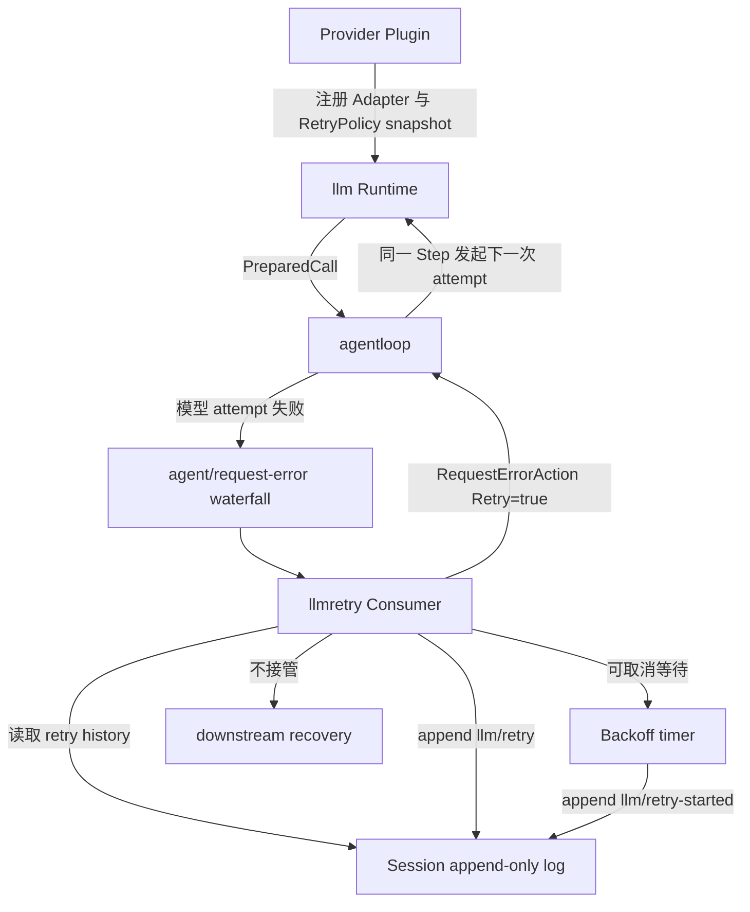
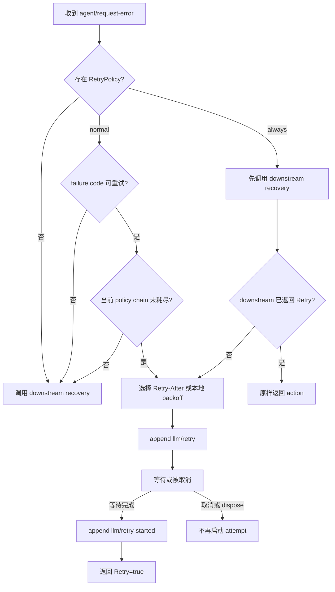
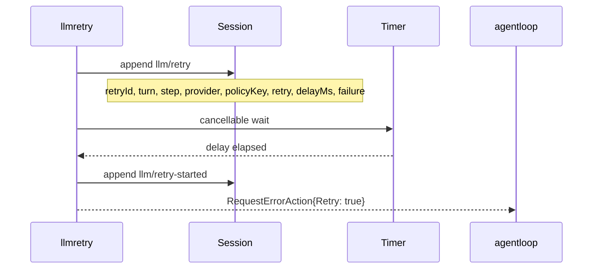
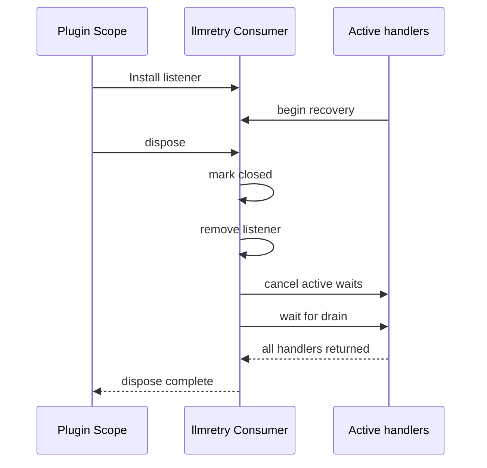

# LLM Retry Consumer

`llmretry` 是 DeepSeek Harness `@deepseek-ai/dsh-llm-retry` 的 Go 对应模块。它监听一次模型请求失败后的 `agent/request-error` waterfall，根据该请求已经绑定的 Provider `RetryPolicy` 决定是否等待并请求 Agent Loop 重试。

本模块只拥有“执行重试策略”这一段责任。`llm` 拥有策略类型和 Provider 配置，`agentloop` 拥有模型请求 attempt 及真正的重复调用，`session` 拥有事件日志。跨模块稳定契约分别见[Harness LLM Runtime 与 DeepSeek Provider](../zh-CN/13-harness-llm-runtime-and-deepseek-provider.md)和[Agent Loop 与请求驱动](../zh-CN/15-agent-loop-and-request-driver.md)，实施证据只见[实施进度](../zh-CN/08-implementation-progress.md)。

## 1. 源实现映射

兼容基线固定为 `47f943859bef60e4160492346772ded9b24f765a`，对应 TypeScript 源 owner：

| TypeScript 源 | Go 位置 | 保留的责任 |
| --- | --- | --- |
| `packages/llm/llm-retry/src/index.ts` | `consumer.go` | Plugin listener、normal/always 分派、等待、取消和 teardown |
| `packages/llm/llm-retry/src/types.ts` | `types.go` | `llm/retry`、`llm/retry-started` durable event payload |
| `packages/llm/llm-retry/src/history.ts` | `history.go` | 从 Session 事件恢复 retry chain、计数和 schedule/start 配对 |
| `packages/llm/llm-retry/src/invariant.ts` | `history.go`、`types.go` | event shape、Turn/Step/Provider 和链路顺序不变量 |
| 源 policy/backoff helpers | `policy.go` | policy identity、retryable code、指数退避和 jitter |

Go 版本使用 interface 表达 `llm.RetryPolicy` 和 `agent.RequestErrorHandler`，不复制 Cordis、Schemastery、JavaScript timer 或动态表达式。

## 2. 职责与非职责

`llmretry` 拥有：

- `agent/request-error` 的默认 Provider-aware Consumer；
- normal/always 两种 policy 的执行顺序、次数预算与 downstream 委托；
- Provider `Retry-After` 和本地指数退避之间的选择；
- 同一 Turn/Step/Provider/policy 的稳定 retry chain identity；
- `llm/retry` 与 `llm/retry-started` durable facts；
- 等待期间的取消，以及 Plugin dispose 时撤销 listener、取消等待和 drain active handler；
- 对已有 Session retry history 的顺序投影与不变量校验。

`llmretry` 不拥有：

- Provider 的 `retryPolicy` 配置、默认值或错误分类；这些属于 `llm` 和具体 Provider；
- 模型请求、StreamChunk 消费或下一次 attempt；这些属于 `agentloop`；
- Session `seq`、append、load、repair、JSONL 或 SQLite/sqlc；这些属于 Session 与存储 adapter；
- DeepSeek HTTP/SSE、credential、wire payload 或 API endpoint；
- Surface event。retry facts 用于审计和恢复，不进入模型可见消息 surface。

因此本模块的 typed config 是严格空对象。把 `retryPolicy` 写到本模块配置会被拒绝；策略必须随 Provider registration 配置并在 `llm.PrepareCall` 时形成 detached snapshot。

## 3. 包内结构

| 文件 | 单一职责 |
| --- | --- |
| `config.go` | 严格空配置及错误归属提示 |
| `consumer.go` | listener 安装、policy 分派、schedule/wait/start 与生命周期收敛 |
| `policy.go` | policy key、retryable 判断、指数退避和 jitter 计算 |
| `history.go` | Session 事件的一次有序投影与 retry chain 不变量 |
| `types.go` | durable event 的封闭类型、codec 和字段校验 |

`history.go` 只读取通用 `session.Event`。它不调用存储 adapter，也不决定如何修复历史；这样 JSONL、SQLite 等 adapter 只需持久化原始业务事件，不会侵入重试业务逻辑。

## 4. 上下游交互

上游只提供失败事实：Agent、Turn、Step、Provider、`LlmFailure` 和 prepared call 捕获的 `RetryPolicy`。本模块不会再次查询 live Provider 配置，因此 Adapter replacement 不会改变已经失败的请求所使用的策略。

下游收到的不是模型调用，而是 `RequestErrorAction`。只有本模块或其他 recovery Consumer 明确返回 `Retry=true`，Agent Loop 才会在同一 Step 发起新 attempt。

## 5. 决策流程

normal policy 只接管配置中的 retryable code，并受 `maxRetries` 限制。always policy 先给更专门的 downstream recovery 机会；只有 downstream 未接管或发生已上报的 recovery failure 时，才使用本地无限重试策略。这样后注册的专门 recovery 可以覆盖默认行为，而默认 Consumer 仍提供兜底。

延迟选择规则：

1. `failure.providerRetryAfterMs` 为正有限值且不超过 policy `maxDelayMs` 时，原样使用；
2. Provider delay 超过上限时，normal policy 委托 downstream，always policy 改用本地 backoff；
3. 本地 delay 为 `min(initialDelayMs * 2^(retry-1), maxDelayMs)`，再应用 `[1-jitterRatio, 1+jitterRatio]` 区间的随机抖动并最终封顶。

## 6. Durable event 与恢复投影

每个实际等待由一对非 surface event 表示：

`llm/retry` 在等待前提交，说明 retry 已经排期；`llm/retry-started` 只在等待完整结束后提交，说明 Agent Loop 可以开始下一次 attempt。取消发生在两者之间时只保留 schedule fact，不伪造 started fact。

`ValidateHistory` 以一次有序扫描恢复并校验：

- retry 必须位于仍打开的 Turn 和 Step；
- event 中的 Provider 必须等于该请求 header 的 effective Provider；
- 同一 `turn + step + provider + policyKey` 的 retry 从 1 连续递增并复用一个 `retryId`；
- 一个 `retryId` 不能属于另一条 chain；
- 每个 `llm/retry-started` 必须匹配此前 schedule，且不能重复。

当前投影用于执行前预算恢复和历史校验，不负责进程重启后自动恢复未完成 timer。cold load、crash repair 和 pending retry 恢复必须由 Session Persistence/Recovery 阶段定义，不能由存储 adapter 猜测。

## 7. 取消与生命周期

请求 context 取消与 Plugin lifetime 取消都会终止 backoff。dispose 先禁止新的 captured callback 进入，再撤销 listener、取消已有等待并等待 active handler 退出；它不会让已卸载 Plugin 在后台晚到地触发 retry。

## 8. 装配与扩展规则

composition root 以 canonical Factory `@deepseek-ai/dsh-llm-retry` 装配本模块。它要求 `agents` Service 已存在，不提供新的 Service，只注册 owned event listener；默认 spec 位于 Agent Loop 之前，使随后注册的 recovery 成为 waterfall downstream。

扩展本模块时遵守以下边界：

- 新 Provider 只需注册自己的 `llm.RetryPolicy`，不能依赖 `llmretry` concrete type；
- 新 recovery 通过 `agent/request-error` waterfall 组合，不能修改 Agent Loop 的 vendor branch；
- 新 policy mode 必须同步扩展 policy union、policy key、durable record union、history invariant 和固定源差分证据；
- 新存储 adapter 只编码/解码 Session event，不复制 retry count、delay 或 chain 决策；
- 只有会改变客户端可见协议时才进入 API/Connection 层，retry audit event 本身保持非 surface。

## 9. 验证边界

包内测试负责 normal/always 分派、次数预算、Retry-After、本地 backoff、jitter、取消、dispose/drain、durable codec 与 history invariant。仓库级 contract 测试负责把固定 TypeScript runtime 的 observation 与 Go 行为交叉比较。真实 DeepSeek endpoint smoke 单独验收，不能由 deterministic fake 或跨语言 differential 代替。
