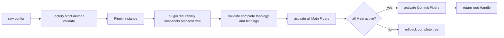

# Plugin Runtime

plugin 是 Goren 的 typed Plugin 运行时底座，负责 Plugin/Fiber 生命周期、Scope 可见性、Service 依赖、Waterfall 洋葱扩展、Event 事实分发和逆序回滚。总体设计见[Go Cordis 风格通用 Plugin 事件领域框架设计](../zh-CN/Go_Cordis_风格插件事件领域运行时设计方案.md)，实施状态以[08 实施进度](../zh-CN/08-implementation-progress.md)为准。

## 职责

本包负责：

- 接收已构造的静态 Plugin；
- 递归读取 `Manifest.Children`，在 Runtime 准入前构造完整声明树；
- 校验完整树的对象身份、循环、Scope placement、Manifest 与对象实现；
- 按 required Service 依赖激活 Fiber；
- 自动发布和撤销 `ProvidedService`、Event、Waterfall binding；
- 实现 Service 最近 Provider、Event current-to-root、Waterfall root-to-current 路由；
- 管理 Child Fiber、完整 Main 子树 replacement、dependent-first stop 和 diagnostics；
- 在 Runtime 内部管理 Event/Waterfall 调用准入与排空；
- 对失败的完整挂载批次执行依赖安全的逆序回滚。

本包不读取配置、不查询 Catalog、不构造业务 Plugin，不拥有业务事务、Event Store、HTTP、数据库或 Goren 业务模型。factory 子包属于构造边界，不进入 Runtime 核心流程。

## 运行流程

Plugin 对象嵌入 `Base`，并实现 `Manifest`、`Apply` 和幂等 `Dispose`。`Manifest.Provides` 使用 `NewProvidedService[S](implementation)` 显式绑定命名 Service 接口与实现对象。Plugin 的 Fiber 决定 binding 在哪个 Scope 何时发布、撤销；implementation 拥有业务状态与不变量，且不要求实现 Plugin。只有两类职责确实属于同一对象时，才把 Plugin 自身作为 implementation；装配型 Plugin 应发布独立 service 对象，不能靠转发方法伪装成业务 Service。

组合型 Plugin 创建并持有自己的子 Plugin 实例，通过 `Manifest.Children` 声明 `SameScope` 或 `NestedScope` 关系。调用方只把根 Plugin 交给 `Start`、`Mount`、`MountChild` 或 `MountScopedChild`；公开 API 不暴露 Tree 或 Tree Builder。plugin 包对每个实例只读取一次 Manifest，完成整棵树校验后才进入 Runtime 准入。

普通子节点使用 `ActivationMain`。只有必须等整棵普通树就绪后才能执行、且卸载时必须先撤销的外部可见生命周期，才使用 `ActivationCommit`。Commit Plugin 不能提供 Service，避免普通依赖反向依赖提交阶段。包含 Commit 节点的子树不允许 `Replace`，因为框架无法原子回滚任意外部副作用；不含 Commit 的 Main 子树必须保持逐节点 Manifest、顺序、Scope placement 和子拓扑契约，Runtime 会先在私有 Service 视图中准备完整候选树，再一次性切换 binding。

一个监听事件的 Plugin 只实现一个 `ObserveEvent(context.Context, Event)` 入口，并在 Manifest 中通过多个 `EventOf[E]()` 声明它真正接受的 Event 类型。Runtime 只投递这些显式声明的类型；同一 Plugin 重复声明同一 Event 类型会在接纳阶段失败。Plugin 在统一入口中使用 type switch 分派到自己的具名业务方法。

Runtime 根据 Manifest 自动注册 binding。插件作者不接收暴露 Scope 或注册表的 Runtime Context 对象，不调用 Define、Observe、Use，也不保存 Registration 或 disposer。`ProvidedService` 是声明快照，不是调用期注册句柄。

Plugin 的 `Apply`、`Dispose`、Event Observer 和 Waterfall 调用不能同步修改同一个 Runtime 的拓扑；Runtime 返回 `ErrTopologyMutation`，而不是等待形成重入死锁。普通业务调用可以在回调返回后发起动态挂载。Event 和普通 Waterfall 的调用租约完全由 Runtime 管理，业务 Plugin 不调用显式准入或排空方法。

只有 `ChunkStream` 一类在方法返回后仍继续执行 Plugin 代码的惰性结果使用 `RunRetained`。返回的 `InvocationLease` 由结果 owner 包装并在终态、失败或关闭时自动 `Release`；Release 只结束该次调用，使参与 Fiber 可以排空，不停止 Plugin 或业务资源。当前 LLM Runtime 已在流包装器内部完成这一管理；普通调用使用 `Run`，在返回前直接释放准入，不创建可跨越方法边界的 lease。

## 子包

- factory：拥有 Factory/Catalog 公共构造协议与通用 JSON 边界；具名配置、字段解码、校验和 Plugin 构造仍属于各领域 Factory；
- example：只使用 plugin 公共 API 的独立示例。

## 示例

- [Service](example/service_test.go)：Plugin 用 `ProvidedService` 显式发布业务实现；
- [Scope 继承](example/scope_inheritance_test.go)：Child Fiber 继承并覆盖祖先 Service；
- [Service 与 Event](example/service_event_test.go)：Service owner 发布事实，Observer Plugin 通过 Manifest 声明监听类型；
- [Waterfall](example/waterfall_test.go)：Plugin 声明持有的 Middleware 并执行洋葱链。

## 生命周期与失败

Runtime.Start 先构造并校验所有根 Plugin 的完整声明树，再按 Service 依赖激活 Main Fiber；只有全部 Main Fiber Active 后才执行 Commit Fiber。Apply 或 binding 发布失败会取消 lifetime、撤销 binding、调用 Dispose，并回滚本批完整树。

Event 和 Waterfall 在 Runtime view 内同时取得路由快照和 Fiber 调用租约，随后释放 view 再调用 Observer、Middleware、Action 或 reporter。Unload、Replace 和 Shutdown 先撤销 binding、关闭新调用准入并等待已准入调用结束，再执行 Dispose。Runtime 在 Dispose 前取消 `plugin.Lifetime(instance)`，使后台任务能够先退出。

`DeliveryParallel` 与 `DeliveryBestEffort` 只在存在多个 Observer 时创建并发投递；零个 Observer 直接完成，单个 Observer 在当前调用中执行。这个快路径不改变错误契约：Parallel 仍向发布方返回 Observer 错误，BestEffort 仍只交给 `EventFailureReporter`，所有调用继续受同一组 Fiber 租约和排空边界保护。
