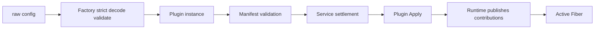
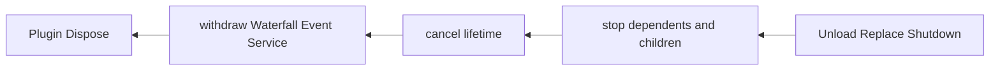

# Plugin Runtime

plugin 是 Goren 的 typed Plugin 运行时底座，负责 Plugin/Fiber 生命周期、Scope 可见性、Service 依赖、Waterfall 洋葱扩展、Event 事实分发和逆序回滚。总体设计见[Go Cordis 风格通用 Plugin 事件领域框架设计](../zh-CN/Go_Cordis_风格插件事件领域运行时设计方案.md)，实施状态以[08 实施进度](../zh-CN/08-implementation-progress.md)为准。

## 职责

本包负责：

- 接收已构造的静态 Plugin；
- 校验 Manifest 与对象实现是否一致；
- 按 required Service 依赖激活 Fiber；
- 自动发布和撤销 Service、Event、Waterfall contribution；
- 实现 Service 最近 Provider、Event current-to-root、Waterfall root-to-current 路由；
- 管理 Child Fiber、replacement、dependent-first stop 和 diagnostics；
- 通过 Runtime 私有 Effect stack 统一回滚。

本包不读取配置、不查询 Catalog、不构造业务 Plugin，不拥有业务事务、Event Store、HTTP、数据库或 Goren 业务模型。factory 子包属于构造边界，不进入 Runtime 核心流程。

## 运行流程

Plugin 对象嵌入 Base，并实现 Manifest、Apply 和幂等 Dispose。对象可以按需同时实现业务 Service interface、EventObserver 或 WaterfallMiddleware，不创建只负责 Runtime 转发的包装 Plugin。

Runtime 根据 Manifest 自动注册贡献。插件作者不接收 Context，不调用 Define、Provide、Observe、Use，也不保存 Registration 或 disposer。

## 子包

- factory：拥有具名配置、严格解码、校验与 Plugin 构造的 Factory，以及静态 Catalog；
- example：只使用 plugin 公共 API 的独立示例。

## 示例

- [Service](example/service_test.go)：Plugin 对象直接实现并提供业务 Service；
- [Scope 继承](example/scope_inheritance_test.go)：Child Fiber 继承并覆盖祖先 Service；
- [Service 与 Event](example/service_event_test.go)：Service owner 发布事实，Observer Plugin 自动绑定；
- [Waterfall](example/waterfall_test.go)：Middleware Plugin 自动绑定并执行洋葱链。

## 生命周期与失败

Runtime.Start 先接纳完整静态集合，再按 Service 依赖结算；所有 Plugin Active 后才成功。Apply 或贡献发布失败会取消 lifetime、撤销贡献、调用 Dispose，并回滚本批已经激活的 Plugin。

Event 和 Waterfall 只在 Registry 锁内取得快照，调用 Observer、Middleware、Action 或 reporter 前释放锁。Runtime 在 Dispose 前取消 plugin.Lifetime(instance)，使后台任务能够先退出。
