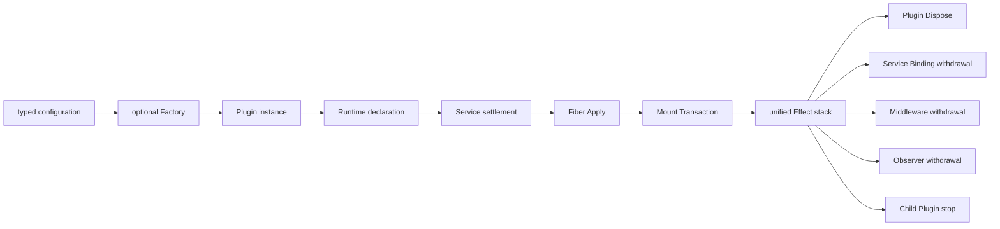

# Plugin Runtime

`plugin` 是 Goren 的 typed Plugin 运行时底座，拥有 Plugin/Fiber 生命周期、Scope 路由、Service 依赖结算、Waterfall 洋葱扩展、Event 事实分发、Effect 回滚和 Replacement。详细框架语义见[Go Cordis 风格通用 Plugin 事件领域框架设计](../zh-CN/Go_Cordis_风格插件事件领域运行时设计方案.md)，Goren 端的模块归属见[09 Plugin Runtime 与 Server Assembly](../zh-CN/09-plugin-runtime-and-server-assembly.md)，实施状态只以[08 实施进度](../zh-CN/08-implementation-progress.md)为准。

## 职责边界

本包负责：

- 加载静态链接的 `Plugin`，按 typed Service hard/optional 依赖启动 Fiber；
- 用 Mount Transaction 原子发布 Service、Waterfall、Event registration；
- 用 Scope 实现 Service 最近 Provider、Waterfall root-to-current 和 Event current-to-root 路由；
- 在 Provider 丢失、卸载、关闭和替换时按实际依赖图停止 Consumer；
- 用一个 Runtime 私有的 Fiber Effect stack 统一回收 Plugin lifecycle、registration 和 Child Plugin，并提供不可变状态诊断。

本包不读取配置、不查 Catalog、不构造业务 Plugin，不拥有领域事务、Event Store、HTTP、数据库或 Goren 业务模型。`configuration` 与 `factory` 子包属于构造边界，不进入 Runtime 核心流程。

## 运行模型

插件统一实现 `Manifest`、`Apply` 与幂等 `Dispose`。Service Provider、Service Consumer、Waterfall Middleware 和 Event Observer 按需使用，不要求每个插件实现全部角色；没有自身资源的插件让 `Dispose` 直接返回 `nil`。

以下示例集中在 `example` 子目录，彼此独立且只依赖 `plugin` 的公开 API：

- [Service](example/service_test.go)：定义、提供并获取 typed Service，同时展示 Go 接口嵌入和结构体组合；
- [Scope Service 继承](example/scope_inheritance_test.go)：Child Fiber 继承祖先 Provider，并由最近 Provider 覆盖；
- [Service 与 Event](example/service_event_test.go)：Service 完成状态变更后发布 Event，独立 Listener Plugin 注册 Observer；
- [Waterfall](example/waterfall_test.go)：登记 Middleware 并执行洋葱链。

## 生命周期与失败

hard Service 不可用时 declaration 保持 Waiting，不调用 `Apply` 或 `Dispose`。Runtime 在 `Apply` 前先登记 Plugin lifecycle effect，`Apply` 期间的 registration 保持暂存；任一步失败都会零发布、撤销 registration，并调用 Plugin `Dispose` 清理部分启动状态。`Apply` 返回后注册关闭，动态缩短生命周期必须使用 Active Fiber 加载的 Child Plugin。Child Plugin 本身进入父 Fiber 私有 effect stack；Fiber 停止时先停止实际 Consumer、取消 lifetime，再逆序撤销 registration，最后调用 Plugin `Dispose`。

Waterfall 和 Event 分发只在 Registry 锁内取得快照，执行 Middleware、Terminal、Observer 或 Plugin 代码前必须释放锁。调用方取消通过请求 `context.Context` 传播，后台资源通过 `Context.Lifetime()` 传播；无效 Context 返回已经取消的 lifetime，不会产生孤儿任务。
