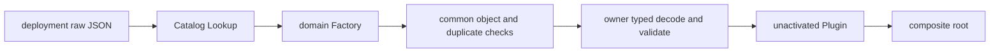

# Plugin Factory 构造边界

`plugin/factory` 定义静态链接的 Plugin 构造协议。通用生命周期见[Plugin Runtime](../README.zh-CN.md)，Goren 默认组合见[09 Plugin Runtime 与 Server Assembly](../../zh-CN/09-plugin-runtime-and-server-assembly.md)。

## 职责

- `Factory`：以 canonical name 接收 raw JSON，严格解码并返回未激活 Plugin；
- `Catalog`：保证 Factory 名称唯一，提供并发安全的 lookup 和确定性 name snapshot；
- 配置 helper：验证 Create Context、JSON object、任意深度 duplicate field 和严格空配置。

本包不读取文件或环境变量，不拥有任一领域 Config，不创建业务默认值，不 mount Plugin，也不依赖 Runtime 内部状态。unknown field、类型、范围和字段组合由具体领域 Factory 校验。

Catalog 不执行 Create，Runtime 也不查询 Catalog。raw JSON 必须在 Factory.Create 终止，不能进入 Plugin Apply 或业务 Service。
