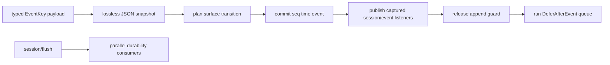

# Session 子模块

`session` 拥有 Header、append-only Event log、model-visible surface、Store 与生命周期事件。权威设计见[`zh-CN/10-session-core-and-lifecycle.md`](../zh-CN/10-session-core-and-lifecycle.md)。

## 职责与工作原理

`Session` 负责连续 seq、seed、surface 与 detached reads；`MemoryStore` 负责 live membership、attachment、created/event/disposed/flush publication。`DeferAfterEvent` 只允许在 `OnEvent` callback 中登记，用于确实需要在 publication 之后追加 follow-up fact 的 Consumer；它不是通用任务队列。

本包不拥有 Agent loop、LLM、Tool policy、API frame、JSONL/SQLite 格式或 repair policy。

## 上下游

- 上游：Agent/Application use case 通过 typed key append；Plugin Scope 创建和释放 Session。
- 下游：Agent reconstruction、projection、persistence consumer、API adapter 读取 detached facts。
- Storage adapter 只能观察 committed event 并参与 flush，不能分配 seq 或修改 surface。

## 生命周期、错误与取消

Create 由 Prepare、Enter、Announce 组成；created listener 可 veto 并触发 rollback。Event commit 后 observer error 被包含和报告，不回滚事实。publication 期间直接重入 append 会拒绝；`DeferAfterEvent` queue 在 guard 释放后按登记顺序运行，每项 panic 被隔离并报告。

Flush 接收调用方 context 并等待所有 durability listener；detach/dispose 与正在 publication 的 callback 协调后再删除 membership。Session 自身没有后台 goroutine，取消由调用它的 use case 和 flush consumer 负责。
