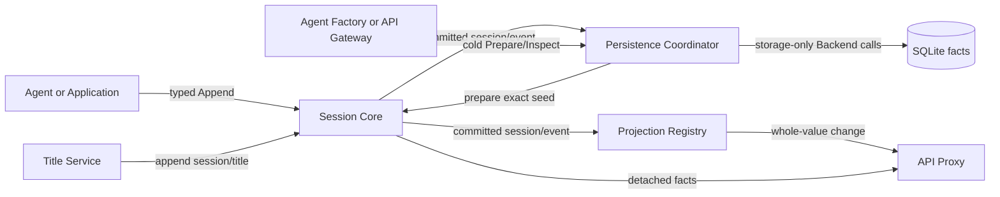

# Session 领域模块

`session/` 集中承载 Session core 及其 persistence、projection、title 能力。Core 权威设计见[10 Session Core 与生命周期](../zh-CN/10-session-core-and-lifecycle.md)，Projection/Title 见[18](../zh-CN/18-session-projection-and-title.md)，Persistence/SQLite 见[19](../zh-CN/19-session-persistence-and-sqlite.md)。本目录只保留这一份代码近邻 README。

## 目录与职责

| 路径 | 职责 | 不拥有 |
| --- | --- | --- |
| `session` | Header、append-only Event log、model-visible surface、live `Store` 与生命周期事件 | Agent loop、API frame、数据库格式、repair policy |
| `session/persistence` | durable `Persistence` 服务、storage-only `Backend` port、write-behind、cold load 与 recovery 编排 | SQLite row/SQL、Agent 执行、Session seq 分配 |
| `session/persistence/sqlite` | SQLite Header/Event fact adapter、schema、transaction、revision、sqlc row mapping | Turn/Step/Tool repair 决策、projection fold |
| `session/projection` | 通用 projection unit registry、live fold、snapshot、checkpoint/restore 与 change feed | 具体 projection key、API DTO、数据库事务 |
| `session/title` | `session/title` 事实、fallback、Provider 调度、rename/refresh 与 title projection | 具体 LLM Provider、HTTP、wire handler、持久化 adapter |

Go 调用方对后三个 capability 通常使用 `sessionpersistence`、`sessionprojection`、`sessiontitle` 显式 import alias，以保留 canonical 模块语义，同时让包路径按领域归组。

## 总体工作原理



### Core

`session.DefineEvent[D]` 定义可写入 durable log 的 typed event key；`Append` 先生成 lossless JSON snapshot、规划 surface transition，再原子提交连续 `seq`、`time` 与 Event。它不同于 `plugin.DefineEvent`：后者定义进程内插件 dispatch，不进入 Session log。

`Session` 负责 seed、surface 与 detached reads；`MemoryStore` 负责 live membership、attachment、created/event/disposed/flush publication。`DeferAfterEvent` 只允许在 `OnEvent` callback 中登记，用于 publication 完成后追加 follow-up fact，不是通用任务队列。

### Persistence 与 SQLite

`session.Store` 只回答当前进程有哪些 live Session；`session/persistence.Persistence` 回答跨进程事实、cold inspection、恢复与 resume preparation。`Coordinator` 监听 `OnCreated`、`OnEvent`、`OnFlush`、`OnDisposed`，按 Session ID 串行化 write-behind、load 与 repair；`Backend` 只映射 records、revision、repair marker 和事务。

SQLite adapter 使用以下领域内结构：

```text
session/persistence/sqlite/
├── sql/schema.sql
├── sql/query.sql
├── sqlc.yaml
└── internal/dbsql/
```

从仓库根目录运行 `sqlc generate -f session/persistence/sqlite/sqlc.yaml`。根目录不保存 sqlc 配置，生成类型也不离开 adapter。第一次 batch 在同一事务中创建 Session row、追加 Event rows 并递增 revision；repair 在同一事务中删除 torn tail、追加 Coordinator 已决定的 closing facts。SQLite 不分配 seq，也不解释业务状态。

### Projection 与 Title

Projection `Registry` 只驱动 domain-owned `Unit`，不理解具体 state；`Changed` 显式控制 whole-value change，checkpoint 是可重建缓存而非事实。Title Service 把 fallback、Provider 或 user rename 统一追加为 `session/title`，以日志中的最新合法事件作为真相，再由 title unit 投影给 API Proxy。

Fallback 通过 `DeferAfterEvent` 在原 user event publication 后追加。Rename 会 supersede 自动生成并 pin；Refresh 明确解除 pin。具体 first-prompt/all-prompts LLM Provider 保持独立插件，不进入 title core。

## 上下游与依赖方向

- 上游：Agent/Application use case、Agent Factory/Loop resume、API Gateway cold list/history/create、Plugin Scope 生命周期；
- 下游：Agent reconstruction、API Proxy，以及 SQLite `Backend`；
- `session/title -> session/projection -> session`，`session/persistence -> session`；core 不反向依赖子包；
- wire DTO、Echo/WebSocket、LLM adapter、sqlc row 和 SQLite driver 不进入 Session contract。

JSONL 与 SQLite 是同一 `Backend` port 的可替换事实存储方案，不是业务层的两个 Session 模型；当前默认组合选择 SQLite。未来 `session-query-sqlite` 属于独立可重建查询索引，不与事实库混为一体。

## 生命周期、错误与取消

Core `Create` 由 Prepare、Enter、Announce 组成；created listener 可 veto 并触发 rollback。Event commit 后 observer error 被包含和报告，不回滚事实。publication 期间直接重入 append 会拒绝，deferred queue 在 guard 释放后按登记顺序运行。

Persistence 对同一 Session ID 的 load/append/repair 串行化。write-behind 失败保留未提交 batch；显式 flush、dispose 和插件关闭会等待 drain。Scope teardown 先停止 listener admission，再 drain writer，最后关闭 Backend。未知 required event、非连续 seq、Header 不一致或不可解释状态明确失败；是否删除 torn tail、追加哪些 recovery facts只由 Coordinator 决定。

调用方 Context 控制锁等待、读取、事务与 flush。Session dispose、Provider dispose、用户 rename 或更新 revision 会取消过期 title work；迟到结果在 append 前再次校验。慢客户端不参与这些事务，由 API Proxy 自己的 delivery queue 隔离。
