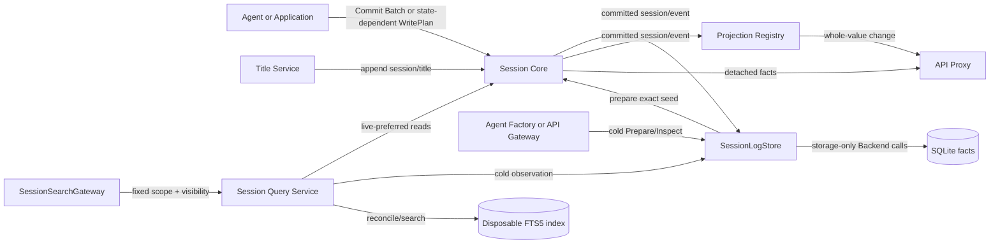

# Session 领域模块

`session/` 集中承载 Session core 及其 persistence、projection、title、query 能力。Core 权威设计见[Session Core、唯一写协调与生命周期](./docs/design.zh-CN.md)，全仓实施状态见[08](../zh-CN/08-implementation-progress.md)；Projection/Title 见[18](../zh-CN/18-session-projection-and-title.md)，Persistence/SQLite 见[19](../zh-CN/19-session-persistence-and-sqlite.md)，Query/Search 见[23](../zh-CN/23-session-query-and-search.md)。本 README 只提供代码近邻导航，不复制 Core 契约。

## 目录与职责

| 路径 | 职责 | 不拥有 |
| --- | --- | --- |
| `session` | Header、append-only Event log、model-visible surface、live `LiveStore` 与生命周期事件 | Agent loop、API frame、数据库格式、repair policy |
| `session/persistence` | durable `Persistence` 服务、storage-only `Backend` port、write-behind、cold load 与 recovery 编排 | SQLite row/SQL、Agent 执行、Session seq 分配 |
| `session/persistence/sqlite` | SQLite Header/Event fact adapter、schema、transaction、revision、sqlc row mapping | Turn/Step/Tool repair 决策、projection fold |
| `session/query` | live-preferred corpus、exact read/filter/title/surface/trace、search reconciliation 与 cursor policy | browser visibility、SQLite row、canonical fact 写入 |
| `session/query/sqlite` | disposable SQLite FTS5 index、ranking、literal query、snippet、generation 与 sqlc mapping | Session recovery、live precedence、API wire policy |
| `session/projection` | 通用 projection unit registry、live fold、snapshot、checkpoint/restore 与 change feed | 具体 projection key、API DTO、数据库事务 |
| `session/title` | `session/title` 事实、fallback、rename/refresh、Provider 调度、First/All-Prompts LLM 策略与 title projection | 具体 LLM adapter、HTTP、wire handler、持久化 adapter |

Go 调用方对 Persistence 使用较短的 `sesspersist`，对其 SQLite adapter 使用 `sesssqlite`；公开包路径、领域类型与 Service 名不因导入缩写改变。Projection/Title 仍按各自调用点保留清晰的领域别名。

## 总体工作原理



### Core

Session 的 durable Event 类型和 Plugin Runtime 的进程内 Event 是两套明确契约：Session Event 由具名 event key 构造 `EventDraft`，再由唯一 `Commit(context.Context, WritePlan)` 边界分配连续 `seq/time` 并规划 Surface transition；Plugin Event 由 `plugin.EventOf[E]` / `plugin.Publish` 分发，不进入 Session log。Event Sourcing 由 Session/Persistence owner 决定，Plugin Runtime 不保存或重放它。

其他领域只持有 `session.Context`，不能取得具体 coordinator 或 log。包内私有 `log` 负责 seed、append-only Event、Surface 与 detached reads；私有 coordinator 负责唯一 FIFO，并直接持有当前 `registration`，不再建立只为转发 append 的接口。`registration` 独占一个 live membership，并用 `entered -> announcing -> live -> releasing -> closed` 单一状态字段表达 announce/release 生命周期；等待通道只表示当前 announce 或 release 操作何时结束，不再承担业务状态。私有 `memoryStore` 管理 registration 集合、注册顺序和 Store 准入，`session.Plugin` 只适配 `LiveStore` Service 发布与 Plugin Event 分发。`Snapshot` 从同一 committed revision 返回 Event log、Surface 与 durability barrier，供按位置校验的 Consumer 使用。

普通 producer 用 `session.Batch(drafts...)` 创建固定 plan，再调用 `Context.Commit`。只有完整 drafts 无法在 admission 前确定、必须基于 FIFO 头部最新 `Snapshot` 计算的业务 use case 才实现 `WritePlan.Build`；一个 use case 实现一次，不是每个 Event 实现。`Build` 一次返回完整 batch，`log` 只暂存本次新 Event，并在必要时复制 Surface nodes 来验证全部 transition，成功后原子 append；它不会为每次固定写复制完整历史，也不存在 request-local Event FIFO 或部分 batch。LLM、Tool、网络、文件和数据库 I/O 必须在 coordinator 外执行。

### Persistence 与 SQLite

`session.LiveStore` 只回答当前进程有哪些 live Session；`session/persistence.Persistence` 回答跨进程事实、cold inspection、恢复与 resume preparation。具体 `SessionLogStore` 是有状态 Go 对象：监听 `OnCreated`、`OnEvent`、`OnFlush`、`OnDisposed`，编排 write-behind、load 与 repair；durable cursor、live writer、prepared LRU/reservation 和 per-ID gate 分别由内部状态对象拥有，`Backend` 只映射 records、revision、repair marker 和事务。

正常 Agent Turn 在提交 `turn/end` 后调用 `session.LiveStore.Flush`。LiveStore 先从 Session coordinator 取得 ordered `WriteBarrier`，再发布并等待 `session/flush`；`SessionLogStore` 作为 durability participant 至少将该 prefix 的 retained facts 提交给 Backend。这样 Agent Loop 不认识 SQLite，Session coordinator 不等待数据库 I/O，而 idle 表示该正常 Turn 已越过配置中的持久化边界。

SQLite adapter 使用以下领域内结构：

```text
session/persistence/sqlite/
├── sql/schema.sql
├── sql/query.sql
├── sqlc.yaml
└── internal/dbsql/
```

从仓库根目录运行 `sqlc generate -f session/persistence/sqlite/sqlc.yaml`。根目录不保存 sqlc 配置，生成类型也不离开 adapter。第一次 batch 在同一事务中创建 Session row、追加 Event rows 并递增 revision；repair 在同一事务中删除 torn tail、追加 `SessionLogStore` 已决定的 closing facts。SQLite 不分配 seq，也不解释业务状态。

### Query 与 Search

`session/query.Service` 同时观察 live LiveStore 和 durable Persistence；同 ID Header 必须兼容，Event log 始终 live-preferred，同时保留 live/persisted availability。Exact read、filter、title、surface、event window 与 trace 直接在 detached logical log 上执行，不依赖 FTS。

Full-text search 才进入 `session/query.Index`。默认 SQLite adapter 保存可删除的 `indexed_sessions` 与 FTS5 documents；Service 根据 live identity/seq 或 persisted revision 计算 reconciliation delta，adapter 在事务内 replace/remove 并推进 generation。Opaque cursor 绑定 Service instance、normalized request 与 generation，相关 corpus 改变时返回 stale cursor。

Query SQLite 结构：

```text
session/query/sqlite/
├── sql/schema.sql
├── sql/query.sql
├── sqlc.yaml
└── internal/dbsql/
```

从仓库根目录运行 `sqlc generate -f session/query/sqlite/sqlc.yaml`。固定 schema/query 由 sqlc 生成；可选 metadata filter 的 FTS statement 留在 adapter 内参数化构造。该数据库不是 Session facts，删除后可从 LiveStore/Persistence 重建。

### Projection 与 Title

Projection `Registry` 只驱动 domain-owned `Unit`，不理解具体 state；`Changed` 显式控制 whole-value change，checkpoint 是可重建缓存而非事实。Title Service 把 fallback、Provider 或 user rename 统一追加为 `session/title`，以日志中的最新合法事件作为真相，再由 title unit 投影给 API Proxy。

Fallback observer 先返回，再由 Title Service 自己拥有的生命周期任务通过正常 `Commit` 重新准入；Session 不提供 after-event 写入口。Rename 会 supersede 自动生成并 pin；Refresh 明确解除 pin。First-Prompt 与 All-Prompts 是同一个 Session Title 插件内由 typed config 选择的 `LLMProvider` 策略对象，不是独立插件。该对象经 `LLMStreamer` 消费 provider-neutral LLM runtime，在分发前提交 `session/title-llm-request`，并负责输入/输出预算、超时、流组装与文本校验；`LogService` 仍拥有 revision、取消、迟到结果拒绝和最终 `session/title` 事实。

## 上下游与依赖方向

- 上游：Agent/Application use case、Agent Factory/Loop resume、API Gateway cold list/history/create/search、Plugin Scope 生命周期；
- 下游：Agent reconstruction、API Proxy、SQLite fact `Backend` 与 disposable Query `Index`；
- `session/title -> session/projection + llm + session`，`session/persistence -> session`，`session/query -> session + session/persistence`；core 不反向依赖子包；
- wire DTO、Echo/WebSocket、LLM adapter、sqlc row 和 SQLite driver 不进入 Session contract。

JSONL 与 SQLite 是同一 `Backend` port 的可替换事实存储方案，不是业务层的两个 Session 模型；当前默认组合选择 SQLite。`session/query/sqlite` 是独立可重建查询索引，不与事实库混为一体。

## 生命周期、错误与取消

Core `Create` 由 Prepare、Enter、Announce 组成；created listener 可 veto 并触发 rollback。Event commit 后 observer error 被包含和报告，不回滚事实。publication 期间同步重入同一 Session 会拒绝。Release/Close 由 `registration` 先 seal/drain 写队列，再 flush final barrier、从 `memoryStore` 删除 exact registration、detach exact membership，并仅为已经进入 `live` 的 Session 发布 disposed。并发 announce/release 通过同一状态机串行化，第二个调用只等待正在进行的状态迁移。

`memoryStore` 使用 `open -> closing -> closed` 单一状态字段管理 Store 级准入。`Close` 在取得待释放快照前先进入 `closing`，此后 `Prepare` 和 `Enter` 都会拒绝新 Session；已有 registration 按进入顺序逆序释放。关闭失败不会重新开放准入，显式再次 `Close` 可重试尚未完成的释放。`session.Plugin.Dispose` 是进入该关闭流程的 Runtime 适配入口，业务 Store 本身不依赖 Plugin 生命周期。

Persistence 对同一 Session ID 的 load/append/repair 串行化。write-behind 失败保留未提交 batch；显式 flush、dispose 和插件关闭会等待 drain。Scope teardown 先停止 listener admission，再 drain writer，最后关闭 Backend。未知 required event、非连续 seq、Header 不一致或不可解释状态明确失败；是否删除 torn tail、追加哪些 recovery facts只由 `SessionLogStore` 决定。

Query Service 串行化 observe/reconcile/search，使一个 page 与 cursor 绑定同一 index generation；取消、Persistence failure、source conflict、index failure、invalid/stale cursor 分开分类。Scope teardown 等待正在执行的 Query operation 后关闭 derived index。

调用方 Context 控制锁等待、读取、事务与 flush。Session dispose、Provider dispose、用户 rename 或更新 revision 会取消过期 title work；迟到结果在 append 前再次校验。慢客户端不参与这些事务，由 API Proxy 自己的 delivery queue 隔离。
