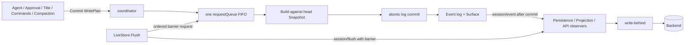

# Session Core、唯一写协调与生命周期设计

状态：Accepted；Implemented；Verified（2026-08-24）

本文是 `session` Core 的唯一权威设计，拥有 Header、Event envelope、内存 append-only log、Surface、单 Session 写协调、LiveStore 生命周期以及与 Persistence 之间的 committed-prefix barrier。全仓实施汇总见[08 实施进度](../../zh-CN/08-implementation-progress.md)，持久化设计见[19](../../zh-CN/19-session-persistence-and-sqlite.md)，Context Compaction 如何消费写契约见[24](../../zh-CN/24-context-compaction.md)。

## 1. 设计来源与 Go 差异

Session Core 的固定源基线是 `47f943859bef60e4160492346772ded9b24f765a`。Context Compaction 仅按[01](../../zh-CN/01-porting-scope-and-baseline.md)使用 `b150a55` capability-scoped exception，不把其他 Session 行为升级到新基线。

| DeepSeek Harness 证据 | Go owner | 保留的职责或语义 |
| --- | --- | --- |
| `packages/core/session/src/types.ts` | `Header`、`Event`、typed event key | format、Header、Event envelope、Surface metadata |
| `packages/core/session/src/index.ts` 的 `Session` | 包内 `log` | seed、连续 `seq`、append-only log、Surface、detached read |
| 同文件的 `SessionStore` | `LiveStore`、`MemoryStore` | prepare、enter、announce、live membership、flush、detach |
| `packages/core/session/src/surface.ts` | `SurfaceOperation` 与内部 Surface fold | append/replace、provenance、model-visible history |
| `session/created`、`session/event`、`session/flush`、`session/disposed` | Session Plugin Event | 创建 veto、post-commit feed、durability checkpoint、dispose |

源 `Session.append()` 依靠 JavaScript run-to-completion：以当前 `log.length` 分配 `seq`，在两个 `await` 之间的连续同步 append 不会被其他 Promise continuation 穿插。源代码没有 `WritePlan`、Go FIFO 或另一套写领域模型。

已核对 `47f9438..b150a55`：`src/index.ts`、`surface.ts`、`preparation.ts`、`json.ts` 与 `request-header.ts` 完全一致，因此写协调、Surface 和 Store 生命周期证据没有版本差异。较新版本只在 Session package 增加 `assistant/message.interrupted?: true` 和四个 `team/*` known event，并调整文档、版本与测试类型断言；前者属于尚未升级的 AgentLoop 事件契约，后者属于未纳入的 Agent Teams，均不随本次写协调重构静默进入。

Go producer 可以来自多个 goroutine。若同时公开 raw append 和可选串行入口，调用方就必须自行判断并发风险，Session 无法完整保护顺序不变量。因此 Go 在同一职责边界内增加每 Session 一个 FIFO，并只公开一个 `Commit(context.Context, WritePlan)`。`WritePlan` 是 Go 并发适配 seam；DeepSeek Harness 只作为 owner、事件、顺序和生命周期语义的证据，不作为 Go 队列设计模式的来源。

## 2. 所有权与架构

外部调用方只获得 `session.Context`。包内 `coordinator` 是唯一写入协调器，`log` 只保存 Session 领域状态；两者都不会以具体指针暴露给其他领域。Live membership 的状态机由 `registration` 拥有，`coordinator` 只保留一个包内 publication port，不持有 `MemoryStore` 或 `registration` 的具体指针。



Session Core 拥有：

- Header、Session identity、seed、`firstLiveSeq` 和 `session/end-seed`；
- Event envelope、typed draft construction、连续 `seq` 与时间戳分配；
- append-only Event log、Surface append/replace、provenance 与 replacement generation；
- 每 Session 唯一 FIFO、请求准入、执行、取消检查、seal/drain；
- committed Event publication 和 committed-prefix barrier；
- live membership、创建/释放顺序以及 Session 与 Store 的包内 attachment。

Session Core 不拥有：

- Agent Turn/Step、Tool、Approval、Title、Commands 或 Compaction 的业务决定；
- LLM、网络、文件、数据库等高延迟工作；
- SQLite/JSONL 格式、sqlc 类型、write-behind batch 或 repair policy；
- Echo、WebSocket、RPC、Host frame 或浏览器 projection；
- 跨 Session 原子性。

业务 owner 决定“要写哪些事实”；Session 决定“请求何时执行、基于哪个已提交快照、如何原子提交以及何时发布”。Persistence 只持久化已经 committed 的事实。

## 3. 公开上下文契约

```go
type Reader interface {
    Header() Header
    ID() SessionID
    FirstLiveSeq() int64
    Seq() int64
    Events() []Event
    Surface() Surface
    Snapshot() Snapshot
    DeriveMessages() ([]llm.Message, error)
}

type Writer interface {
    Commit(context.Context, WritePlan) (WriteResult, error)
}

type Context interface {
    Reader
    Writer
}
```

`session.New`、`LiveStore.Get/List`、`Handle.Session` 和 persistence preparation 都返回 `Context`。其他领域不保存 `*session.Session`，也不能取得 aggregate mutex、FIFO、coordinator 或 publication attachment。

读取返回 detached value：调用方修改 `Header()`、`Events()`、`Surface()`、`Snapshot()` 或 `WriteResult.Events` 的返回值，不能反向修改 Session。需要同时校验 Event 位置和 Surface 的调用方使用一次 `Snapshot()`，不能分别读取后自行拼接 revision。

`Snapshot` 表示同一个 committed revision：

```go
type Snapshot struct {
    Events  []Event
    Surface Surface
    Barrier WriteBarrier
}
```

## 4. EventDraft 与 Surface

`EventDraft` 是尚未分配 `seq`、`time` 的不可变候选。调用方只能通过 owner-defined `EventKey[D]` / `SurfaceEventKey[D]` 创建 draft；字段保持 private，不能伪造 event type 或绕开 payload snapshot。

`NewEventDraft` 和 `NewSurfaceEventDraft` 在进入 FIFO 前完成 JSON snapshot 与 lossless validation。`Batch` 再次 detach draft slice 及其 payload/provenance，调用方在 admission 前后修改自己的值都不能改变计划内容。

只有 `user/message`、`assistant/message` 与 `tool/result` 能进入 model-visible Surface：

- `SurfaceAppend()` 把当前 Event 的 `seq` 加到 Surface 尾部；
- `SurfaceReplace(start, end)` 用当前 Event 替换 Surface 上对应的连续区间。

replace 在提交前校验边界顺序、只引用更早 Event 的唯一 provenance，以及对全部 shadowed node 的覆盖。`tool/result` replacement 只能替换一个当前 result 的 content，并保持 call identity、metadata 与其他字段。任何 draft 或 Surface transition 失败时，整个 batch 都不增长日志、不改变 Surface，也不推进 replacement generation。

## 5. 唯一写入口

```go
type WritePlan interface {
    Build(context.Context, Snapshot) ([]EventDraft, error)
}
```

`Context.Commit(requestContext, plan)` 是唯一公开写入口。所有 plan 都进入同一个 FIFO；没有 raw append、另一个 serialized API、公开 queue item、request-local event queue 或调用方可选的锁。

一个 FIFO request 包含一个 `WritePlan`。`Build` 一次返回完整、有序的 `[]EventDraft`，slice 顺序就是 batch 内 Event 顺序；它不是内层 FIFO，因为没有独立 admission、head、drainer、mutex 或调度。

### 5.1 固定 batch

如果全部 draft 能在提交前确定，调用方使用 `Batch`，不实现自定义 plan。

```go
draft, err := session.NewEventDraft(
    session.TurnStarted,
    session.TurnStart{
        Turn: turn,
    },
)
if err != nil {
    return err
}

_, err = conversation.Commit(
    requestContext,
    session.Batch(draft),
)
return err
```

固定多事件同样使用 `Batch`：

```go
_, err = conversation.Commit(
    requestContext,
    session.Batch(firstDraft, secondDraft),
)
```

“有多个 Event”或“Event 彼此相关”都不是自定义 `WritePlan` 的理由。只要完整 drafts 能提前构造，`Batch` 就能保证它们原子且不被其他 producer 插入。

### 5.2 基于 FIFO 头部状态构造 batch

只有无法在 admission 前确定完整 drafts 时，业务 use case 才实现 `WritePlan`。典型原因是：

- payload 或 provenance 需要本 request 真正执行时的下一个 `seq`；
- 候选集合必须从 FIFO 头部看到的最新 Event log 或 Surface 计算；
- 必须在“校验当前 revision”和“提交完整 batch”之间禁止其他 request 插入。

例如 skipped Tool call 需要让 `tool/result.sourceEventSeqs` 指向同一 batch 中将要提交的 `tool/call`。排队前不知道前方还有多少 request，所以在 `Build` 看到 head `Snapshot.Barrier.NextSeq` 后才能构造 result draft：

```go
type skippedCallPlan struct {
    callDraft session.EventDraft
    result    session.ToolResult
}

func (plan *skippedCallPlan) Build(
    _ context.Context,
    current session.Snapshot,
) ([]session.EventDraft, error) {
    provenance := []int64{current.Barrier.NextSeq}
    resultDraft, err := session.NewSurfaceEventDraft(
        session.ToolResultAdded,
        plan.result,
        session.SurfaceIntent{
            Operation:       session.SurfaceAppend(),
            SourceEventSeqs: &provenance,
        },
    )
    if err != nil {
        return nil, err
    }
    return []session.EventDraft{plan.callDraft, resultDraft}, nil
}

_, err := conversation.Commit(requestContext, plan)
```

`WritePlan` 对应一个状态相关的业务提交，不对应 Event 类型。Compaction completion 与 Tool Result Pruner 各实现一个 use-case plan；`compaction/summary`、`compaction/prune`、`tool/result` 等 Event 本身不实现接口。

`Build` 必须是短时、确定性的内存计算，不执行 LLM、Tool、网络、文件或数据库 I/O，不保留或修改传入的 detached `Snapshot`。高延迟工作在 coordinator 外完成；plan 只在 FIFO 头部重新校验结果并构造最终 drafts。自定义 plan 可以返回空 slice 表示 no-op；`Batch()` 空 batch 则拒绝。

## 6. FIFO 与原子提交算法

每个 Session 使用 FIFO baton，不创建常驻 goroutine，也不让一个调用方代替其他调用方执行 plan：

1. `Commit` 在短 queue mutex 下检查 open state 并追加 request；只有队首 request 的 `ready` channel 被关闭。
2. 每个调用方等待自己的 `ready`；获得 baton 后只执行自己的 request，此时 queue mutex 已释放。
3. 固定 `Batch` 直接取得已 detach 的 drafts，不复制当前 Session snapshot；状态相关 plan 才在 FIFO 头部读取一个 detached `Snapshot`，并调用一次 `Build`。
4. `log` 在锁内只暂存本 batch 的新 Event；它不 clone 已提交 Event 前缀。存在多个 Surface Event 时才复制 Surface nodes 作为临时视图，否则只保存单个 transition。
5. 在临时状态上校验全部 draft、分配连续 `seq/time` 并规划 Surface transition；任一 draft 失败时不追加 Event，也不改变 Surface。
6. 全部校验成功后一次 append 新 Event，并一次应用最终 Surface 状态。log mutex 释放后按 `seq` 顺序发布 committed `session/event`。
7. 当前调用方完成 publication 后调用 `requestQueue.complete`；Queue 清除已完成槽位并关闭下一项的 `ready`，把 baton 交给下一个 FIFO request。队列排空且正在 sealing 时转为 closed。

FIFO 使用 slice + head index，出队不搬移其余元素，已完成槽位置 `nil`，整队排空后再复用零值结构。不同 Session 没有全局写锁，可以并行提交。JSON snapshot、高延迟工作与 persistence I/O 不占用 Session FIFO；固定 `Batch` 的常见路径也不复制完整历史。

同一个 batch 是内存原子提交：不存在“前两个 Event 已提交，第三个失败”的部分 prefix。Publication 与 durability 在提交之后，因此 observer 或 Backend 失败不能回滚已经 committed 的 batch。

## 7. 写结果、取消、panic 与重入

`WriteResult` 描述一个 request 提交的半开区间 `[FirstSeq, NextSeq)` 和 detached Events。no-op plan 的两个边界相等。

`WriteBarrier{SessionID, NextSeq}` 表示：Persistence 只有在全部 `Seq < NextSeq` 的 Event durable 后才满足该 barrier。它不是数据库事务 ID，也不保证 Tool side effect exactly-once。

取消边界如下：

- admission 前 Context 已取消：不入队；
- 排队中的 request 在到达头部前被取消：跳过 `Build`，不产生 Event；
- `Build` 返回后 Context 已取消：不进入 aggregate commit；
- aggregate commit 一旦开始就完成或整体失败，不在 batch 中间留下取消导致的部分提交；
- 调用方取消等待不会改变已经开始的 seal，Session 不会重新开放。

`Build` panic 会转换为 error，当前 request 不提交，当前调用方仍归还 baton，后续 request 继续执行。`session/event` observer 收到的是已经 committed 的事实；listener error 由 `PostCommitFailureReporter` 报告，不改变 `Commit` 结果。

Publication context 内同步重入同一个 Session 会返回 `ErrWriteReentry`，避免 observer 等待当前 request 自己完成。Session 不提供 after-event/follow-up 写 API；需要派生写入的 observer 必须先返回，并由自己拥有的生命周期任务通过正常 `Commit` 重新准入。Title fallback 即采用该方式。

## 8. LiveStore、flush 与 Preparation

`MemoryStore` 只拥有 live registration 集合、注册顺序和 Store 级 Plugin Event 分发，不持久化业务数据，也不执行单个 registration 的状态转换。创建顺序是：

```text
Prepare -> construct detached unpublished Context
Enter   -> install registration and publication attachment
Announce -> publish vetoable session/created
```

`registration` 表示一个 Session 在 `MemoryStore` 中的成员身份，独立拥有 `live / announcing / announced / release` 状态，并实现包内 publisher。它调用 Store 的集合操作与 Event 分发，但 Store 不读写它的生命周期字段。`Handle.Release` 是释放这份成员身份的唯一 capability。

attachment 只是一条从 `coordinator` 到当前 publisher 的包内端口：`coordinator.attach/detach` 只维护端口 identity，既不清理 registration，也不修改 Store 集合。反向清理顺序由 `registration` 独占：先从 Store 删除 exact registration，再 detach exact publisher，最后在已 announce 的情况下发布 `session/disposed`。因此 conversation 写协调、registration 生命周期和 Store 集合管理不会互相侵入职责。

`LiveStore.Flush` 先向同一个 request FIFO admission 一个内部 barrier request。该 request 到达队首时取得 committed prefix，因而不会越过“已经提交但尚未完成 publication”的前序写；随后 Store 在 coordinator 外发布携带 `WriteBarrier` 的 `session/flush`。Persistence 至少把该 prefix 写入 Backend，可以顺带持久化 barrier 后的并发 Event，但不能少于 barrier。

`Handle.Release` / `MemoryStore.Close` 是关闭 owner：先 seal 新写 admission，排空已准入 request，取得 final barrier，完成 flush，再移除 registration 并发布 `session/disposed`。并发 `Release` 共享同一次 final flush；等待者可以由自己的 Context 取消等待，但不能启动第二次 flush。创建 veto 使用脱离已取消请求的 rollback Context，最终 flush 失败时仍强制 detach，且同时返回 creation failure 与 flush failure。`Context` 不公开 seal 方法。

Persistence 的 `Prepare` 返回一个 `session.Preparation`，其中包含原样重建的 unpublished `Context` 与 provider-owned `PreparationLease`。Persistence 内部的 `reservation` 是这份排他占用本身，并直接实现 `Release`。发布消费 reservation 后，再调用 `Preparation.Dispose` 是幂等 no-op；未发布时 Dispose 按当前 revision 是否仍可复用决定是否归还准备缓存。

## 9. Plugin Event 语义

| Event | 调度目的 | 失败语义 |
| --- | --- | --- |
| `session/created` / `Created` | 创建 veto | 失败使 `Create` rollback Enter，并形成配对清理 |
| `session/event` / `EventAppended` | committed fact feed | batch 不回滚；listener failure 被包含并报告 |
| `session/flush` / `FlushRequested` | durability checkpoint | 等待所有 participant 满足 barrier，聚合错误 |
| `session/disposed` / `Disposed` | membership 已移除通知 | best-effort，observer failure 被包含和报告 |

Plugin Runtime 只分发进程内事实，不保存 Session Event history。Session Event log 才是可恢复事实来源；Projection、Title、Persistence 和 API live frame 都是 Consumer。

## 10. 文件职责

| 文件 | 责任 |
| --- | --- |
| `contracts.go` | 对外 `Reader`、`Writer`、`Context` capability |
| `write.go` | `WritePlan`、`Batch`、`EventDraft`、`Snapshot`、`WriteResult`、`WriteBarrier` |
| `coor_context.go` | 私有 coordinator 的 log、queue、publisher port 组合与读委托 |
| `coor_commit.go` | `Commit`、seal 与 ordered barrier 的协调入口 |
| `coor_execute.go` | FIFO 头部的 Build、atomic commit、publication 与结果组装 |
| `queue.go` | FIFO 自己拥有的 admission、baton transfer、seal 与状态转换 |
| `session.go` | 私有 `log`、seed、detached read、atomic batch commit |
| `surface.go` | Surface transition 的纯规划与应用 |
| `lifecycle.go` | `LiveStore`、`Handle`、Plugin Event 与 lifecycle collaborator 契约 |
| `memory_store.go` | `MemoryStore` Provider、live registration 集合与 Store 级 Event 分发 |
| `registration.go` | 单个 live membership 的 announce、append publication、release 与 rollback 状态机 |
| `preparation.go` | unpublished Session 的 provider lease |
| `event_codec.go`、`request_state.go`、`message_projection.go` | Event codec、请求状态 fold 与模型消息投影 |

`coor_` 只作为 coordinator 实现文件的分组前缀，不进入类型名。Queue 方法只位于 `queue.go` 并由 `requestQueue` 拥有；coordinator 不在 queue 文件中定义方法。

## 11. 实现与验证证据

| 行为 | 实现 | 验证 |
| --- | --- | --- |
| 单一 Context / Commit 边界 | `contracts.go`、`write.go` | `tests/architecture` 旧 API 与命名审计；全仓编译 |
| FIFO 头部 Snapshot | `queue.go`、`coor_execute.go` | `TestPlanBuildSeesSnapshotAtFIFOHead` |
| batch 原子性 | `log.commitBatch` | `TestCommitRejectsWholeBatchWhenLaterDraftCannotApply` |
| queued / post-Build cancellation | `coor_execute.go` | `TestQueuedCancellationSkipsPlanBuild`、`TestCancellationAfterBuildCommitsNothing` |
| panic 后 queue 继续 | `coor_execute.go`、`queue.go` | `TestPlanPanicDoesNotStopQueue` |
| seal、drain、拒绝新写 | `requestQueue.seal` | `TestSealDrainsAdmittedItemsAndRejectsNewWrites` |
| ordered durability barrier | `orderedBarrier`、`MemoryStore.Flush` | `TestOrderedBarrierSeparatesEarlierAndLaterWrites`、persistence tests |
| draft detached snapshot | `Batch`、draft constructors | `TestBatchDetachesDraftBeforeAdmission` 与 Session codec tests |
| publication 重入拒绝 | coordinator publication context | `TestAppendObserverFailureIsContainedAndReentryRejected` |
| 动态 use case | AgentLoop、Compaction、Pruner plans | 对应包测试和全仓 race test |
| preparation reservation 生命周期 | `session/persistence/prepared_cache.go` | `session/persistence` prepare/reuse tests |
| registration / Store / coordinator 边界 | `registration.go`、`memory_store.go`、`coor_context.go` | Store lifecycle、并发 Release、creation rollback 与 architecture tests |

2026-08-24 已执行并通过：`go test ./...`、`go test -race ./...`、`go vet ./...`、`go build ./...`、`go test ./tests/architecture` 与 `git diff --check`。实现中不存在旧 `Append*` / `ExecuteWrite` / `WriteContext` / after-event API、兼容 wrapper、`*session.Session` 跨领域持有或 request-local event queue。
