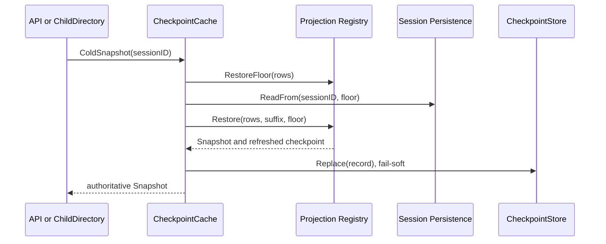
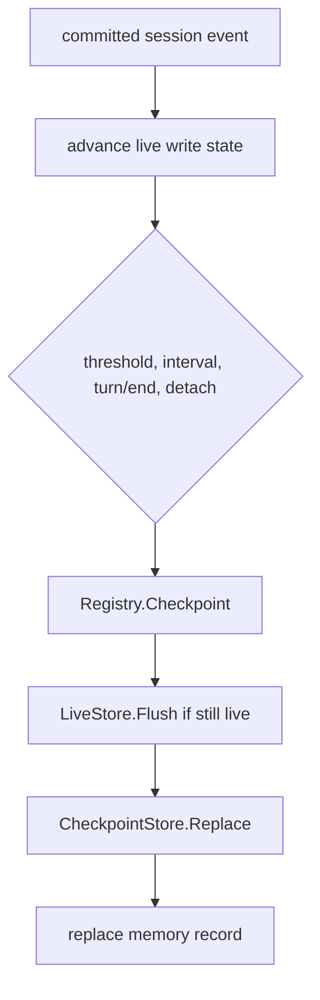

# Session Projection Cache

本包拥有可重建 Session Projection checkpoint 的业务对象 `CheckpointCache`。Session Event Log 始终是唯一事实源；删除、损坏或落后的 cache 只影响读取成本，不改变结果。

## 职责与非职责

本包负责：

- 每个 Session ID 保存一个当前 `CheckpointRecord`，record 内包含多个 Projection Unit row；
- 校验 `{createdAt, cwd}` Log Identity，禁止复用另一个 Session 生命周期的 state；
- 使用 `Registry.RestoreFloor`、`Persistence.ReadFrom` 和 `Registry.Restore` 完成 suffix 恢复；
- 根据事件数量、时间、`turn/end` 和 detach 调度 checkpoint；
- 保证单 Session 写入串行，以及 `Checkpoint -> LiveStore.Flush -> CheckpointStore.Replace` 的耐久顺序；
- 在关闭时停止准入和 timer，排空已经进入存储边界的操作。

本包不负责 Session 事实、Projection Unit 业务规则、Plugin Runtime 适配、SQLite schema、`session.list/history` wire 映射或 Subagent identity 解释。跨模块最终契约见[Session Projection Cache 最终设计](../../zh-CN/SessionProjectionCache最终设计方案.md)，实施证据见[专项进度矩阵](../../zh-CN/SessionProjectionCache实施进度矩阵.md)和[全仓进度](../../zh-CN/08-implementation-progress.md)。

## 读取流程

`CachedSnapshot` 只读取内存 record index，不执行 SQLite 或 Session-log I/O。非空结果表示命中，`nil, nil` 表示正常未命中，`nil, err` 表示读取失败。它只选择当前已注册且 `StateVersion` 匹配的 row，并用所选 row 的最小 seq 作为安全的 `AsOfSeq`。`ColdSnapshot` 必须用当前 durable log 证明结果；identity、版本、anchor、row state 或 suffix 不足时从 `seq=0` 全量重放。

Registry 没有 Unit 时，`ColdSnapshot` 只读取最新一条事件：`Values` 为空，最新事件 seq 写入 `Snapshot.AsOfSeq`；空日志使用 `-1`。cut 属于整个 Snapshot，不属于空 `Values`。

## 写入与生命周期

同一 Session lifecycle 只有一个 writer。写入期间到达的新事件继续保持 dirty，不会被成功回调盲目清零。相同 lifecycle 的新 record 会保留 Registry 当前未注册的旧 row；Registry 读取时仍忽略未知 Unit。这避免 Plugin shutdown 中动态 Unit 先注销、异步 detach write 后完成时抹掉仍可复用的 checkpoint。

cache 可以落后 durable log，不能领先 durable log。后台写入或 cold write-back 失败通过 `FailureReporter` 报告；Session 权威读取失败、完整 fold 失败和请求取消返回调用者。
