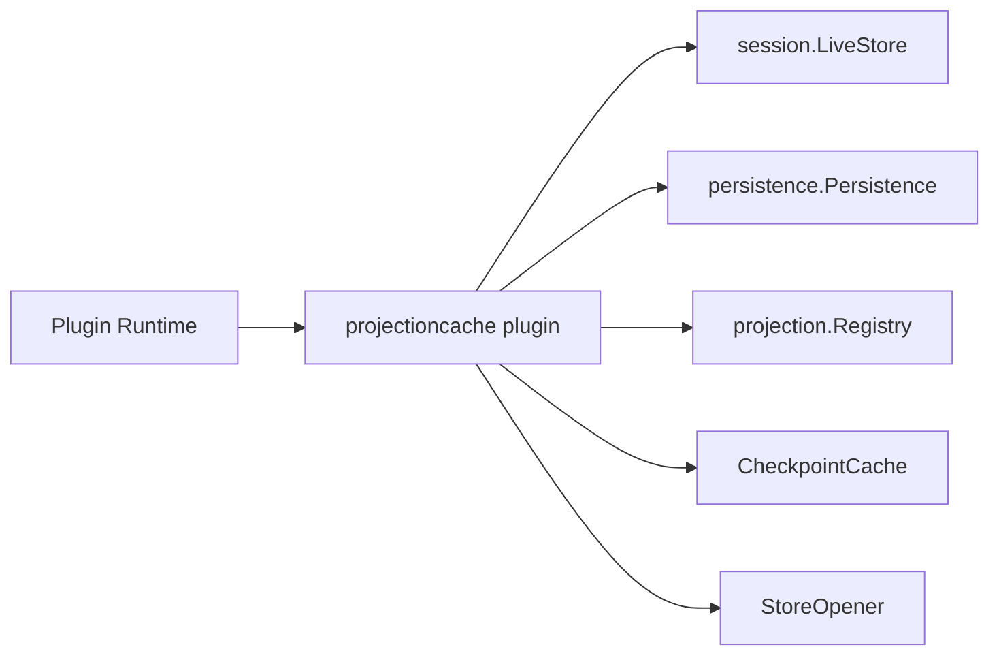

# Session Projection Cache Plugin

本包是 `CheckpointCache` 与 Plugin Runtime 之间的生命周期 adapter，不拥有 checkpoint 算法或 SQLite。

`Manifest` 发布 `projectioncache.Cache`，要求 Session LiveStore、Persistence 和 Projection Registry，并订阅 `session/event` 与 `session/disposed`。`Apply` 解析依赖、打开 `CheckpointStore` 并调用 `CheckpointCache.Open`；事件 observer 只翻译为 `Advance` 或 `Retire`；`Dispose` 调用 `CheckpointCache.Close`，由业务对象关闭准入、停止 timer、排空 in-flight 后关闭 Store。

本包不定义 Factory config、不导入 SQLite adapter、不解释 Projection Unit，也不实现 API 或 Subagent 用例。完整契约见[最终设计](../../../zh-CN/SessionProjectionCache最终设计方案.md)，真实实现证据见[专项进度矩阵](../../../zh-CN/SessionProjectionCache实施进度矩阵.md)和[全仓进度](../../../zh-CN/08-implementation-progress.md)。
