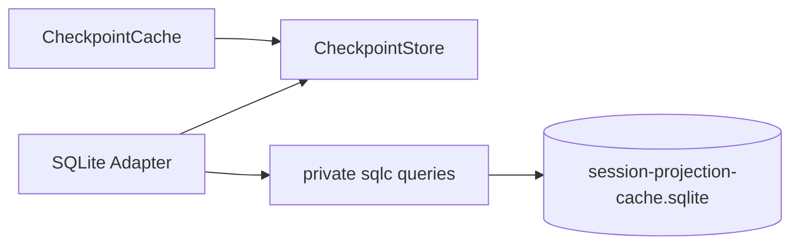

# Session Projection Cache SQLite Adapter

本包实现 `projectioncache.CheckpointStore`，只持久化可丢弃的 checkpoint record，不保存 Session Header/Event 事实，也不决定 checkpoint 时机、Unit 版本兼容或恢复策略。

数据库为每个 Session ID 保存一行 `{created_at, cwd, rows_json}`；`rows_json` 是整个 `projection.Checkpoint`，`Replace` 使用单行 UPSERT，不提供 per-Unit patch 或 checkpoint 历史。`LoadAll` 在一个只读事务中取得一致 record index，sqlc/driver 类型不会越过 adapter。

adapter 使用独立 `application_id` 和 `user_version`。空数据库可以初始化；确认属于本 cache 的旧 schema 可以整库重建；外来 application identity、未识别表或无法映射的存储形状使启动失败。语义上无效但可映射的 row 交由 `CheckpointCache.Open` 丢弃并报告。

`Close` 幂等；SQLite 路径、权限、schema ownership 和 I/O 错误返回调用者。完整契约见[最终设计](../../../zh-CN/SessionProjectionCache最终设计方案.md)，实施证据见[专项进度矩阵](../../../zh-CN/SessionProjectionCache实施进度矩阵.md)和[全仓进度](../../../zh-CN/08-implementation-progress.md)。
