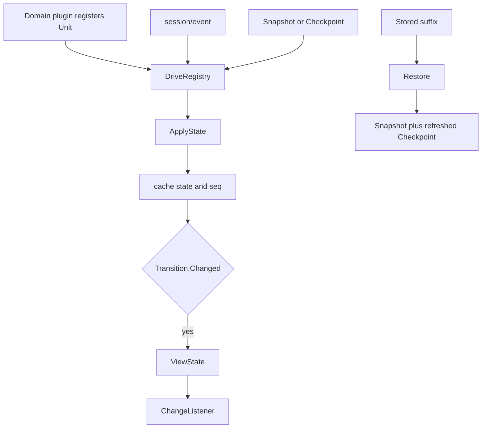

# Session Projection 子模块

`sessionprojection` 是 committed Session facts 的通用派生状态驱动器。跨模块权威设计见[`zh-CN/18-session-projection-and-title.md`](../zh-CN/18-session-projection-and-title.md)。

## 职责

- `Registry`：Consumer-facing capability；注册 unit、读取 snapshot/checkpoint、恢复和订阅 change。
- `Unit`：由业务包实现的同步纯 fold；Registry 不理解业务 state。
- `DriveRegistry`：内存实现，持有每个 key/Session 的可重建 cell。
- `Checkpoint`：带 `StateVersion` 与 seq 的非权威缓存。

本包不拥有 Session persistence、API DTO、数据库事务或具体 projection key。`json.RawMessage` 只用于开放 key 空间上的合法 JSON 边界；业务 unit 负责恢复具体类型。

## 工作原理

晚注册或首次读取会从 Session event snapshot 建 cell；已有 cell 只折入更高 seq。`Changed` 明确控制 whole-value change，不通过反射或深比较猜测。Snapshot、checkpoint 和 change 中的 JSON 都会复制，调用方不能改写 Registry state。

## 上下游

- 上游：`session.OnEvent`、`session.OnDisposed`、domain `Unit` registration。
- 下游：`sessiontitle` 等业务 projection、`apiproxy` baseline/frame、未来 checkpoint adapter。
- 依赖方向：本包只依赖 `session` 与 `plugin`，不依赖下游 Consumer。

## 生命周期、错误与取消

Unit registration 与 change listener 都归调用方 `plugin.Scope`；最后一个兼容 registration 释放后删除 key，Session dispose 删除对应 cell。Unit 版本冲突、非 JSON state、非连续 restore suffix 或缺少必需前缀会失败，不会返回伪造 snapshot。

所有 fold 都是同步计算，不启动 goroutine，也没有独立取消点。取消属于发起 snapshot/持久化读取的上游 use case；本包只对已经提供的 detached facts 完成原子 fold。
