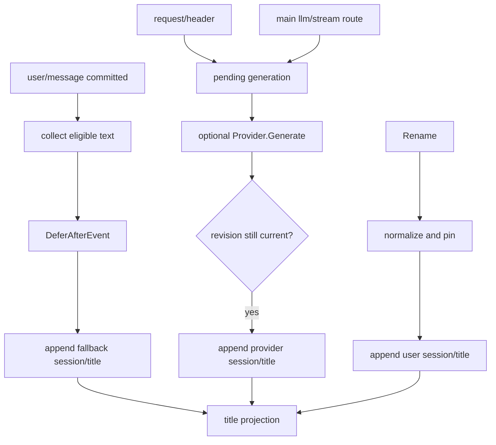

# Session Title 子模块

`sessiontitle` 拥有 log-backed Session title、fallback、Provider 调度与 `title` projection。跨模块权威设计见[`zh-CN/18-session-projection-and-title.md`](../zh-CN/18-session-projection-and-title.md)。

## 职责

- 定义并验证 `session/title` 与 `fallback | provider | user` source union；
- 规范化 title，按 UTF-8 byte 截断并生成 deterministic fallback；
- `LogService` 提供 `Get`、`Rename`、`Refresh`、`Register`；
- 注册 `titleProjectionUnit`，初始值为 `null`；
- 协调 request header、主 `llm/stream`、revision、supersession 与 drain。

本包不实现具体 LLM Provider、HTTP 调用、wire handler 或持久化 adapter。first-prompt/all-prompts Provider 是独立插件。

## 工作原理

Fallback 在原 user event publication 完成并释放 append guard 后运行，不依赖 sleep。Rename 会先 supersede 自动 work，再追加 user title；Refresh 明确解除 pin 并按当前日志重新生成。

## 上下游

- 上游：Session committed events、`llm.StreamEvent`、调用 `Rename/Refresh` 的 application adapter、可选 Provider plugin。
- 下游：Session append-only log、`sessionprojection.Registry`、API Proxy 的 rename 与 projection feed。
- 数据真相：永远是最新合法 `session/title`，内存 work state 只负责调度。

## 生命周期、错误与取消

Provider registration 归 owner Scope，且同一 Service 同时只接受一个 Provider。新 revision、user rename、Session dispose、Provider dispose 或 Service close 都取消旧 active call；迟到 Provider 结果在 append 前再次校验 revision。

空白或控制字符 rename 返回 `SessionTitleInvalidError`；Provider title、message seq 或 model provenance 不合法时拒绝且不 append。已 committed title 不因 projection/frame observer 失败回滚。Close 会停止接收新 work，并等待已启动 Provider 调用退出。
