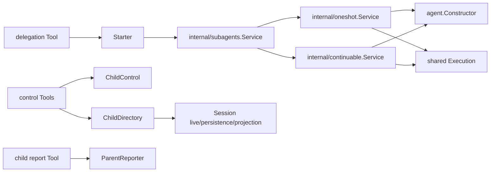

# Subagent

`subagent` 拥有委派请求、OneShot 与 Continuable 两种实现的统一生命周期契约，以及 durable child 的查询和父子通信语义。完整技术设计见[Subagent 架构与生命周期重构技术方案](../zh-CN/Subagent架构与生命周期重构技术方案.md)，实施顺序见[Subagent 重构实施方案](../zh-CN/Subagent重构实施方案.md)，当前完成证据见[Subagent 重构进度矩阵](../zh-CN/Subagent重构进度矩阵.md)，固定源职责证据见[源能力分析](../zh-CN/subagent/01-source-capability-analysis.md)。

局部文档包括[设计导航](./docs/design.zh-CN.md)、[术语规范](./docs/terminology.zh-CN.md)和[测试问题记录](./docs/server-test-findings.zh-CN.md)。Parent-bound 是未实现且仍有决策缺口的未来能力，只能从独立的[需求草案](./docs/parent-bound-requirements.zh-CN.md)和[技术草案](./docs/parent-bound-design.zh-CN.md)阅读，不能用于解释当前行为。

## 职责边界

本模块负责：

- `StartCommand` 构造时校验并复制调用方输入，读取时返回副本，再由 `Starter` 按 `Mode` 选择实现；
- 用同一个 `Execution` 契约表示 OneShot 或 Continuable 的一次 exact Agent epoch；
- 为模型 Tool 和 Host Consumer 提供最小的 `ChildControl`、`ParentReporter` 与 `ChildDirectory` 能力；
- 通过 `SeedBuilder` 生成首次创建 child Session 时使用的 detached event prefix；
- 保存 Subagent descriptor、事件、错误和模型消息来源等领域契约。

本模块不拥有 Agent epoch、AgentLoop、Session 持久化、Plugin topology、Tool schema 或模型传输。`agent` 负责 Agent 创建、恢复、运行时父子关系、结构关闭和 Scope 卸载；`agentloop` 只执行单个 Agent 的 Inbox、turn、step、Tool 与模型循环。Session 仍是 append-only 事实来源。

## 公共契约

| 文件 | 对象是什么 | 消费者 |
| --- | --- | --- |
| `lifecycle.go` | `Mode`、`ChildRequest`、`StartCommand`、`Execution`、`Starter` | delegation Tool、Host use case |
| `control.go` | 后续消息、中断授权和子向父报告契约 | control、report |
| `seed_builder.go` | fresh child Session seed 的构造策略与注册目录 | spawn、fork、runtime |
| `directory.go` | durable child 的只读查询目录与查询结果 | list_agents、Host/UI |
| `descriptor*.go` | Session log 中可重建的 Subagent identity | Continuable resume、目录查询 |
| `extension.go` | Continuable child Scope 的扩展安装契约 | report 等 child-scoped capability |
| `events.go` | 固定源兼容的注册与运行事件 | Plugin listener、Tool publication |
| `message_source.go` | 父子消息进入 Session log 时的来源描述 | Agent Inbox、重建 |
| `errors.go` | 稳定领域错误码 | 所有 Consumer |

`provider` 只保留在固定源兼容的事件名、配置字段和 descriptor 字段中；Go 对象统一称为 `SeedBuilder`。它只构造 seed，不创建 Agent，也不拥有执行生命周期。

## 模块划分

| 模块 | 负责 | 不负责 |
| --- | --- | --- |
| `plugin` | 解析依赖、构造业务对象、发布窄 capability、转接事件、注册 Projection，并把 child-local Plugin 组合实现注入两种执行模式 | Subagent 用例、Plugin Runtime 本身和 Agent 结构关闭策略 |
| `internal/subagents` | 统一准入、按 `Mode` 路由、公共中断授权、关闭编排 | 枚举 OneShot/Continuable 的公开 API |
| `internal/oneshot` | OneShot 创建、初始消息、结果选择和终止 | durable resume、后续消息 |
| `internal/continuable` | Continuable fresh create、cold resume、续投、报告和 settlement | Agent epoch 或 Session durability |
| `internal/execution` | 两种实现共用的一次执行状态、terminal future 和进程内索引 | Agent phase 镜像或父子树 |
| `internal/seedbuilder` | SeedBuilder 注册、查找和事件边界 | Agent 创建 |
| `internal/childdirectory` | live/persisted child 的只读合并查询 | 创建、恢复或控制 child |
| `internal/childpolicy` | `plugin` 组合层共用的 child-local policy Plugin adapter | OneShot/Continuable 业务策略 |
| `internal/projection` | Subagent identity/timing Session Projection | Registry、checkpoint 和 Session API |
| `internal/extension` | Continuable Extension registration 和 installation | Plugin lifecycle 或 Agent creation |
| `tools/delegation` | 创建新 Subagent 的模型委派 Tool 适配 | Subagent 启动状态机 |
| `tools/control` | 控制和查询已有 child 的三项 Tool 适配 | child lifecycle 与 durable query |
| `tools/report` | child 向 exact parent 报告的 Tool/Extension 适配 | 父子投递业务 |
| `spawn`、`fork` | 两种 SeedBuilder 策略 | OneShot/Continuable 执行 |

## 调用关系

`plugin.Plugin` 只做装配。真正的运行方向是 Consumer 调用 `Starter`/`ChildControl`/`ParentReporter`，统一 Service 再调用选中的实现；实现调用 `agent.Constructor` 创建或恢复 exact Agent，并用 `Execution` 汇合 terminal 结果。

## 生命周期

OneShot 与 Continuable 都经历 `Starting -> Active -> Stopping -> Stopped`。状态属于 `Execution`，不是 Agent 状态的副本；一个 Execution 与一个 exact Agent epoch 一一对应，不再存在额外 Activation 对象。

- OneShot 每次 `Start` 创建新 child；terminal 形成后实现自动释放 exact `agent.Handle`，调用方只等待 `Execution`，不再承担第二次 Dispose 义务。
- Continuable 的 durable child identity 可跨多个 resident epoch。cold child 收到 `Send` 时从 Session log 恢复，形成新的 common `Execution`；seed 只在首次创建时构造。
- 普通 interrupt 取消当前 turn，但不等价于删除 durable child。
- 模块关闭先停止统一 Service 准入并等待已准入调用返回，再让两种实现停止自己持有的 Execution。实现只等待 exact Agent 进入 Closing；Agent 模块继续拥有 child-first 结构关闭和 Scope teardown。
- 收到 `agent/disposed` 时，Subagent 只结算与该 exact Agent 匹配的 Execution，不再次 Dispose 已由 Agent 关闭的 Handle。

所有模型可见输入必须能从 Session log 重建。`ChildDirectory` 是读取时快照，不是投递或恢复承诺；实际 `Send`、`Interrupt` 和 `Report` 会重新校验 exact live Agent 与父子授权。
