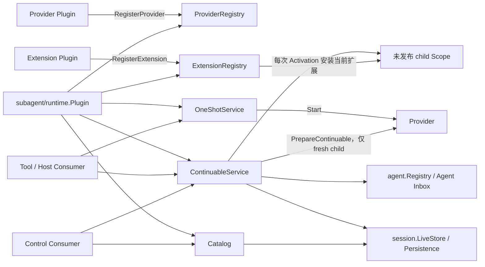

# Subagent

`subagent` 是父 Agent 委派子任务的领域能力。它统一拥有 Provider 注册、one-shot 运行、continuable 子会话、父子授权、durable descriptor、委派生命周期事件、驻留策略和只读目录；运行期 Agent epoch、父子关系和 child-first 关闭统一属于 `agent`，Agent Loop 只负责单个 Agent 的 Inbox、轮次与取消。

当前实现依据 DeepSeek Harness `b150a551b8d465e31e418e1b2eaf5e79bbb7d28e` 分析。该提交只是 Subagent 的 feature-local 参考，不改变仓库在 [01 复制范围与兼容基线](../zh-CN/01-porting-scope-and-baseline.md)中固定的全局基线。

## 文档导航

### 当前实现与依据

- [领域设计](./docs/design.zh-CN.md)：职责、接口、状态、依赖和关键流程。
- [术语规范](./docs/terminology.zh-CN.md)：兼容词汇、领域术语和 Go 命名规则。
- [服务端测试问题记录](./docs/server-test-findings.zh-CN.md)：测试暴露的问题、根因、结构性修复和复查证据。
- [DSH 源证据](../zh-CN/subagent/01-source-capability-analysis.md)：固定 feature-local commit 下的源 owner、符号与兼容差异。
- [全局实施进度](../zh-CN/08-implementation-progress.md)：仓库级证据索引，只记录 Subagent 已进入实现、Jobs/Workflow 仍 deferred。

### 临时设计文档

Parent-bound Subagent 仍是待确认的临时设计议题，相关需求和技术草案不属于当前文档集，因此不在这里建立导航。确认前，它们不得作为当前领域设计、兼容基线、实现承诺或现有 one-shot、continuable 和 Activation 行为的解释依据。

## 领域边界

`subagent` 核心能力拥有：

- `ProviderRegistry`、`OneShotService`、`ContinuableService`、`ExtensionRegistry` 和 `Catalog` 五个面向不同 Consumer 的能力；
- one-shot `Run` 的发布边界和 `subagent/start`、`subagent/end` 生命周期；
- continuable child 的 durable identity、Activation residency、冷恢复、续投授权、report、interrupt，以及发起关闭的业务策略；
- `subagent/descriptor` 的严格 codec、父子 MessageSource 和稳定错误码。

`subagent` 核心能力不拥有：

- 单个 Agent 的模型循环、Inbox、Session append 或持久化 I/O；
- Provider 的具体 spawn/fork 算法；
- Tool、Host API、Echo 或 WebSocket DTO；
- `subagent-acp`、`subagent-codex`、`subagent-claude-code`、`subagent-dsh-sdk`。

## 上下文关系

Subagent 位于调用适配器和 Agent/Session 基础能力之间，是“父 Agent 委派及管理 child”的业务上下文，不是第二套 Agent Runtime。依赖方向以 Consumer 所需的最小接口为准：

| 相邻上下文 | 谁主动调用谁 | 边界 |
| --- | --- | --- |
| Process Assembly / Plugin Runtime | Assembly 通过静态 Factory 创建 `runtime.Plugin`；Plugin Runtime 调用其 `Manifest`、`Apply` 和 `Dispose` | Plugin Runtime 拥有 Scope、binding、事件分发和结构化启停；Subagent Runtime 只装配本领域 Service |
| Tool Consumer | 模型调用 `tool`、`control` 或 child-local `report` Tool；这些适配器再调用 `OneShotService`、`ContinuableService` 或 `Catalog` | Tool schema、渲染和模型交互属于适配层，不能进入核心 Service |
| Provider Plugin | `spawn`、`fork` 等 Plugin 主动向 `ProviderRegistry` 注册；收到业务请求后，one-shot/continuation Service 再反向调用选中的 Provider | Provider 只决定创建策略和 fresh seed，不拥有 continuable residency |
| Agent | Subagent 用 `agent.Registry` 校验 exact live Agent，用 `agent.Constructor` 创建或恢复 child，用 `agent.DescendantLifecycle` 关闭运行期后代 | Agent 拥有 exact epoch、`RuntimeParent` 父子关系、Scope、模型循环、状态、Inbox 接受和取消语义 |
| Session | Subagent 产生 descriptor、lineage metadata 和 MessageSource，并通过 `LiveStore`、Persistence、Projection 读取 durable child 事实 | Session 拥有 append-only log、序号、flush、存储和恢复 I/O |
| Approval / Tools / System Prompt | `childscope` 消费授权策略；`tool`、`control`、`report` Plugin 向 Tool Catalog 或 Prompt Registry 安装效果 | 这些上下文提供通用能力，Subagent 只定义委派场景下的使用方式 |

## 运行关系

Provider、Activation Extension 和 `runtime.Plugin` 处于不同层次：

| 角色 | 用途 | 不拥有 |
| --- | --- | --- |
| Provider | 声明一种子 Agent 创建策略；处理 one-shot `Start`，支持 continuable 时只准备 fresh child 的持久化 seed | continuable child 的驻留、恢复、投递与回收 |
| Activation Extension | 在 continuable child 每次形成未发布 Activation 时，把当前注册的 child-scoped 能力安装进该 Scope，并返回可精确撤销的 Installation | Provider 创建策略、Agent Loop 或 Plugin 生命周期 |
| `runtime.Plugin` | 装配并发布五个独立 Service，解析 Agent、Session 等依赖，管理模块启停和失败回滚 | Provider 或 Extension 的具体业务实现，也不代替 Agent Runtime |

注册只让 Provider 或 Extension 可被后续用例发现，不会主动创建 child。`OneShotService` 或 `ContinuableService` 被 Tool/Host 调用后才查找 Provider；Extension 则由 continuable child 的 Scope 物化过程按当时注册快照安装。

## 子模块职责

### 公开契约、Plugin 与适配器

| 路径 | 职责 | 非职责 |
| --- | --- | --- |
| `subagent` | 声明五个 Service、Provider、Run、descriptor、消息来源、生命周期事件和稳定错误等公开契约 | 不保存运行期状态，不实现 Provider 或用例 |
| `subagent/factory` | 严格校验核心 Plugin 配置并创建未激活的 `runtime.Plugin` | 不解析运行期依赖，不注册具体 Provider 或 Tool |
| `subagent/runtime` | 构造并发布五个独立 Service，适配 Plugin event bus，注册 Projection，解析可选依赖并启停 continuation/Catalog | 不转发 Service 业务方法，不实现 Provider、Agent Loop、Agent 生命周期或 Session I/O |
| `subagent/spawn` | 实现 fresh in-process Provider；one-shot 与 continuable 都从空 seed 创建 child | 不继承 parent conversation，不拥有 admission 或 residency |
| `subagent/fork` | 实现 fork in-process Provider；只截取 parent 最后一个完整 `turn/end` 之前的前缀作为创建 seed | 不复制未完成 turn，不在冷恢复时重新 fork parent |
| `subagent/tool` | 把一个配置选定的 Provider 暴露成 delegation Tool；前台路由 one-shot，continuable background 返回 durable child ID | 不实现 Provider，不收集 Jobs，不控制已有 child |
| `subagent/control` | 安装 `send_message`、`interrupt_agent`、`list_agents`；把调用 Agent 作为授权主体 | 不创建 child，不选择 Provider，不恢复 child 只为列表展示 |
| `subagent/report` | 注册 Activation Extension，在每个 continuable child Scope 安装 `report` Tool 和提示；将 child 报告投递给 exact direct parent | 不结束 child turn，不向 ancestor 广播，不作用于 one-shot child |
| `subagent/{spawn,fork,tool,control,report}/factory` | 严格解码各 Provider/Consumer 的 typed config，并构造对应静态 Plugin | 不持有 Service，不把原始 JSON 传入业务逻辑 |

Factory Catalog 静态注册 core、spawn、fork、tool、control、report 的 Factory；默认服务器只挂载 core、spawn、tool、control 和 report。fork 已可组合，但不是默认 Provider。

### 仓库私有实现

| 路径 | 实际 owner |
| --- | --- |
| `internal/provider` | Provider 名称唯一性、稳定枚举顺序、精确 registration、added veto 回滚和 removed best-effort 事件 |
| `internal/oneshot` | one-shot 请求快照与 capability 校验、Provider dispatch、Run 合同检查，以及成对 `subagent/start` / `subagent/end` 观察 |
| `internal/continuation` | continuable 的创建、冷恢复、父子授权、Inbox 投递、interrupt、report、settlement、Activation residency，以及向 Agent 生命周期发起关闭请求 |
| `internal/childscope` | 决定 unpublished child Scope 安装哪些 delegation policy、persona、Tool restriction、run-local Plugin 和 Activation Extension，并组合事务型 `agent.Provisioner` |
| `internal/extension` | Activation Extension 的有序 registration、每个 Activation 的安装事务、失败回滚和 resident installation 精确撤销 |
| `internal/inprocess` | spawn/fork 共用的本地 one-shot Driver：创建 child、提交 prompt、等待 idle、选择结果并收敛取消与 `Run.Dispose` |
| `internal/lineage` | 从 exact parent 推导 depth、cwd、origin、preset、Agent options 和 Session metadata；不做 live authorization |
| `internal/catalog` | 从 live-preferred Session 语料和 Projection 构造只读 child/descendant 目录；损坏的单个候选收敛为 diagnostic |
| `internal/projection` | 折叠 `subagent` identity 与 `subagentTiming` 两个纯 Session Projection，不拥有 Registry 或 checkpoint |
| `internal/assistantoutput` | one-shot 与 continuable 共用的纯选择算法，从一个 Activation epoch 的事件后缀选择权威最终 assistant output |

`internal/continuation` 内部区分“行为 owner”和“状态容器”：稳定的 `Service` 负责激活期间的 Manager 切换和 API 入口；`Manager` 协调 continuable 用例；`Activation` 记录一个 durable child 的单次进程内驻留 epoch；`residency` 只集中保存 mutex、Activation map、per-child lock 和模块级 draining 状态。runtime parent graph、descendant admission 和关闭顺序不在该容器中，由 `agent.DescendantLifecycle` 统一拥有。

## 关键调用链

1. Provider 注册：Provider Plugin → `ProviderRegistry.RegisterProvider` → 发布 `subagent/provider-added`。到此只有可发现性变化，没有 child 被创建。
2. 前台 one-shot：模型 → `tool.Plugin.execute` → `OneShotService.Start` → `ProviderRegistry.GetProvider` → `Provider.Start`。内置 spawn/fork Provider 随后调用 `internal/inprocess.Driver` → `agent.Constructor.Create`；Tool 等待 `Run`、读取 `Result` 并负责 `Run.Dispose`。
3. continuable 创建：模型 → `tool.Plugin.execute` → `ContinuableService.StartContinuable` → continuation `Manager.Start` → `ContinuableProvider.PrepareContinuable` → `agent.Constructor.Create`。`childscope` 在 Agent 发布前安装当前 Activation Extensions；初始 prompt 被 Inbox 接受后才返回 child ID。
4. continuable 续投：`send_message` → `ContinuableService.Followup`。Manager 先校验 exact direct parent；child 不驻留时通过 descriptor 和 Session log 冷恢复，再调用 exact resident child 的 `Agent.Followup`。冷恢复不会再次调用 `PrepareContinuable`。
5. report：continuable child → child-local `report` Tool → `ContinuableService.ReportFrom` → exact direct parent 的 `Agent.Inject` 或 `Agent.Steer`。`quiet` 只追加，`next-step` 还请求 parent 下一步调度。
6. 目录与状态：`list_agents` → `Catalog` → LiveStore/Persistence/Projection；control 适配器随后查询 `agent.Registry`，只把 durable 目录行映射为 `running`、`idle` 或 `ready`，不会为观察状态而恢复 cold child。

## 生命周期与失败

- Provider 注册先检查名称唯一性，再发布 `subagent/provider-added`；有序 observer 拒绝时回滚注册。精确 registration 撤销后发布 best-effort `subagent/provider-removed`。
- one-shot `Start` 在 Provider 成功发布 `Run` 后才返回；启动失败不产生运行生命周期。返回后由 holder 负责 `Run.Dispose`，Runtime 观察 terminal result 并保证 start 先于 end。
- continuable 以 Session log 为事实来源。Activation 只是一个进程内驻留周期，不是可持久化业务事实。
- Continuation Manager 判断 Activation 何时结束，只持有 `agent.Constructor` 返回的 exact `agent.Handle`；运行期父子关系和 child-first 回收由 `agent.DescendantLifecycle` 执行。Activation 仅保存本次 residency、Handle 和 exact parent 事件目的地，不维护第二套父子集合。
- `context.Context` 只取消接受前的操作或等待；已被 Inbox 接受的消息不因调用方随后取消而撤回。
- `Interrupt` 是发出取消后立即返回，不等待 Agent idle；是否保留 Inbox 由 Agent cancel contract 决定。
- drain 阻止目标父树继续 admission，等待已进入的创建事务，再按 child-first 顺序释放 resident handle。

精确完成状态和测试证据以[全局实施进度](../zh-CN/08-implementation-progress.md)为准；临时设计文档不得作为现有行为已经实现的证据。
