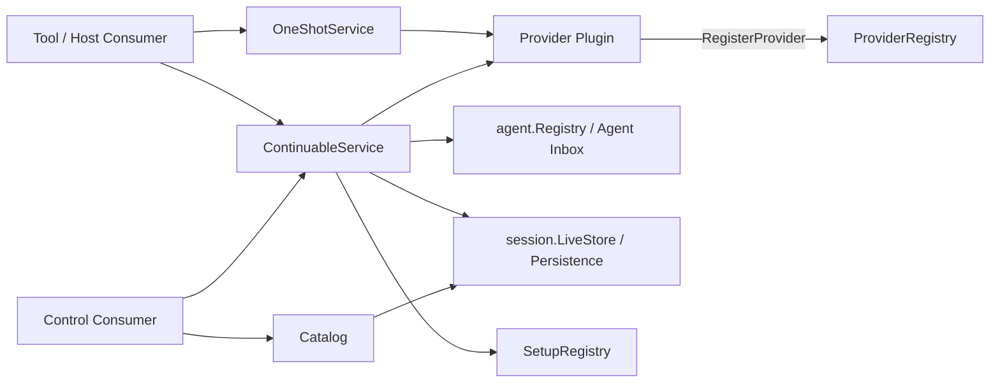

# Subagent

`subagent` 是父 Agent 委派子任务的领域能力。它统一拥有 Provider 注册、one-shot 运行、continuable 子会话、父子授权、durable descriptor、生命周期事件、子树清理和只读目录；Agent Loop 仍只负责单个 Agent 的 Inbox、轮次与取消。

当前实现依据 DeepSeek Harness `b150a551b8d465e31e418e1b2eaf5e79bbb7d28e` 分析。该提交只是 Subagent 的 feature-local 参考，不改变仓库在 [01 复制范围与兼容基线](../zh-CN/01-porting-scope-and-baseline.md)中固定的全局基线。

## 文档导航

- [领域设计](./docs/design.zh-CN.md)：职责、接口、状态、依赖和关键流程。
- [术语规范](./docs/terminology.zh-CN.md)：兼容词汇、领域术语和 Go 命名规则。
- [实现进度](./docs/implementation-progress.zh-CN.md)：已实现、进行中、未实现及验证证据。
- [迁移草案](../zh-CN/subagent/00-draft-scope-and-reading-order.md)：源实现分析和跨包迁移方案；在架构确认前不属于权威设计。
- [全局实施进度](../zh-CN/08-implementation-progress.md)：仓库级证据索引；当前按约定暂不写入 Subagent 进度。

## 领域边界

`subagent` 拥有：

- `ProviderRegistry`、`OneShotService`、`ContinuableService`、`SetupRegistry` 和 `Catalog` 五个面向不同 Consumer 的能力；
- one-shot `Run` 的发布边界和 `subagent/start`、`subagent/end` 生命周期；
- continuable child 的 durable identity、Activation residency、冷恢复、续投授权、report、interrupt 和 child-first drain；
- `subagent/descriptor` 的严格 codec、父子 MessageSource 和稳定错误码。

`subagent` 不拥有：

- 单个 Agent 的模型循环、Inbox、Session append 或持久化 I/O；
- Provider 的具体 spawn/fork 算法；
- Tool、Host API、Echo 或 WebSocket DTO；
- `subagent-acp`、`subagent-codex`、`subagent-claude-code`、`subagent-dsh-sdk`。

## 运行关系

`subagent` 根包只声明领域公开契约和共享值对象；已实现用例按内聚能力划分为 `internal/provider`、`internal/oneshot`、`internal/continuation`、`internal/composition`、`internal/setup`、`internal/catalog` 和 `internal/projection`。`subagent/runtime.Plugin` 是唯一 Plugin 与装配入口，但不实现这些业务接口；它以 `ProvidedService` 发布各子模块的独立对象，并管理两个 Subagent Projection Unit 的 registration。私有子模块不得各自建立 Plugin 或直接操作 Runtime topology。

## 生命周期与失败

- Provider 注册先检查名称唯一性，再发布 `subagent/provider-added`；有序 observer 拒绝时回滚注册。精确 registration 撤销后发布 best-effort `subagent/provider-removed`。
- one-shot `Start` 在 Provider 成功发布 `Run` 后才返回；启动失败不产生运行生命周期。返回后由 holder 负责 `Run.Dispose`，Runtime 观察 terminal result 并保证 start 先于 end。
- continuable 以 Session log 为事实来源。Activation 只是一个进程内驻留周期，不是可持久化业务事实。
- `context.Context` 只取消接受前的操作或等待；已被 Inbox 接受的消息不因调用方随后取消而撤回。
- `Interrupt` 是发出取消后立即返回，不等待 Agent idle；是否保留 Inbox 由 Agent cancel contract 决定。
- drain 阻止目标父树继续 admission，等待已进入的创建事务，再按 child-first 顺序释放 resident handle。

精确完成状态和测试证据见[实现进度](./docs/implementation-progress.zh-CN.md)，不要从目录或接口存在推断行为已经完成。
