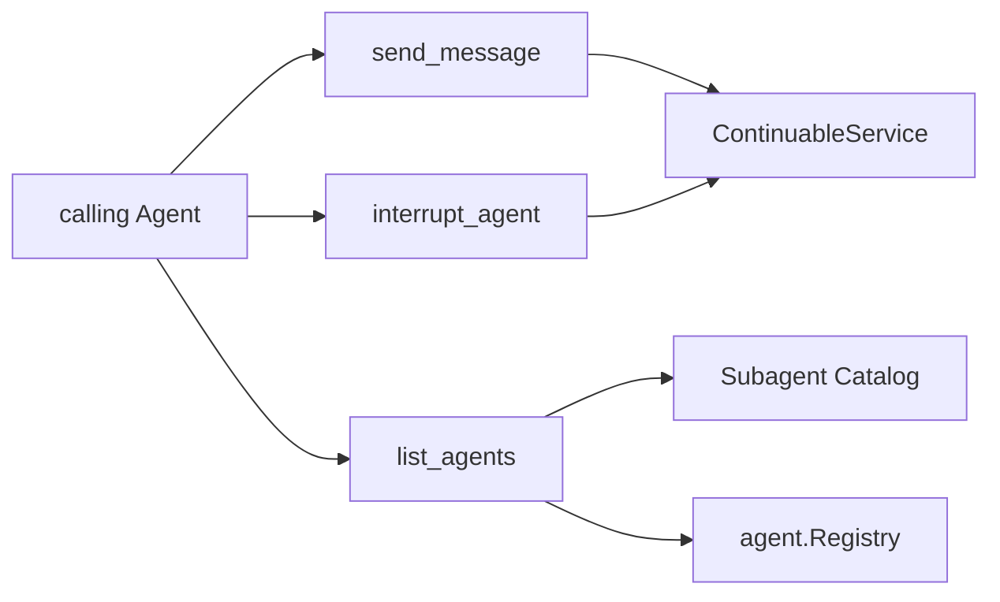

# Subagent Control Tools

本包一次注册 `send_message`、`interrupt_agent` 与 `list_agents` 三个 continuable control Tool，并在任一注册失败时逆序回滚全部已取得 handle。

send 使用 exact calling Agent 作为 direct-parent authority；interrupt 使用 exact ancestor authority，发出 cancel 后立即返回；list 读取 durable Catalog，并用 live Agent Registry 区分 running、idle、ready，不为观察状态而 resume cold Agent，也不把 one-shot child 当作可续投目标。

本包不拥有 child lifecycle、Catalog projection 或 Provider 选择。跨包合同见[领域设计](../docs/design.zh-CN.md)，实现证据见[进度](../../zh-CN/08-implementation-progress.md)。
