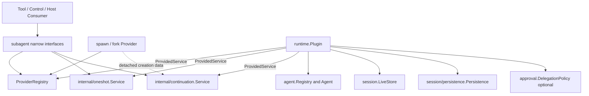

# Subagent 领域设计

状态：Working Design

## 1. 范围与证据

本文是 `subagent` 包的局部实现设计，解释代码职责和当前契约，不替代仓库权威范围、路线图或全局实施进度。跨包来源分析见：

- [源功能与模块关系](../../zh-CN/subagent/01-source-capability-analysis.md)；
- [Continuable 生命周期与持久化](../../zh-CN/subagent/02-continuable-runtime-and-durability.md)；
- [Go 架构与契约草案](../../zh-CN/subagent/03-go-architecture-and-contracts.md)。

源参考为 DeepSeek Harness `b150a551b8d465e31e418e1b2eaf5e79bbb7d28e` 的 `packages/subagent/subagent`。最后一次与当前 Go 实现核对：2026-08-23。

## 2. 职责分解

### 2.1 Plugin 与业务 Service

`runtime.Plugin` 是唯一装配和 Plugin 生命周期 owner，但不是 Subagent 用例实现。它解析外部依赖、控制模块启停、适配 Event bus，并以 `ProvidedService` 发布四个独立业务对象。one-shot 与 continuable 仍是不同 Consumer 接口：

| 能力 | Consumer 意图 | 主要实现文件 |
| --- | --- | --- |
| `ProviderRegistry` | 注册、查找和列举 Provider | `provider.go`、`internal/provider` |
| `OneShotService` | 启动一个 holder-owned `Run` | `one_shot.go`、`internal/oneshot` |
| `ContinuableService` | 创建、续投、报告、中断和清理 durable child | `continuable.go`、`internal/continuation` |
| `SetupRegistry` | 为每个 continuable Activation 组合 Plugin | `setup.go`、`internal/setup` |
| `Catalog` | 不 resume Agent 地列举 durable child | `catalog.go`、后续 listing 行为文件 |

接口和数据声明与用例实现分文件，是为了阅读和依赖审计；它们仍属于一个领域。`types.go` 不作为所有声明的收容处。Plugin 不通过转发方法实现上述接口；Consumer 解析到的是对应子模块对象。

### 2.2 Provider

`Provider` 是基础能力，每个 Provider 都能建立 one-shot `Run`。`ContinuableProvider` 是附加能力，只贡献 detached continuable creation data；continuation Service 继续拥有 child identity、Agent Handle、消息投递和 teardown。

Provider 不得直接修改 continuation residency，不得持有 continuable child Handle，也不得实现自己的恢复和父子授权。

### 2.3 continuation Manager 与 Activation

`internal/continuation` 的 Manager 负责：

- 每个 child ID 的 admission serialization；
- resident Activation、parent cutoff 和 ancestry authority；
- fresh create 与 cold resume 的同一发布事务；
- settlement、selected drain 和 descendant drain。

`activation` 表示一个 child 在当前进程中的一次 residency epoch。它持有 exact `agent.Handle` 和 epoch `RunID`，但 durable identity 来自 Session Header 与第一个 `subagent/descriptor` event。

### 2.4 Setup

`Setup` 回答“要安装的贡献是什么”。`internal/setup.Registry` 管理有序注册、每次 materialization 的 fresh `agent.Setup` 和 exact resident installation；`internal/composition.Composer` 把 delegation policy、persona、Tool restriction 与注册贡献装入未发布 child Scope。撤销注册立即卸载它在所有 resident Activation 中产生的精确安装，而不是按名称删除。

## 3. 依赖方向

禁止的方向：

- `agent`、`session`、`llm`、`tools` 反向依赖 `subagent`；
- core 依赖 spawn、fork、Tool 或 delivery adapter 的具体实现；
- Echo、API Proxy wire struct、数据库 driver 或旧 `llm/docs` 类型进入领域契约；
- 在顶层 `internal/subagent` 或各私有子模块复制 Plugin 装配入口；
- 把 Provider、one-shot、continuation、setup 和 catalog 再按 DTO/service/mapper 技术层平铺。

## 4. 公开边界与不变量

### 4.1 Provider publication

输入是 trusted same-process `Provider`。名称必须非空、已 trim 且唯一。注册期间 Provider 在 registry 中可解析，以匹配源 `registerProvider` 的 publication 顺序；`ProviderAdded` observer 报错会精确回滚。成功后列表保持注册顺序。旧 registration 不能删除后来注册的同名实例。

### 4.2 One-shot Start

调用顺序：

1. 解析 Provider；
2. 验证声明能力、depth 与 object JSON schema；
3. detach prompt、options、restriction、schema 和 descriptor；
4. 调用 `Provider.Start`；
5. 验证非空 `Run` 与 local Agent identity；
6. 绑定 terminal observer，发布 `subagent/start`，返回同一个 `Run`；
7. result 完成或失败后发布同 `RunID` 的 `subagent/end`。

Provider 返回前仍拥有创建事务，失败必须自行回滚且不产生 start/end。Provider 返回后 ownership 转给 caller；移除 Provider 不撤销已返回的 Run。

### 4.3 Continuable admission

目标流程是：预检 Provider 附加能力与依赖，保留 child ID，构造 descriptor/seed/policy，创建未发布 Agent，安装 Setup，接受 initial prompt，再提交发布。任何 prompt 接受前失败都不得返回 IDs，并释放整个 child transaction。

`Followup` 验证传入的是 registry 中 exact live direct parent。resident child 直接进入其唯一 Inbox；cold child 先从 persistence resume，再由同一 Inbox 接受。MessageSource 只做 durable attribution，不是 authority credential。

### 4.4 Interrupt、settlement 与 drain

- `Interrupt` 只对 resident child 做 exact authority 校验；目标不存在时是 no-op。它调用 Agent cancel 后返回，不等待 idle，也不删除 Activation 或未认领 Inbox。
- settlement 在 Agent 真正 idle 后判定 epoch outcome，追加 parent notice，并 child-first 释放 exact Handle。
- drain 的 admission cutoff 绑定 exact parent Agent identity；同 Session ID 的陈旧实例不能获得 authority。

### 4.5 Catalog

`Catalog` 读取 live Session 与可选 persistence，使用 descriptor projection/fold 分类，但不调用 `agent.Registry.Resume`。普通 Session 和 one-shot child 仍可作为 traversal node，以发现其下层 continuable descendants。每个候选的损坏或暂时读取失败成为 contained diagnostic，不应让整个列表丢失。

## 5. Owned state

| 状态 | owner | 持久性 | 不变量 |
| --- | --- | --- | --- |
| Provider map/order | `internal/provider.Registry` | 进程内 | 名称唯一；exact registration 撤销 |
| Descriptor | child Session | durable | 第一个 descriptor 权威；version/mode 严格解释 |
| Parent/child relation | Session Header + descriptor | durable | direct parent 不由 MessageSource 推断 |
| Activation map | `internal/continuation.Manager` | 进程内 | 每个 child 至多一个 resident epoch |
| Inbox queue | `agent.Inbox` | durable projection | 所有 accepted continuable 消息共享 FIFO |
| Setup registration/installations | setup registry | 进程内 | ordered snapshot；exact installation 撤销 |
| Run lifecycle | one-shot Service / continuation Manager | observe-only | 每个 accepted `RunID` 恰好 start 后 end |

## 6. 失败与取消

领域失败用 `subagent.Error` 的稳定 `ErrorCode` 分类，技术原因放在 `Cause`。禁止把 Provider、Session 或 transport 原始错误改写成成功。

- operation context 在开始时必须检查；nil context 不是有效调用；
- one-shot `Start` context 是底层 Run 的 canonical cancellation channel，`AwaitResult` context 只取消等待；
- continuable 发送在 Inbox 接受前响应取消，接受后返回稳定 `MessageID`；
- lifecycle observer 是 best-effort，不得改变已经发布的 Run 或 teardown；
- registry `ProviderAdded` 是有序且可 veto 的唯一例外，因为它属于 publication transaction。

## 7. 局部决策与待决项

- 已决定：one-shot 和 continuable 是同一领域的两种策略、不同 Consumer 接口、不同业务 service 实现，由同一 Plugin 装配和发布。
- 已决定：continuable 是 Provider 的附加接口能力，不是 `Capabilities.Continuable` 布尔字段。
- 已决定：根包保留公开契约和值对象；用例按内聚能力进入 `subagent/internal/*`，由 `subagent/runtime` 唯一装配。
- 已实现但待扩充验证：continuable Manager、child composition 与 Setup 安装/撤销。
- 待实现：Catalog、spawn/fork Provider、Tool/control/report Consumer 和默认 assembly。
- 待全局确认：把 feature-local DSH 差异并入权威范围、路线图和全局进度索引。

逐项状态和验证命令见[实现进度](./implementation-progress.zh-CN.md)。
