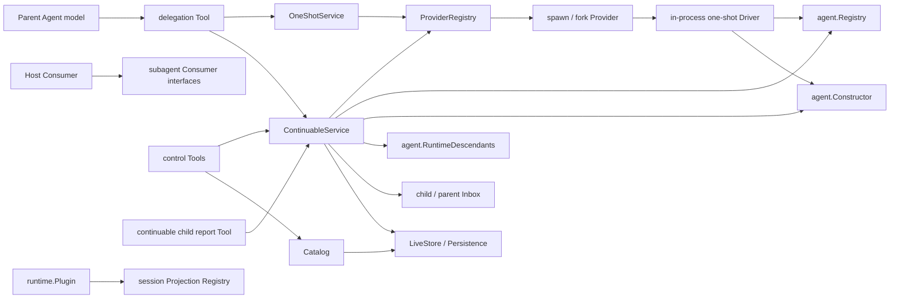
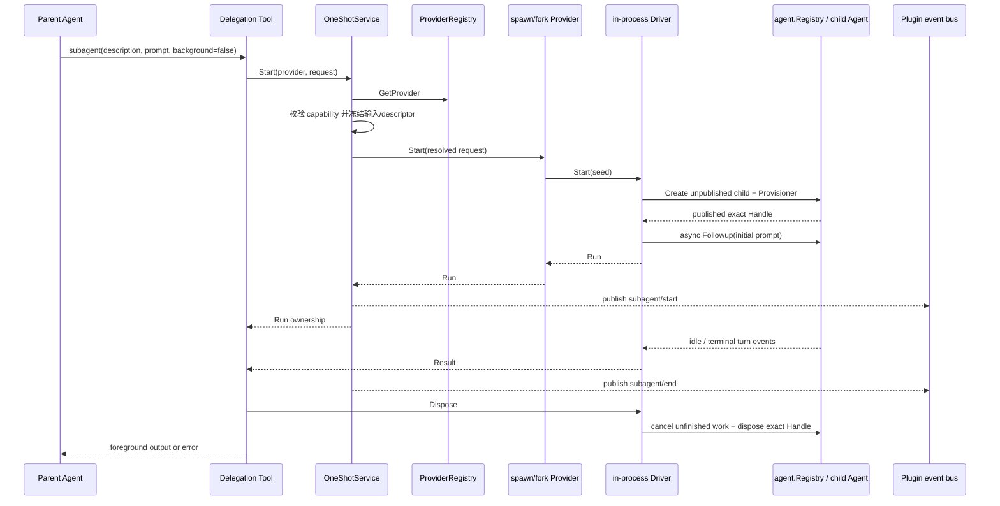
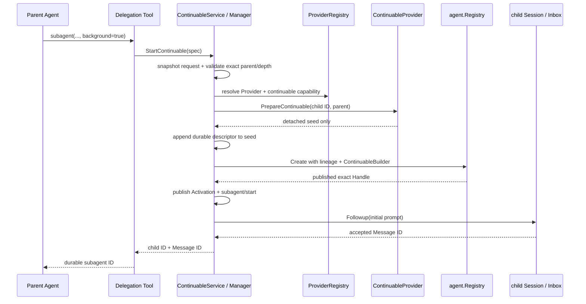
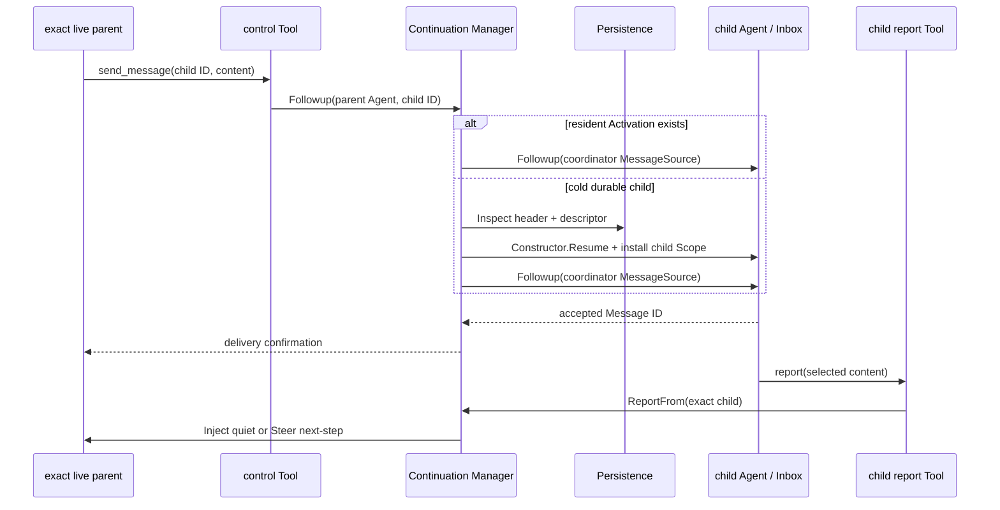

# Subagent 领域设计

状态：Working Design

## 1. 范围、结论与证据

本文解释 Goren `subagent` 领域的两种执行模式、生命周期、设计 owner 和上下游交互。它是局部实现设计，不替代仓库权威范围、路线图或全局实施进度。固定源 owner 与符号见 [DSH Subagent 源证据](../../zh-CN/subagent/01-source-capability-analysis.md)；本目录不另建实施进度真相源。

源参考为 DeepSeek Harness `b150a551b8d465e31e418e1b2eaf5e79bbb7d28e` 的 `packages/subagent/subagent`、`subagent-in-process-driver`、`subagent-spawn-in-process`、`subagent-fork-in-process`、`tool-subagent`、`tool-subagent-control` 与 `tool-subagent-report`。最后一次与当前 Go 实现核对：2026-08-24。

阅读本文前先区分两个正交维度：

- `one-shot` 与 `continuable` 是两种**执行和生命周期模式**；本文所说“两种 Subagent”默认指这一维度。
- `spawn` 与 `fork` 是两种**上下文构造 Provider**；它们决定 child 初始 Session seed，不拥有 child 后续生命周期。

因此一个调用先选择 Provider，再选择执行模式。当前 `spawn`、`fork` 的代码都实现两种模式所需的 Provider 能力；默认 deployment 只把 `spawn` 暴露为 continuable delegation Tool，不能由代码能力反推部署承诺。

## 2. 两种执行模式

| 维度 | one-shot | continuable |
| --- | --- | --- |
| 适用任务 | 一次委派、等待一个终态结果 | 后台协作、后续可继续交互 |
| Consumer 边界 | `OneShotService` | `ContinuableService`、`Catalog` |
| 调用返回 | holder-owned `Run`，最终读取 `Result` | initial prompt 被 Inbox 接受后返回 durable child ID 与 Message ID |
| 运行 owner | 返回的 `Run` holder | continuation Manager 的 resident `Activation` |
| 对话次数 | 一个 child turn | 多个按 Inbox FIFO 接受的 turn |
| 冷恢复 | 不支持 | 支持；storage-only child 可在 `Followup` 时恢复 |
| 父到子 | Start prompt | Start prompt、`send_message` |
| 子到父 | terminal `Result` | `report`、settlement notice |
| 中断 | Start context 或 `Run.Dispose` 终止整个 run | `interrupt_agent` 只停止当前 turn，保留 Inbox 和 durable child |
| 结束含义 | 结果已形成；holder 释放 exact Agent Handle | 当前 Activation 结算并释放；Session identity 仍可再次 materialize |
| 查询 | Catalog 可向 UI 等 Consumer 分类，但 control Tool 不列出 | `list_agents` 列出 `running`、`idle`、`ready` |

两种模式都创建独立 child Session，并在 Header 写入 parent、origin 和 delegation depth。continuable 在 creation seed 中先写 `subagent/descriptor`；one-shot 在首次进入 model step 前写 descriptor。差异不是“是否有 Session”，而是谁持有运行期对象、是否存在可续投的 durable identity，以及一次运行结束后还能否冷恢复。

### 2.1 one-shot 的功能边界

one-shot 表达“一次输入、一次终态结果”的前台委派：

- Consumer 可指定 persona、Tool restriction、depth limit 和可选 structured output schema，但只能使用 Provider 声明支持的能力。
- Provider 创建 child 并返回 `Run`；`Run` 暴露 child ID、可选同进程 Agent、等待结果和释放操作。
- 当前 in-process Driver 只驱动一个 child turn，并只从 activation boundary 之后的 child 自有事件提取 assistant output 与 stop reason。
- `AwaitResult` 只等待，不转移或释放 ownership；holder 必须调用 `Dispose`。
- Provider registration 被移除后只禁止新的 Start，已经发布的 `Run` 继续由 holder 管理。

one-shot 没有 `send_message`、`report`、冷恢复或 resident Activation。若要把 one-shot 放到后台并稍后收集，owner 应是 Jobs；当前构建未包含 Jobs，因此不会用 continuable 冒充 background one-shot。

### 2.2 continuable 的功能边界

continuable 表达“一个 durable child，多次可独立调度的 turn”：

- Start 只保证 initial prompt 已被 child Inbox 接受，不等待模型开始或产生结果。
- 父 Agent 通过 `send_message` 向 direct child 续投；resident child 复用同一 Inbox，cold child 先恢复再投递。
- exact live child 可通过 child-local `report` Tool 向 exact direct parent 回报选定内容；report 不结束 child turn。
- exact live ancestor 可 `interrupt_agent`；它只发出当前 turn 的取消信号，不等待 idle，不清空未 claim 的消息，也不释放 child。
- `list_agents` 从 durable Catalog 发现 continuable child；`ready` 表示当前只在存储中、可恢复，不表示有待收集结果。
- Activation idle、无 accepted message 且无 resident child 后自动 settlement；释放的是本次 residency epoch，不是 durable child identity。

continuable 必须有 Session persistence。没有 persistence 时不能承诺冷恢复，Service 会拒绝创建，而不是静默退化成易失后台任务。

## 3. Provider 设计：spawn 与 fork

Provider 回答“child 如何起步”，core 回答“child 如何活着、被控制和结束”。基础 `Provider` 建立 one-shot `Run`；附加的 `ContinuableProvider` 只返回 detached creation seed。continuation Manager 始终拥有 child ID、Agent Handle、prompt delivery、residency、恢复、settlement 和 teardown。

| Provider | seed 规则 | child 能看到的父上下文 | 不变的继承项 |
| --- | --- | --- | --- |
| `spawn` | 空 seed | 看不到父 Session conversation | cwd、Agent defaults、preset、delegation depth 等 lineage policy |
| `fork` | 截至父 Session 最后一个 `turn/end` 的平衡前缀 | 看到已完成 turns；排除尚未完成的当前 turn | 同上 |

这两个维度组合后的语义是：

| 组合 | 语义 | 当前默认装配 |
| --- | --- | --- |
| spawn + one-shot | fresh child 执行一个 turn，返回 Result | 支持；同一默认 Tool 可用 `run_in_background=false` 选择 |
| spawn + continuable | fresh durable child，返回 ID 后继续后台协作 | 默认 Tool 路径 |
| fork + one-shot | 带父 completed-turn prefix 执行一个 turn，返回 Result | Provider 已实现；默认未挂载 fork Tool |
| fork + continuable | 带创建时 prefix 的 durable child | Provider 已实现；默认未挂载 fork Tool |

`fork` 的 prefix 在创建时做 detached snapshot。continuable child 后续冷恢复重放 child 自己已经持久化的 Session，不再次读取父 Session，也不会把父会话后来新增的 turns 动态合并进 child。

Provider 不得：

- 直接写 continuation residency map 或持有 continuable `AgentHandle`；
- 自行实现父子授权、Inbox、cold resume、settlement 或 descendant close；
- 用 `Capabilities.Continuable` 布尔值替代附加接口能力；
- 因 Provider 卸载而取消已经发布的 `Run` 或 `Activation`。

## 4. Owner 与职责分解

### 4.1 Runtime Plugin 与五个业务能力

`subagent/runtime.Plugin` 是唯一装配和 Plugin 生命周期 owner，但不是 Subagent 用例实现。它解析外部依赖、控制模块启停、注册 Projection Unit、适配 Event bus，并以 `ProvidedService` 发布五个独立业务对象：

| 能力 | Consumer 意图 | 主要实现位置 |
| --- | --- | --- |
| `ProviderRegistry` | 注册、查找和按稳定顺序列举 Provider | `provider.go`、`internal/provider` |
| `OneShotService` | 验证并启动一个 holder-owned `Run` | `one_shot.go`、`internal/oneshot` |
| `ContinuableService` | 创建、续投、报告和中断 durable child | `continuable.go`、`internal/continuation` |
| `ExtensionRegistry` | 注册并精确撤销 continuable child-scoped 扩展 | `extension.go`、`internal/extension` |
| `Catalog` | 不 resume Agent 地列举 durable child | `catalog.go`、`internal/catalog` |

接口和值对象按概念分文件，但仍属于同一个领域。Plugin 不通过一组转发方法伪装成所有能力；Consumer 得到的是各自的业务 Service。

### 4.2 continuation Manager 与 Activation

`internal/continuation.Manager` 负责：

- 每个 child ID 的 admission serialization；
- resident Activation、parent cutoff、exact ancestry authority；
- fresh create 与 cold resume 的同一 publication boundary；
- Inbox accepted-message accounting；
- settlement，以及模块卸载时 resident Activation 的 managed close 请求。

`Activation` 表示一个 continuable child 在当前进程中的一次 residency epoch。它持有 exact `agent.Handle`、本 epoch 的 `RunID`、accepted messages 和 resident children；durable identity 则来自 Session Header 与第一个 `subagent/descriptor` event。同一个 child 可先后产生多个 Activation，但每个进程中同一 child 同时至多一个 resident epoch。

### 4.3 Child Scope 与 Extension

`internal/childscope` 只解释“未发布 child Agent 的 Scope 中要安装什么”，不创建 Agent，也不拥有 child lifecycle：

- one-shot 安装共享 delegation policy、persona、Tool restriction、run-local descriptor appender，以及可选 structured-output capture；
- continuable fresh create 安装 delegation policy、persona、Tool restriction 和 Activation Extensions；cold resume 重放 durable policy，不重复 seed；
- report Plugin 通过 `ActivationExtension` 只进入 continuable child，提供 child-to-parent 的 `report` Tool 与提示词。

Extension registry 保存有序注册，并为每个 resident Activation 持有精确 installation。撤销 registration 时卸载对应 installation，不按名称猜测或批量删除。

### 4.4 Agent、Session 与 Subagent 的边界

- Agent Runtime 拥有单个 Agent、Inbox、turn、cancel 和 Handle publication/disposal。
- Session 拥有 append-only event log、Header、LiveStore 与持久化 I/O。
- Subagent 拥有两种委派策略、父子关系解释、授权、residency、lifecycle event 和跨 Agent 投递语义。
- Agent Loop 不发现 Provider，不选择 Subagent 模式，也不维护 child tree。

## 5. 谁主动调用谁

调用方向始终是 Consumer 主动调用 Subagent core，core 再调用 Provider、Agent、Session 等下游能力。Provider registration 和 Tool registration 只决定能力是否可发现；真正的 child 创建只发生在一次显式 Start 中。

| 交互 | 主动方 | 被调用方 | 返回或副作用 |
| --- | --- | --- | --- |
| Provider 发布 | spawn/fork Plugin | `ProviderRegistry.RegisterProvider` | 注册期间可解析；added observer 可 veto 并回滚 |
| 工具可见性 | delegation Tool Plugin | Provider lifecycle + Tool Registry | Provider 存在时注册 model-visible Tool，移除时撤销 exact handle |
| one-shot 委派 | delegation Tool / Host | `OneShotService.Start` | 返回 holder-owned `Run` |
| continuable 委派 | delegation Tool / Host | `ContinuableService.StartContinuable` | initial prompt 接受后返回 child ID、Message ID |
| 父到子续投 | `send_message` / Host | `ContinuableService.Followup` | 返回 accepted Message ID，不返回 child answer |
| 子到父报告 | child-local `report` Tool | `ContinuableService.ReportFrom` | 向 live direct parent Inject 或 Steer |
| 中断 | `interrupt_agent` / Host | `ContinuableService.Interrupt` | 授权后发出 cancel，立即返回 |
| 列举 | `list_agents` / UI | `Catalog` | 合并 live/persisted identity，不创建 Agent |
| 生命周期观察 | Subagent core | Plugin event bus | `subagent/start` 与同 RunID 的 `subagent/end` |

禁止的依赖方向：

- `agent`、`session`、`llm`、`tools` 反向依赖 `subagent`；
- core 依赖 spawn、fork、Tool 或 carrier adapter 的具体实现；
- Echo、API Proxy wire struct、数据库 driver 或旧 `llm/docs` 类型进入领域契约；
- Tool、Provider 或 Catalog 绕过 Service 直接修改 Activation、Inbox 或 Session。

## 6. one-shot 生命周期

生命周期分为四个 ownership 边界：

1. **Admission**：Service 解析 exact Provider，校验 capability、depth 和 object schema，并 detach prompt、options、restriction、persona 与 descriptor。
2. **Provider creation transaction**：Provider 返回前仍拥有回滚责任；失败不得泄露 Agent Handle，也不产生 `subagent/start/end`。
3. **Published Run**：Service 验证 Run identity 后先发布 start，再允许 paired end；从此 holder 拥有等待和 Dispose。
4. **Settlement and release**：Driver 等待 Agent idle，从 child 自有 event suffix 读取结果；终态 observer 发布 end。结果完成不等于 Handle 已释放，holder 仍须 Dispose。

in-process Driver 在返回 `Run` 前已经异步启动 initial prompt；`subagent/start` 是 Run publication 的观察边，不承诺先于 child 实际进入 turn。Service 通过 start gate 保证的顺序是 observer 必定先看到 start，再看到同 `RunID` 的 end。

取消有两个不同入口：Start context 是底层 Run 的 canonical cancellation channel，会请求 child cancel；`AwaitResult` 的 context 只放弃本次等待。`Run.Dispose` 对未完成 child 使用 `KeepInbox=false` 取消，等待执行和 exact Handle teardown 收敛。

## 7. continuable 生命周期

### 7.1 创建与 initial prompt

Start 的成功边界是 Inbox 已接受 initial prompt。此前任一步骤失败都不向 caller 返回 IDs；若 Agent 已经 materialize 但 prompt 未接受，Manager 释放整个 child transaction。`subagent/start` 是 publication 观察事件，可能在最终 Start 返回前出现；后续回滚仍以同一 `RunID` 发布 end。

### 7.2 续投、冷恢复与双向通信

冷恢复不重新调用 Provider。Manager 从持久化 Header 和 authoritative descriptor 恢复 Agent options、persona、Tool restriction 和 Provider identity，然后重新安装当前 deployment 的 Activation Extensions。MessageSource 只记录来源：`coordinator`、`subagent-report` 和 `subagent-settled` 都不是 authority credential。

父子方向故意不对称：

- `send_message` 只允许 exact live direct parent 向 child 投递，返回“已接受”的 Message ID，不同步等待 child 回答。
- `interrupt_agent` 可由 exact live ancestor 对任意 resident descendant 发起，但不能由 sibling、self、同 Session ID 的陈旧实例或任意陌生 Agent 发起。
- `report` 只从 exact resident child 发给 exact live direct parent；parent 不在线时失败，不能向 ancestor 广播。
- settlement notice 由 Runtime 编写，不冒充 child report；parent 不在线时可丢弃，因为 child Session 才是 durable 事实来源。

### 7.3 Settlement、再激活与关闭

一个 Activation 同时满足以下条件时进入自动 settlement：Agent 已 idle、accepted-message 集合为空，且只读 `agent.RuntimeDescendants` 确认该 exact Agent 没有运行期后代。该 capability 由 Agent 模块统一定义；Subagent 不保存第二份 child 集合，也拿不到 descendant close 命令。accepted 集合在 Inbox claim 或 discard 事件后清除，因此“消息已被 Inbox 接受”与“消息已被 Agent 消费”不会混为一谈。

settlement 顺序是：

1. 在 Activation 上安装同步 disposal cutoff，阻止新消息进入即将关闭的 residency epoch；
2. 向当前 Agent 发出 `KeepInbox=false` 取消；释放 exact Handle 时，由 Agent Registry 关闭 descendant admission 并执行 child-first teardown；
3. 等待 idle，执行 final Session flush；flush 失败记录为独立运维故障，但仍继续结构回收；
4. 从本 epoch boundary 之后的 consumed work 计算 stop reason 和 closing assistant output；
5. 释放 exact Agent Handle；
6. 向仍在线的 direct parent 投递 settlement notice；
7. 从 residency map 移除 epoch，向创建时记录的 exact parent 事件目的地发布 paired `subagent/end`，并唤醒可能正在等待的 parent settlement。

settled child 的 Session 和 descriptor 仍然存在。direct parent 后续 `send_message` 会为同一 child identity 创建新的 Activation epoch；新的 epoch 有新的 `RunID` 和 start/end 对，但不是新 child。

`ContinuableService` 不暴露 selected-child 或 descendant close 命令。自然 settlement 只释放当前 Activation 持有的 exact `agent.Handle`；Subagent Runtime 卸载时关闭模块准入，为每个 resident Activation 发起同样的 managed close，并等待 exact Agent 进入 `Closing`。父 Agent 关闭时，后代准入 cutoff、已接纳 materialization join 和 child-first 顺序全部由 Agent 生命周期传播，Subagent 不枚举父树，也不调用递归关闭接口。普通 `Interrupt` 只取消当前 turn，不释放 Activation。

## 8. Durable state、进程内状态与查询

| 状态 | owner | 持久性 | 关键语义 |
| --- | --- | --- | --- |
| Provider map/order | `internal/provider.Registry` | 进程内 | 名称唯一、稳定注册顺序、exact registration 撤销 |
| Descriptor | child Session | durable | 第一个 descriptor 权威；严格解释 version/mode |
| Parent/child relation | Session Header + descriptor | durable | direct parent 不从 MessageSource 推断 |
| Activation forest | continuation residency | 进程内 | 每个 child 至多一个 resident epoch；记录 exact ancestry |
| Inbox queue | Agent Inbox projection | durable | continuable accepted messages 的唯一 FIFO；Subagent 不建第二条 queue |
| Extension registrations/installations | extension Registry | 进程内 | ordered snapshot；exact installation 撤销 |
| Run lifecycle | one-shot Service / continuation Manager | observe-only | 每个 accepted `RunID` 恰好 start 后 end |

Catalog 合并 live Session 与可选 persistence，但不调用 `agent.Constructor.Resume`。live Session 优先于同 ID 的 persisted Header；cold inspection 使用固定并发上限并校验 lifecycle witness。损坏、版本不支持或暂时读取失败成为单条 contained diagnostic，不让整次列表失败。

Catalog 保留 one-shot 与 continuable 分类，供 UI 或 Host Consumer 使用；model-facing `list_agents` 只投影 continuable，因为 one-shot 不能续投。descendant traversal 可穿过普通 Session 和 one-shot child，以发现更深的 continuable descendants。

## 9. 失败、取消与可观察性

领域失败使用稳定 `subagent.ErrorCode`，技术原因保留在 `Cause`。Provider、Session、Agent 或 transport 原始失败不得被改写成成功。

- nil context 无效；operation context 在进入副作用前检查。
- one-shot Start 失败不产生 start/end；Run 发布后的 observer 是 best-effort，不能改变 Run 结果。
- continuable initial prompt 接受前取消可回滚整个 creation；接受后返回稳定 Message ID，调用方随后取消不能撤回 durable Inbox 消息。
- `Interrupt` 对不存在或已经 settled 的目标是 no-op；对未授权 live target 返回稳定错误。
- Provider `added` observer 是有序且可 veto 的 publication transaction；`removed`、start、end observer 都是 best-effort。
- Catalog 是读取时快照，不是后续投递承诺；真正的 Followup/Interrupt 仍重新执行 live authority 与 ownership 校验。
- final flush 失败不阻塞 teardown，也不覆盖从 child event suffix 得到的业务 stop reason；它通过 failure reporter 独立暴露。

## 10. 当前实现边界

已经进入实现并有测试证据的范围包括：Subagent core、spawn/fork in-process Provider、one-shot Driver、continuable lifecycle、Catalog/Projection、delegation Tool、control Tools 与 report Extension。

以下能力当前不在实现承诺内：Jobs、background one-shot collection、Workflow、Code Mode structured capture、Host Subagent API，以及 ACP、Codex、Claude Code、DSH SDK Provider。`subagent` 目录或源仓库中存在相关名称不代表 Goren 已纳入。

Parent-bound Subagent 也是尚未实现的 Goren extension。其需求与推荐架构分别见[需求文档](./parent-bound-requirements.zh-CN.md)和[技术设计](./parent-bound-design.zh-CN.md)；不得从当前 continuable 的 durable identity、Activation 或 managed close 行为推断 parent-bound 已完成。

本文只陈述设计与当前代码语义；每项是否完成、运行过哪些验证、哪些仍 Deferred，以全仓[实施进度](../../zh-CN/08-implementation-progress.md)为准。
