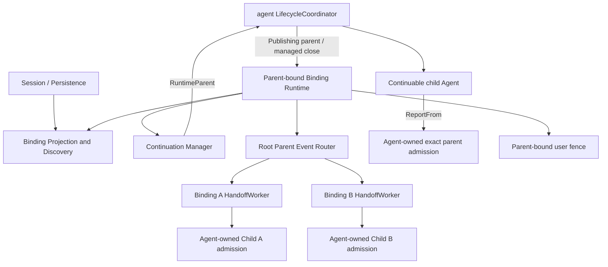
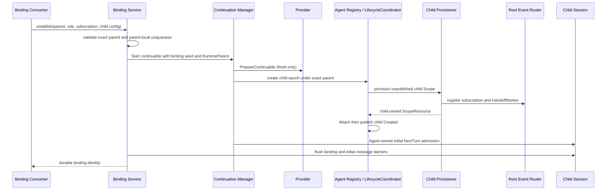
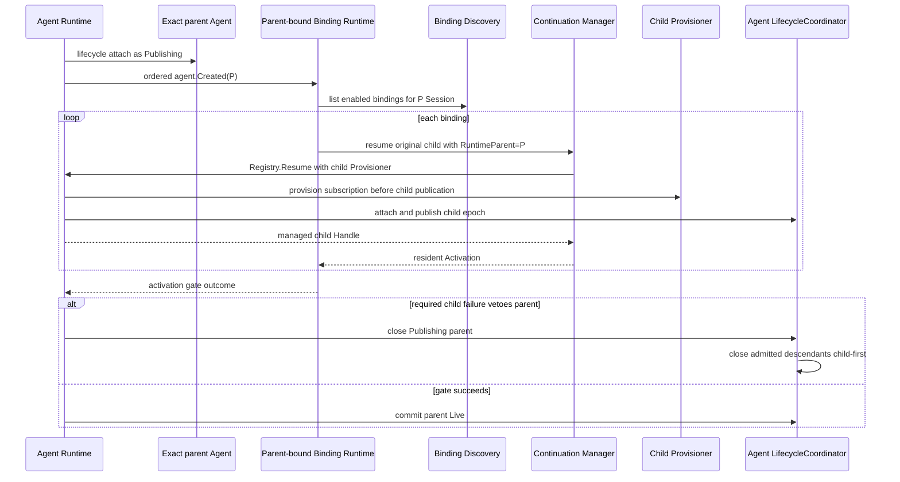
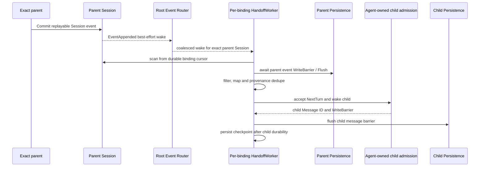
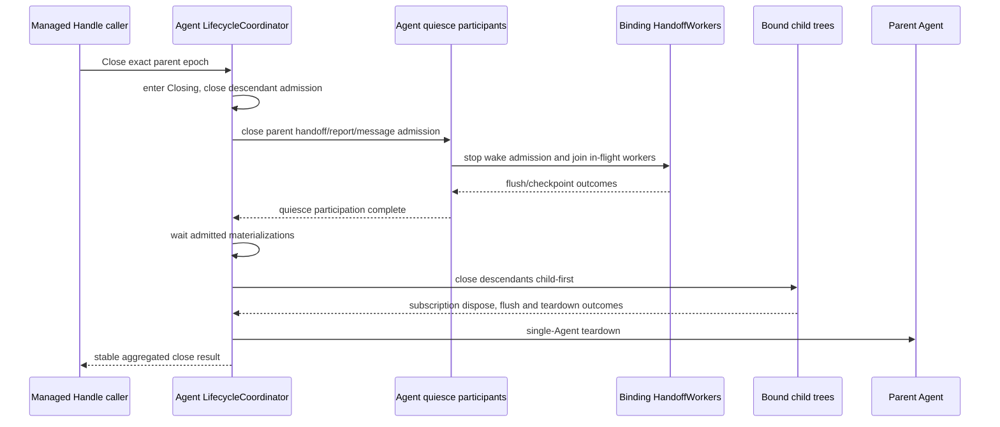

# Parent-bound Subagent 技术设计

状态：Proposed Design，尚未实现

最后核对：2026-08-25

## 0. 范围、结论与证据状态

本文给出 [Parent-bound Subagent 需求](./parent-bound-requirements.zh-CN.md)的实现分析，重点回答：

1. parent-bound subagent 是否具备 continuable 的核心语义；
2. 是否应在现有 continuable 上增加一种与 parent 绑定的 residency policy；
3. 在 Goren 当前 Agent、Session、Plugin 和 Subagent 边界内，父子 Agent 如何激活、交换信息、恢复和关闭。

结论是：**parent-bound 是 continuable 的一种 durable ownership/residency policy，不是第三种 execution mode。** 现有 continuable 提供了大部分基础，但不能只给 settlement watcher 加一个条件；完整能力还需要 durable binding、binding activation、实际共同祖先上的 typed event router、construction-time subscription installation、可恢复的 subscription-to-Inbox handoff worker，以及 mandatory user-interaction fence。

本次对齐后的关键边界是：不新增 Parent Residency Coordinator，也不在 Subagent 内维护第二套 runtime parent graph、closing root 或递归关闭流程。所有 exact epoch、`RuntimeParent`、descendant admission、in-flight materialization join 和 child-first close 统一属于 [`agent.LifecycleCoordinator`](../../agent/lifecycle_coordinator.go)；Subagent 只解释 binding/residency policy、安装本领域 effect，并释放自己持有的 exact Agent Handle。规范依据是[Agent 生命周期与运行期父子所有权设计](../../zh-CN/Agent生命周期与运行期父子所有权设计.md)和[Agent 重构实施方案](../../zh-CN/Agent重构实施方案.md)。

本文不声明已经实现。当前代码证据来自：

- [`ModeContinuable`](../mode.go) 与 [`ContinuableService`](../continuable.go)；
- [`Manager`](../internal/continuation/manager.go)、[`Activation`](../internal/continuation/activation.go) 和 settlement policy 实现；
- [`agent.RegistryService`](../../agent/registry.go)、[`agent.LifecycleCoordinator`](../../agent/lifecycle_coordinator.go)、[`agent.Inbox`](../../agent/inbox.go) 与 Agent Loop publication；
- [`plugin.Publish`](../../plugin/event.go) 的 Scope 路由规则；
- [`session.EventAppended`](../../session/events.go) 与 Session append-only log；
- Host 的 Subagent ownership fence 和 user-question root fence。

DeepSeek Harness feature-local checkout 固定在 `b150a551b8d465e31e418e1b2eaf5e79bbb7d28e`。该基线实现普通 continuable，但没有本文定义的 parent-bound residency；因此本文是显式功能扩展，不是现有兼容面的完成声明。实验性 Agent Team 可以作为“durable roster 使用 continuable child”的参考，但其 inactive/cold-resume teammate 不是本文要求的 resident parent-bound child，不能直接等同。

## 1. 语义分析

### 1.1 Continuable 的核心语义

一个能力属于 continuable，关键不在于 Agent 是否持续驻留，而在于它是否保持同一个 durable child conversation：

- child 使用独立 Session ID、Session log 和 Inbox；
- 多条输入形成多个可独立调度的 turn；
- Session non-resident 后能以原 identity 冷恢复；
- direct parent 由 durable lineage 授权，不能只靠 MessageSource 或 label；
- Provider 只参与首次创建，恢复不重新调用 Provider；
- 一次 Activation 结束不等于 durable child identity 被删除。

当前实现已经满足这些基础：`StartContinuable` 建立 child，`Followup` 在 resident/cold 两条分支中复用同一 child，`ReportFrom` 只解析 direct parent，Session Header 与 descriptor 支撑恢复。

### 1.2 Parent-bound 增加的语义

parent-bound 没有改变“一个 durable child，多次 turn”的含义，只改变并扩展以下策略：

| 维度 | 普通 continuable | parent-bound continuable |
| --- | --- | --- |
| quiescent 后 | 自动 settlement，释放 Activation | 保持 idle resident |
| 再次工作 | parent 显式 `Followup`，必要时 cold resume | subscription 接受 parent event 后写 Inbox |
| parent resume | 不自动恢复 child | 自动发现并恢复 enabled bindings |
| parent closing | Agent lifecycle 关闭当前 runtime descendants | 同一 child-first close，外加 binding handoff/report quiesce |
| 用户入口 | delegated child 已受部分隔离 | 额外强制不可解除的用户交互 fence |

`parent closing` 这一行不是两种 residency policy 的不同关闭算法。任何当前 resident 的 child，无论是普通 continuable 还是 parent-bound continuable，都是 Agent Lifecycle Coordinator runtime ownership graph 中的 descendant，都会使用同一个 child-first close transaction。普通 continuable 在此之前可能已经因 quiescent settlement 而 non-resident，此时没有当前 epoch 可关闭；parent-bound child 则因 binding enabled 而预期保持 resident，并额外需要先停止 subscription handoff、child report 和相关 worker。两者的当前 epoch 被关闭都不等于 durable child Session 或 binding 被删除。

因此 residency 是 execution mode 之下的正交策略：

```text
Subagent
├── execution mode
│   ├── one-shot
│   └── continuable
└── continuable residency policy
    ├── settle-when-quiescent   当前缺省
    └── parent-bound           本文目标
```

### 1.3 为什么不能新增 `ModeParentBound`

新增 execution mode 会复制或分叉 descriptor、cold resume、Inbox delivery、report、interrupt、Catalog 与 close 契约，并让 Consumer 再次判断“它到底是不是 continuable”。这会制造第二条长期会话实现。

相反，policy 只改变 Activation 的保留条件和 parent lifecycle participation。缺少新 policy 的历史 child 继续解释为 `settle-when-quiescent`，可以保持现有 descriptor 与调用方行为稳定。

### 1.4 为什么又不能只改 `watch`

[`Manager.watch`](../internal/continuation/manager_settlement.go) 当前在 Agent idle、accepted 集合为空、resident descendants 为空时打开 disposal。让 parent-bound 分支跳过 disposal，只能让 child 暂时不结算，仍无法完成：

- 重启后识别哪些 children 要随 parent 恢复；
- 在 parent publication 完成前恢复 required children；
- 让 child subscription 看见 parent 事件；
- 在 parent teardown 前线性化关闭 handoff/report admission 并等待已接纳操作；
- 对 parent event 做 durable handoff、重放和去重；
- 阻止 child 通过 Tool、Question、Approval 或 Host 绕过 parent。

所以 residency policy 是聚合这些规则的领域概念，不是一个局部布尔值。

## 2. 当前实现的真实调用链与缺口

### 2.1 普通 continuable 的 create/resume

当前谁主动调用谁：

```text
Tool / Host Consumer
  -> ContinuableService.StartContinuable or Followup
  -> continuation.Manager
  -> Provider.PrepareContinuable     仅 fresh create
  -> agent.Constructor.Create/Resume
  -> agentloop.Factory.CreateAgent/ResumeAgent
  -> Provisioner installs child Scope
  -> Session publication and AgentEpoch attachment
  -> child Agent Inbox accepts initial/followup message
```

实现证据：

- fresh Start 在 [`manager_start.go`](../internal/continuation/manager_start.go) 中解析 Provider、descriptor、lineage 和 child ID；
- create/resume 在 [`manager_materialization.go`](../internal/continuation/manager_materialization.go) 中统一进入 `agent.Constructor`；
- cold resume 校验持久化 Header 的 `ParentSession` 和 continuable descriptor，不调用 Provider；
- [`agentloop/prepared_agent.go`](../../agentloop/prepared_agent.go) 在 Agent publication 前执行 Provisioner；
- [`agentloop/session_binding.go`](../../agentloop/session_binding.go) 发布 Session，[`agentloop/prepared_agent.go`](../../agentloop/prepared_agent.go) 将 Agent 和 Scope Runtime 附加到 Registry 创建的 exact `AgentEpoch`；Factory 返回后由 Agent Registry 发布 created/session-start。

这些调用链可以复用。parent-bound 不需要第二个 Agent Loop、第二个 Inbox 或第二个 resume path。

### 2.2 当前 settlement owner

Continuation Manager 是普通 continuable settlement policy 的主动方。它监听 exact child 的 idle、accepted-message 和 runtime descendants 状态；满足 quiescent 条件后，Manager 作出“当前 residency epoch 可以关闭”的业务决定，并向 Agent managed lifecycle 提交 Close 请求。

Agent Loop 只报告单个 Agent 是否 idle，并执行单体 teardown；它不知道 parent-bound binding，也不应决定哪个 continuable 必须保持 resident。Agent Lifecycle Coordinator 才拥有 exact epoch、runtime parent graph、关闭 admission、in-flight join 和 child-first structural teardown。

目标改动保持正交 owner：Manager 根据 Activation 的 durable policy 选择“普通 continuable quiescent 后请求 managed Close”或“parent-bound 继续 KeepResident”；无论由哪种业务原因触发，结构关闭都汇合到 Agent Lifecycle Coordinator 的同一 close transaction。

### 2.3 当前 Plugin event Scope 不能让 child 向上监听

[`plugin.Publish`](../../plugin/event.go) 只把事件路由到发布者当前 Scope 及其祖先 Scope。child Agent Scope 是 parent Scope 的后代，不在 parent event 的向上路径中。

因此以下设计不可行：

```text
mount listener in child Scope
  -> expect it to receive parent Agent event
```

目标架构必须由位于共同祖先 Scope 的 Subagent Runtime 观察 Agent/Session event，再把事实交给每个 child-owned subscription installation。child 拥有 subscription 的选择与生命周期，不表示 listener Fiber 必须位于 child Scope。

### 2.4 Agent lifecycle 已拥有 parent close；缺口是业务 admission quiesce

`agent.Disposed` 在 exact Agent 已从 Registry 移除后才发布。它适合清理陈旧 process-local state，不适合作为 parent-bound close 的开始边界：此时 child report 已无法解析 live parent，也不能撤回已经提交的 handoff。

最新 Agent 生命周期已经由 `LifecycleCoordinator` 统一完成 parent `ClosingSignal`、descendant admission cutoff、已接纳 materialization join 和 descendant child-first close。Parent-bound 不再请求一个 Subagent-owned pre-close coordinator，也不直接调用 descendant close 命令。

剩余缺口是一个 **Agent-owned、可等待且与 `Closing` cutoff 线性化的 quiesce/close participation seam**：它必须在 descendant teardown 前停止 parent event handoff、child report 和相关 message admission，并 join 已经接纳的操作。Subagent 可以注册本领域 participant，但 admission 边界、调用顺序和 join 属于 Agent lifecycle；后置 `agent.Disposed` 只做幂等收尾。Session adapter、Host、Provider 和 Subagent 都不能因此成为 subtree owner。

### 2.5 当前用户隔离可复用但不完整

可复用证据：

- [`apiproxy/session.AgentSessions`](../../apiproxy/session/agent_sessions.go) 拒绝将 `OriginSubagent` Session 当作普通 Host Session adopt/resume；
- [`userquestions.QuestionService`](../../userquestions/service.go) 只允许 exact live root Agent 发起用户问题；
- child Scope 已支持 persona、Tool restriction、delegation policy 和 Activation Extension。

缺口是“不可解除”的 parent-bound policy。调用方传入的普通 Tool filter 不能承担安全职责；必须额外安装强制 fence，并在 Host、Question、Approval 和 Tool 四层分别验证。

## 3. 目标架构

### 3.1 组件与 owner



各 owner 的责任如下。

#### Agent Lifecycle Coordinator

这是所有 Agent 共用的唯一运行期 lifecycle owner。它负责 exact epoch、`Materializing -> Publishing -> Live -> Closing -> Closed`、`RuntimeParent`、descendant admission、in-flight materialization join、managed Handle 和 child-first close。Parent-bound child 在 create/resume 时显式把 exact parent 作为 `RuntimeParent` 交给 Agent Registry；从 child epoch 创建成功开始，后续 publication veto、parent close 与 Runtime shutdown 都由同一 runtime ownership graph 收敛。

Coordinator 不解释 binding、subscription、Provider、continuable settlement 或 user fence。Subagent 不复制它的 graph、closing state 或 teardown algorithm。

#### Continuation Manager

拥有现有 create/resume 用例、exact authority、Activation、continuable message/report policy 和 interrupt 语义。新增责任仅是：解释 residency policy，并让普通 continuable 在 quiescent 后请求 managed Close、parent-bound Activation 保持 resident。

Manager 不发现 parent 的所有 bindings，不解释任意 parent event，不保存 runtime children，也不执行 child-first teardown。所有模型可见消息最终通过 Agent-owned admission 进入目标 Inbox。

#### Parent-bound Binding Runtime

这是建议新增的 Subagent-owned named stateful owner。它负责 binding 的运行期解释，而不是 Agent lifecycle：

- 在 exact parent `agent.Created` 的 `Publishing` 阶段发现 enabled bindings；
- 按 O1/O2 的最终 policy 协调同一 parent epoch 的 required/optional activation gate；
- 为每个 child construction 组合 subscription Provisioner 和 mandatory fence；
- 建立 per-binding `HandoffWorker`，并把其 installation 交给 exact child Scope ownership；
- 作为 Agent lifecycle participant 关闭本领域 handoff/report admission，并 join worker；
- 汇总 per-binding activation、catch-up 和 teardown diagnostics，但不关闭 descendants。

Binding Runtime 不持有 parent/child Handle tree，不递归 Close，也不把 `agent.Disposed` 当作关闭起点。它提出 managed lifecycle 请求后，结构顺序由 Agent Lifecycle Coordinator 决定。

#### Binding Projection and Discovery

这是 Subagent-owned 的 durable relation read model。它从 child Session Header、continuable descriptor 和 parent-bound binding event 解释：direct parent、policy、enabled state、subscription definition、可选 role key 与 revision。

它可以复用 Catalog 已有的 live-preferred/cold-inspection 机制，但不能从 `Catalog` 的展示 label 或 `Activity` 反推 authority。

#### Root Parent Event Router

Router 必须安装在 parent 与所有 Agent Scope 的实际共同祖先，通常是 Runtime root；最新 Agent Scope 是 AgentLoop 结构宿主下的 sibling，不能假设 parent Agent Scope 是 child Agent Scope 的 Plugin ancestor。Router 只做三件事：

1. 解析事件的 exact parent subject/Session；
2. snapshot 该 parent epoch/Session 下的 child-owned subscription registrations；
3. 向每个 binding worker 发送可合并的 wake，或传递声明为 live-only 的 typed fact。

Router 不让 parent 枚举 children，不给事件加入 recipient，不直接写 Inbox，也不等待 child 模型 answer。Plugin Manifest 必须用 `EventOf[T]` 静态声明所有可观察类型；definition registry 只能从已编译类型中选择，不能动态增加未声明 Event type。

#### Subscription installation 与 HandoffWorker

每个 installation 属于一个 exact child Activation，包含 exact parent epoch、binding revision、typed subscription definition、serial cursor、`HandoffWorker` 和 disposer。它必须在 unpublished child 的 construction Provisioner 中注册 Router，随后作为 `agent.ScopeResource` 交给 child Scope；因此 child `agent.Created` publication 前监听已经可用，rollback/close 又能精确撤销。

每个 binding worker 串行拥有 install-time scan、wake coalescing、retry/backoff、reconciliation、checkpoint 和 closing join。best-effort event 只负责唤醒 worker，durable Session replay 才负责最终 catch-up；worker 只能调用 Agent-owned message admission，不能直接修改 Inbox 或调用模型。

#### Agent Runtime 与 Session

Agent Runtime 拥有所有 exact epoch、runtime parent-child ownership、单 Agent、Inbox admission/wake、turn、cancel、quiesce participant 和 managed Handle。Session 拥有 append-only commit、`WriteBarrier`、LiveStore 与 flush。`Session.Commit` 只证明事件进入内存中的 committed log；只有对应 persistence barrier/flush 完成，才能声明 crash durability。

Subagent 只通过 consumer-owned interfaces 表达 binding、消息 admission、persistence barrier 和 managed close 意图，不复制 Agent Inbox、Session Store 或 lifecycle 实现。

## 4. Durable binding 与 residency policy

### 4.1 推荐持久化形态

建议保留现有 `ContinuableDescriptor` v2 作为 source-compatible durable child identity，并新增一个 Subagent-owned、model-hidden 的 parent-bound binding event，而不是创建 `ModeParentBound` 或悄悄改变 v2 strict codec。

binding fold 至少要表达以下语义事实，但本文不固定 Go 字段名：

- binding schema version；
- residency policy = parent-bound；
- enabled/disabled state；
- subscription definition identity 与其 validated config；
- 可选 parent-local role key；
- binding revision，用于拒绝陈旧 installation。

权威关系为：

```text
child Session Header.ParentSession
  + child continuable descriptor
  + latest valid parent-bound binding state
  = durable parent-bound binding
```

三者任一不匹配时不得静默修复或创建替代 child，应返回该 child 的 contained diagnostic。

### 4.2 为什么 policy 不能只存在进程内

如果 policy 只放在 `Activation`：

- 进程重启后无法判断要不要共同恢复；
- Catalog 无法区分普通 continuable 与 parent-bound child；
- parent resume 可能遗漏 child，或把所有普通 continuable 都误恢复；
- 陈旧安装无法与新 binding revision 区分。

Activation 只能缓存已经验证的 durable policy snapshot，不能成为事实来源。

### 4.3 兼容缺省

旧 child 没有 parent-bound binding event 时，必须保持：

```text
mode = continuable
residency = settle-when-quiescent
```

这保证升级不会把所有历史 continuable children 自动拉起并长期占用资源。

## 5. 父子 Agent 交互设计

### 5.1 建立 binding



Provider failure 不能产生成功 binding。subscription registration/fence 必须作为同一个 child construction Provisioner 的 effect，在 `AgentEpoch.Attach` 和 `agent.Created` 前完成；成功后 installation 由 child Scope 拥有，失败则与其他 provisioned effects 逆序回滚。

成功边界应包含 binding state 与 initial Inbox acceptance 的持久化 barrier；精确 flush failure/repair 语义仍受需求 O1、E1 和 E10 约束。建立 binding 不能先发布 resident child、再补装 subscription，因为那会留下可观察但漏收 parent event 的窗口。

### 5.2 Parent create/resume 与共同 activation

建议由现有有序、可 veto 的 `agent.Created` publication 触发 Binding Runtime。此时 parent 是 Registry 中的 exact `Publishing` epoch，尚未向原构造调用方返回 managed Handle，但已经可以作为嵌套 child 的 `RuntimeParent`，适合执行 required child gate。



恢复路径不得调用首次 creation Provider。若 child 的 durable Inbox 已有未 claim work，Agent Runtime 必须在通用 resume/admission 路径唤醒它；这是所有 Agent 的 pending Inbox 恢复语义，不是 Parent-bound 或 Subagent 私有 wake seam，更不能用 dummy message 绕过。

O1 尚未决定所有 children 是否 required。实现前应把 gate policy 固定为 binding 事实或统一 deployment policy，不能根据当次错误临时选择。无论 gate 如何决定，publication rollback 和 descendants teardown 都由 Agent Lifecycle Coordinator 自动完成，Binding Runtime 不保留第二套 rollback tree。

### 5.3 Parent event 到 child Inbox

对需要跨重启最终观察的 Session event，推荐调用链是：



这里主动方是 Session owner、Runtime Router 和 per-binding worker，不是 parent model。parent 不调用 `Followup(childID, ...)`，也不知道哪些 subscriptions 命中。`session.EventAppended` 使用 `DeliveryBestEffort`，所以它只能缩短 catch-up latency；worker 还必须在 installation/resume 时主动扫描，并在 wake 丢失、临时失败或 checkpoint 落后时通过 retry/backoff/reconciliation 收敛。

建议新增内部的 observed-event admission 用例，复用 Agent Inbox 的 canonical `NextTurn + wake` 行为，但不复用 `ContinuableService.Followup` 作为领域入口，也不允许 worker 直接调用 Inbox。模型可见映射必须包含稳定 provenance：parent Session ID、parent event identity、binding identity/revision 和 causation/origin。MessageSource 用于 attribution 与去重证据，不取代 exact Agent authority。

live Agent event 可以由 Router 将 typed fact 交给当前 exact parent epoch 的 installations；它不参与 cursor replay，进程中断时允许按 definition 声明丢失。若 live fact 被映射为模型输入，仍必须通过 Agent-owned admission 形成 child Inbox message；“live-only”只描述触发事实不可重放，不表示可以绕过 durable Inbox。

### 5.4 Child report 到 parent

现有 `ReportFrom` 已接近目标语义：

```text
exact resident child
  -> Continuation Manager resolves Activation.parentID
  -> Registry resolves exact live direct parent
  -> Agent-owned parent NextStep admission
  -> quiet Inject or next-step Steer and wake
  -> flush parent barrier when durable acceptance is promised
```

child 不提供 recipient，report 不结束 child turn，也不代表 parent 已读。多个 siblings 的 report 在 parent Inbox 中各自保留 sender Session ID。Subagent 负责 exact direct-parent authorization 和 report policy，Agent 负责 canonical message admission/wake，Session 负责 persistence barrier。默认 `quiet` 或 `next-step` 仍由需求 O5 决定。

### 5.5 Parent closing 与 child-first release

Parent close caller 只向 Agent Lifecycle Coordinator 提交 exact parent 的 managed Close。Coordinator 对 runtime graph 中所有当前 resident descendants 使用同一结构算法，不按 ordinary/parent-bound mode 分叉。Parent-bound 的差异只是一组关闭前的业务 effect：它必须在 descendant teardown 前让 subscription/report admission quiesce；普通 continuable 没有这些 binding effect。已经 settlement、当前 non-resident 的普通 continuable 不在本次 runtime graph 中，也不会因为 parent close 被删除 durable identity。



需要新增或明确的 quiesce participant seam 由 Agent lifecycle 拥有，Subagent 只注册 binding/handoff participant。它必须与 parent 进入 `Closing` 的 cutoff 线性化：cutoff 前已接纳的 report/handoff 要么完成并被 join，要么得到稳定失败；cutoff 后不得提交新消息。participant 不能 veto close 或调用 descendant teardown。

即使 child flush、worker 或 disposer 失败，Agent Lifecycle Coordinator 也必须继续尝试剩余 siblings 和 parent 单体 teardown；错误作为同一 close transaction 的 outcome 聚合，不能通过无限保留整棵树伪装 durability。

`agent.Disposed` 继续负责清除 exact epoch 的残余索引，不能承担上述前置事务。

### 5.6 进程重启恢复

parent cold resume 的 `agent.Created` 阶段，Binding Runtime 从持久化 child records 发现 enabled bindings，逐个验证：

1. child Header 的 direct parent 等于当前 parent Session；
2. child 是 continuable descriptor；
3. latest binding policy 是 parent-bound 且 enabled；
4. binding revision/config 可由当前静态注册的 subscription definition 解释；
5. child identity 没有被其他 live owner 占用。

验证通过才恢复原 child。Provider 缺失不影响恢复；subscription definition 缺失则是 activation failure，不能静默降级成无监听的 resident child。

## 6. Event durability、acknowledgement 与反馈环

### 6.1 将 durable facts 与 live facts 分开

建议 v1 把事件分成两类：

- **durable parent Session events**：可以按 `(parent Session ID, seq)` 重放，适合承载必须最终被 child 观察的业务事实；
- **live Agent events**：只用于 lifecycle、status、唤醒或观测，进程中断时允许丢失，不能作为唯一业务输入。

不能把 `plugin.Publish` 的进程内回调历史当作 durable log。`session.EventAppended` 只说明 parent event 已提交到 Session 的 append-only 内存状态，且当前 delivery 为 `DeliveryBestEffort`；它既不能证明 parent event 已由 LiveStore 持久化，也不能保证 child Inbox 已接受。crash durability 只能由事件对应的 `WriteBarrier`/flush 证明。

### 6.2 推荐的 durable handoff

对 replayable Session event，建议 subscription 使用 parent event identity 作为幂等键：

```text
HandoffWorker scans parent Session from binding checkpoint
  -> await parent event persistence barrier
  -> filter/map event
  -> search child log for same parent-event identity
  -> absent: Agent-owned NextTurn admission with stable provenance
  -> await child message persistence barrier
  -> advance durable child subscription checkpoint
```

顺序约束是：**parent event persisted-before child message persisted-before checkpoint**。否则 child message 可能在源 parent event 丢失后单独存活，或 checkpoint 越过尚未 durable 的 child 工作。

checkpoint 是性能优化，child log 中的 provenance witness 才是崩溃窗口去重依据。若进程在 child message flush 后、checkpoint 前退出，恢复扫描会发现已经接受或已经消费的同一 parent event，不再生成第二条业务消息。若 parent 或 child flush 失败，worker 不推进 checkpoint，并进入可观察的 retry/backoff 状态。

每个 binding 内由一个 `HandoffWorker` 串行 handoff；它在 installation 时执行初始 scan，把多个 best-effort wake 合并成一次 reconcile，并在 closing 时停止 admission、join 当前 scan。多个 children 不需要跨 Session 原子提交，也不承诺全局顺序。

### 6.3 Publication acknowledgement

推荐 parent event publication 不等待 child 模型执行。对于 durable Session event，root observer 只尝试唤醒 catch-up；即使 best-effort callback 丢失或失败，install-time scan、retry 和后续 wake 也必须由 durable cursor 收敛。这样慢 child 不反压 parent 的业务 commit。

如果最终需求选择“publication 必须等待 Inbox durable acceptance”，则必须明确 timeout、单 child failure 是否影响 parent，以及 `session.EventAppended` best-effort delivery 如何提升；在这些决策完成前不能声称同步 exactly-once。

### 6.4 防止 report feedback loop

subscription 至少要检查：

- source kind 与 sender Session ID；
- causation chain 是否已经包含当前 child/binding；
- parent event identity 是否已接受；
- policy 是否排除由该 child 自己 report 引发的事件类别。

默认建议排除同一 child report 的直接回声；跨 sibling 或跨层传播仍需显式 typed policy，不能靠 prompt 约束。

## 7. 正交状态模型

Parent-bound 不能用一个枚举混合 durable binding、Subagent Activation、Agent lifecycle、AgentLoop activity 和 handoff progress。各 owner 分别维护：

| 状态维度 | Owner | 典型状态 |
| --- | --- | --- |
| durable binding | Subagent binding projection | disabled / enabled / corrupt，外加 revision |
| process-local Activation | Continuation Manager | absent / materializing / active / closing |
| exact Agent lifecycle | Agent Lifecycle Coordinator | Materializing / Publishing / Live / Closing / Closed |
| Agent activity | AgentLoop | idle / running / maintenance / cancelling |
| event handoff | per-binding HandoffWorker | catching-up / idle / backoff / closing |

其中 Agent lifecycle 的规范状态机只由[Agent 生命周期与运行期父子所有权设计](../../zh-CN/Agent生命周期与运行期父子所有权设计.md)定义，本文不复制或扩展它。Subagent Activation 只是当前 residency epoch 的领域视图，不能写入 Coordinator 状态，也不能持有 runtime descendants。

Residency policy 只产生决策：

```text
ordinary continuable + quiescent -> request managed Close
parent-bound + binding enabled + parent resident -> KeepResident
binding disabled / explicit close -> request managed Close
parent Closing / Runtime shutdown -> Agent lifecycle hard boundary
```

`resident` 不等于 `running`。idle resident child 不请求模型、不产生 token；它保留 exact Agent epoch、`RuntimeParent` 关系、Scope、policy、subscription installation、HandoffWorker 和内存资源。worker 的 catch-up/backoff 也不等于 Agent 正在执行模型 turn。

## 8. 配置与 subscription definition

配置必须是 owner-defined Go typed config。binding 只引用静态注册、可验证的 subscription definition；禁止存储或执行 `!!js`、Goja、任意表达式或动态代码 predicate。

Router 可观察的 Event type 必须在 owning Plugin 的 Manifest 中用 `EventOf[T]` 静态声明。运行期 definition registry 只能选择、配置和实例化这些已编译 definition，不能让持久化 binding 动态创造新的 Event type、反射订阅或绕过 Plugin dependency validation。

每个 definition 应拥有：

- 可接受的 typed Agent/Session event kinds；
- exact-parent predicate；
- event 到 child-visible content 或 child-only projection 的 mapper；
- replay eligibility、checkpoint 与去重规则；
- feedback exclusion 与 backpressure policy；
- 安装和撤销的 exact disposer。

Prompt、模型、Tool policy 和 subscription config 可以每个 child 不同，但 mandatory user fence 不能由 child config 关闭。

## 9. 用户交互与安全边界

parent-bound child 的用户隔离必须同时满足：

1. Host Session API 继续按 `OriginSubagent` 和 runtime ownership 拒绝普通 adopt/resume；
2. `ask_user_question` 对 delegated Agent 返回稳定 `DELEGATED_CALLER`；
3. child Scope 安装不可解除的 Tool restriction，隐藏直接用户交互和 Host carrier Tool；
4. Approval 只能使用 parent 授予的 delegation policy，不能从 child 打开新的 UI answerer；
5. report 只能进入 exact direct parent Inbox；
6. WebSocket correlation、Question ID 和用户回答只能绑定 root Agent。

Prompt 可以告诉 child“请向 parent report 未决问题”，但它只是模型引导，不是安全证明。

## 10. Current、Target 与 Gap

| 能力 | Current | Target | Gap |
| --- | --- | --- | --- |
| execution mode | one-shot / continuable | 不变 | 无需新 Mode |
| durable child | Session Header + descriptor | 复用并增加 binding state | binding event/projection 未实现 |
| idle lifecycle | continuable 自动 settlement | policy-controlled | Activation 未携带 policy |
| parent activation | 显式 Start/Followup | `Publishing` parent 的 `agent.Created` gate 自动恢复 | Binding Runtime/binding discovery 未实现；Agent lifecycle 不新增 Coordinator |
| child subscription | Activation Extension 可 provision child Scope | construction-time Router registration，先于 child publication | binding-specific Provisioner/ScopeResource 未实现 |
| event observation | `plugin.Publish` 只到 source Scope 与 ancestors | Runtime-root typed Router + child installation | Router/静态 definitions 未实现 |
| event durability | Session commit、LiveStore flush 与 Inbox durability 分属各 owner | per-binding worker、cursor、parent-before-child flush、provenance dedupe | worker/checkpoint/persistence barrier orchestration 未实现 |
| parent close | Agent Lifecycle Coordinator 已拥有 descendant cutoff 和 child-first close | 增加可等待的 handoff/report quiesce participation | lifecycle participant/admission join seam 未实现 |
| user isolation | Host 与 Question 已有 fence | 四层 mandatory fence | child Tool/Approval 强制策略不完整 |
| resume pending work | 由 Agent create/resume 与 message admission 负责 | 通用 Agent resume 唤醒 pending Inbox | 需由 Agent 层验收，Parent-bound 不另建 wake path |

## 11. 推荐实施切片

### P1：Durable binding vocabulary

- 定义 parent-bound binding event、strict codec 与 projection；
- 缺失 policy 映射到普通 continuable；
- Catalog/内部 discovery 能区分 bound、disabled、corrupt 和 legacy child；
- 添加 descriptor/binding compatibility fixture。

### P2：Policy-aware continuation residency

- Activation 缓存已验证 policy snapshot；
- settlement owner 对普通 continuable 保持现状，对 parent-bound 保持 idle resident；
- explicit managed Close、interrupt、parent close 与 runtime shutdown 继续生效；
- 覆盖旧 descriptor 不被误拉起。

### P3：Publishing-time binding activation

- Binding Runtime 观察 exact `agent.Created`，在 `Publishing` parent 下共同恢复；
- child create/resume 显式传入 `RuntimeParent`；
- subscription/fence 通过 construction Provisioner 在 child publication 前安装；
- required/optional gate 决策落定后验证 veto；descendant rollback 复用 Agent Lifecycle Coordinator。

### P4：Subscription router、worker 与 durable handoff

- Runtime-root observer、per-Activation ScopeResource 与 exact disposer；
- Manifest 静态声明 Event type，typed definition registry 不支持脚本 predicate；
- per-binding HandoffWorker、install-time scan、wake coalescing、retry/backoff 和 closing join；
- Session replay、parent-before-child persistence barrier、provenance dedupe、feedback exclusion 和 backpressure；
- 验证一个 event 可独立命中多个 children，单 child failure 不改变 sibling。

### P5：Close admission 与 mandatory user fence

- Agent lifecycle 提供可等待的 quiesce participant，线性化停止 handoff/report admission；
- child Tool restriction、Question root check、Approval delegation 与 Host ownership 联合验收；
- 验证 child 无法建立 carrier correlation 或直接用户问题；
- 验证 child 只能 report direct parent。

### P6：Recovery、failure 与 observability

- binding revision、corrupt/unavailable diagnostics、pending Inbox wake；
- per-parent/child/binding/event/message/epoch tracing；
- 重启窗口、flush failure、subscription missing 和并发 materialization 压力测试。

每个切片先做 focused test，再执行适用的 `go test ./...`、`go test -race ./...`、`go vet ./...`、`go build ./...` 与 `git diff --check`。parent lifecycle 与 protocol-visible 改动还需要固定源证据或明确标为 Goren extension 的 golden fixture。

## 12. 验证设计

至少需要以下测试层：

- binding codec/projection 单元测试：unknown field/version、legacy default、revision 与 invalid relation；
- continuation policy test：普通 child settlement、parent-bound idle residency、explicit managed Close；
- Plugin Scope contract test：证明 child Scope listener 收不到 parent event，Runtime ancestor router 能收到且按 exact subject 过滤；
- provisioning order test：subscription installation 先于 child `agent.Created`，rollback 与 child Scope teardown 精确撤销；
- parent publication integration：`Publishing` parent 下多个 required/optional children 的成功、部分失败与 veto；veto 自动关闭已接纳 descendants；
- parent close integration：`Closing` cutoff 与 handoff/report admission 可线性化，join in-flight worker，children 先于 parent teardown；
- durable replay test：parent event 先于 child message 持久化，child flush 后 checkpoint 前崩溃不重复消息；
- lost-wake test：`EventAppended` best-effort wake 丢失后，install-time scan/retry/reconciliation 仍追上 cursor；
- Agent admission contract test：handoff 与 report 不直接修改 Inbox，统一产生 canonical wake；
- multi-child test：同一 parent event 命中零个、一个、多个 child，结果相互隔离；
- stale epoch test：相同 Session ID 的旧 parent/child instance 不得操作新 epoch；
- security test：Session adopt、Question、Approval、Tool、WebSocket 五条绕过路径全部拒绝；
- restart test：parent 恢复原 child identity、原 Inbox 和 binding revision，不调用 creation Provider。

JSDOM、编译通过或 process-local event test 不能替代 durable restart 与真实 Agent Loop 验收。

## 13. 待确认决策与推荐方向

以下项目仍以需求文档 Open Items 为准。这里给出推荐，不把它们写成已接受行为：

- O1：建议 binding 明确 required/optional；缺省 required，但需用户确认；
- O5：建议 report 缺省 `next-step`，以保证 parent 及时观察，但需评估 turn 扩展成本；
- O6/O7：建议 durable Session event 采用异步 catch-up + replay，live Agent event 只作实时信号；
- O8：建议 v1 使用静态 typed subscription definition allowlist，不接受任意 predicate；
- O9：建议默认排除同一 child report 的直接回声，并持久化 causation；
- O10/O11：建议先设置每 binding backlog 与每 parent resident-child hard limit，溢出产生 durable diagnostic；
- O12：若配置需要长期稳定角色，建议 parent-local role key 唯一且不可复用；
- O14：建议 parent-bound mandatory fence 始终高于可配置 Tool/Approval policy。

在 O1、O5、O6/O7、O10/O11 未确认前，可以实现 vocabulary 和 isolated policy mechanics，但不能声明 end-to-end parent-bound 行为完成。

## 14. 最终判断

parent-bound subagent **有 continuable 的核心语义**，而且应复用现有 continuable 的 Session、Inbox、cold resume、authority、report，以及 Agent lifecycle 的 managed close。最合适的领域建模是：

```text
Continuable child
  + durable parent-bound binding
  + parent-bound residency policy
  + Subagent-owned Binding Runtime
  + Agent LifecycleCoordinator runtime ownership
  + construction-time child-owned subscription
  + per-binding HandoffWorker
  + mandatory user fence
```

所以答案是“可以在 continuable 上增加一种与 parent 绑定的 residency policy”，但正确实现单位是一个跨 binding、lifecycle、event handoff 和 security 的完整 capability slice，而不是 `watch()` 中的一个永久驻留开关。
