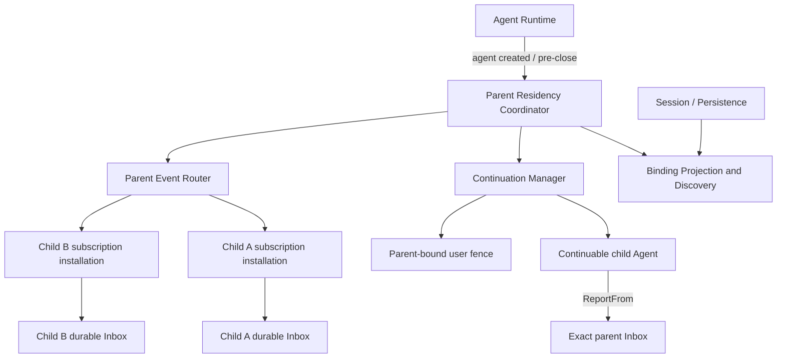
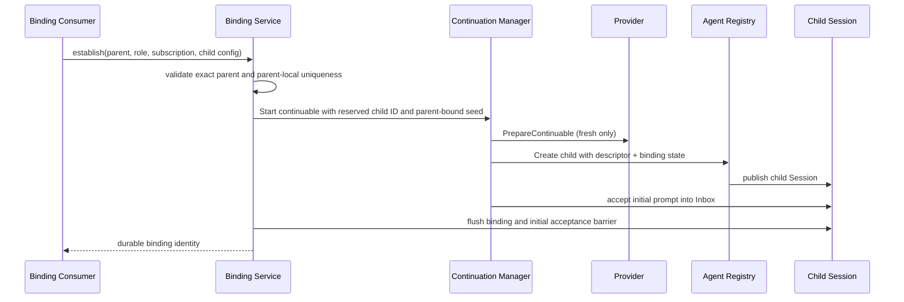
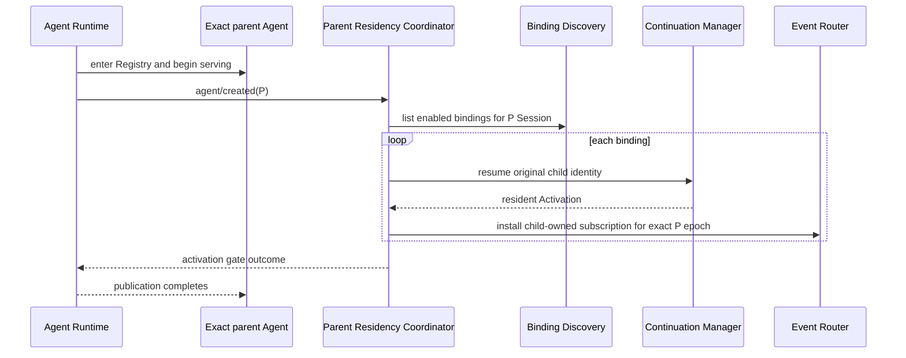
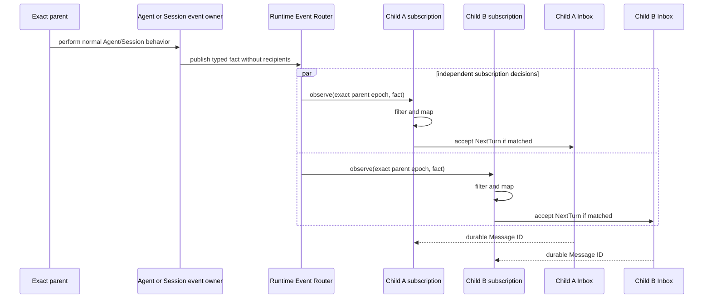
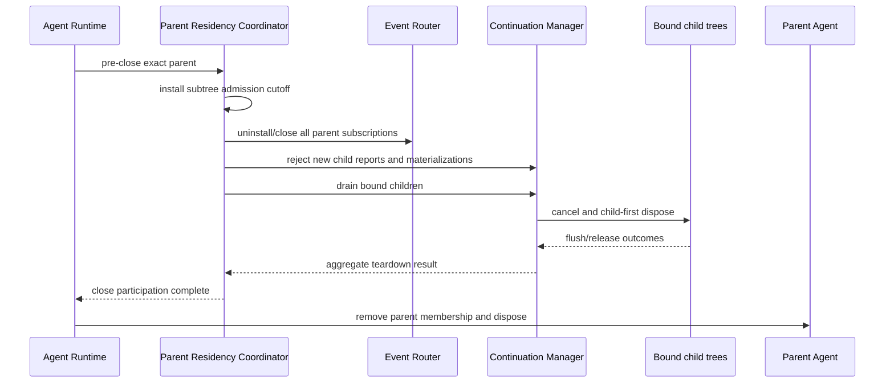
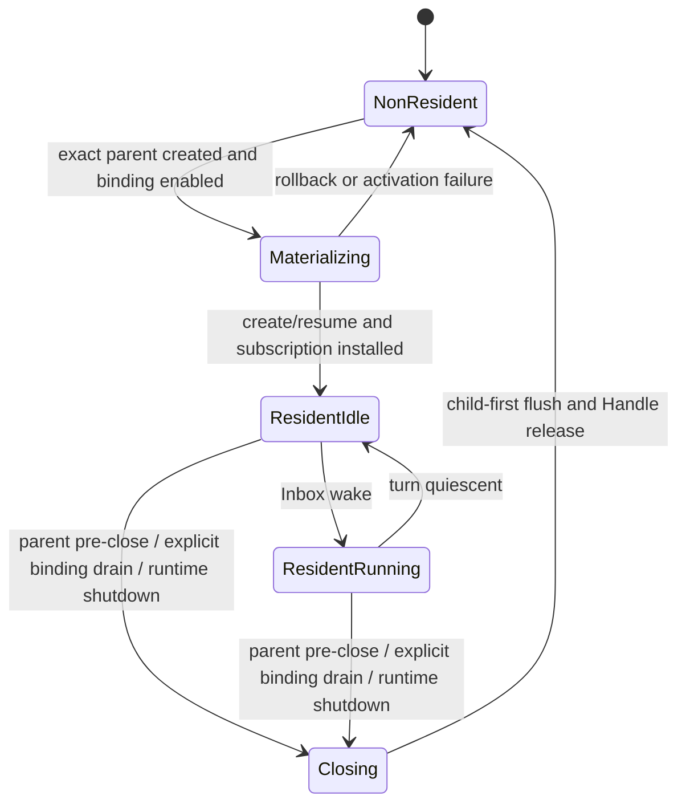

# Parent-bound Subagent 技术设计

状态：Proposed Design，尚未实现

最后核对：2026-08-24

## 0. 范围、结论与证据状态

本文给出 [Parent-bound Subagent 需求](./parent-bound-requirements.zh-CN.md)的实现分析，重点回答：

1. parent-bound subagent 是否具备 continuable 的核心语义；
2. 是否应在现有 continuable 上增加一种与 parent 绑定的 residency policy；
3. 在 Goren 当前 Agent、Session、Plugin 和 Subagent 边界内，父子 Agent 如何激活、交换信息、恢复和关闭。

结论是：**parent-bound 是 continuable 的一种 durable ownership/residency policy，不是第三种 execution mode。** 现有 continuable 提供了大部分基础，但不能只给 settlement watcher 加一个条件；完整能力还需要 durable binding、parent lifecycle coordination、祖先级 event router、subscription-to-Inbox handoff，以及 mandatory user-interaction fence。

本文不声明已经实现。当前代码证据来自：

- [`ModeContinuable`](../mode.go) 与 [`ContinuableService`](../continuable.go)；
- [`Manager`](../internal/continuation/manager.go)、[`Activation`](../internal/continuation/activation.go) 和 settlement/drain 实现；
- [`agent.Registry`](../../agent/registry.go)、[`agent.Inbox`](../../agent/inbox.go) 与 Agent Loop publication；
- [`plugin.Publish`](../../plugin/event.go) 的 Scope 路由规则；
- [`session.EventAppended`](../../session/events.go) 与 Session append-only log；
- Host 的 Subagent ownership fence 和 user-question root fence。

DeepSeek Harness feature-local checkout 固定在 `b150a551b8d465e31e418e1b2eaf5e79bbb7d28e`。该基线实现普通 continuable，但没有本文定义的 parent-bound residency；因此本文是显式功能扩展，不是现有兼容面的完成声明。实验性 Agent Team 可以作为“durable roster 使用 continuable child”的参考，但其 inactive/cold-resume teammate 不是本文要求的 resident parent-bound child，不能直接等同。

## 1. 语义分析

### 1.1 Continuable 的核心语义

一个能力属于 continuable，关键不在于 Agent 是否持续驻留，而在于它是否保持同一个 durable child conversation：

- child 使用独立 Session ID、Session log 和 Inbox；
- 多条输入形成多个可独立调度的 turn；
- Session non-resident 后能以原 identity 冷恢复；
- direct parent 由 durable lineage 授权，不能只靠 MessageSource 或 label；
- Provider 只参与首次创建，恢复不重新调用 Provider；
- 一次 Activation 结束不等于 durable child identity 被删除。

当前实现已经满足这些基础：`StartContinuable` 建立 child，`Followup` 在 resident/cold 两条分支中复用同一 child，`ReportFrom` 只解析 direct parent，Session Header 与 descriptor 支撑恢复。

### 1.2 Parent-bound 增加的语义

parent-bound 没有改变“一个 durable child，多次 turn”的含义，只改变并扩展以下策略：

| 维度 | 普通 continuable | parent-bound continuable |
| --- | --- | --- |
| quiescent 后 | 自动 settlement，释放 Activation | 保持 idle resident |
| 再次工作 | parent 显式 `Followup`，必要时 cold resume | subscription 接受 parent event 后写 Inbox |
| parent resume | 不自动恢复 child | 自动发现并恢复 enabled bindings |
| parent closing | 只有显式 drain 才保证 descendant 先释放 | binding policy 强制 child-first close |
| 用户入口 | delegated child 已受部分隔离 | 额外强制不可解除的用户交互 fence |

因此 residency 是 execution mode 之下的正交策略：

```text
Subagent
├── execution mode
│   ├── one-shot
│   └── continuable
└── continuable residency policy
    ├── settle-when-quiescent   当前缺省
    └── parent-bound           本文目标
```

### 1.3 为什么不能新增 `ModeParentBound`

新增 execution mode 会复制或分叉 descriptor、cold resume、Inbox delivery、report、interrupt、Catalog 与 drain 契约，并让 Consumer 再次判断“它到底是不是 continuable”。这会制造第二条长期会话实现。

相反，policy 只改变 Activation 的保留条件和 parent lifecycle participation。缺少新 policy 的历史 child 继续解释为 `settle-when-quiescent`，可以保持现有 descriptor 与调用方行为稳定。

### 1.4 为什么又不能只改 `watch`

[`Manager.watch`](../internal/continuation/manager_settlement.go) 当前在 Agent idle、accepted 集合为空、resident descendants 为空时打开 disposal。让 parent-bound 分支跳过 disposal，只能让 child 暂时不结算，仍无法完成：

- 重启后识别哪些 children 要随 parent 恢复；
- 在 parent publication 完成前恢复 required children；
- 让 child subscription 看见 parent 事件；
- 在 parent 从 Registry 移除前关闭 child admission 并等待 drain；
- 对 parent event 做 durable handoff、重放和去重；
- 阻止 child 通过 Tool、Question、Approval 或 Host 绕过 parent。

所以 residency policy 是聚合这些规则的领域概念，不是一个局部布尔值。

## 2. 当前实现的真实调用链与缺口

### 2.1 普通 continuable 的 create/resume

当前谁主动调用谁：

```text
Tool / Host Consumer
  -> ContinuableService.StartContinuable or Followup
  -> continuation.Manager
  -> Provider.PrepareContinuable     仅 fresh create
  -> agent.Constructor.Create/Resume
  -> agentloop.Factory.CreateAgent/ResumeAgent
  -> Provisioner installs child Scope
  -> Session publication and Agent Reservation attachment
  -> child Agent Inbox accepts initial/followup message
```

实现证据：

- fresh Start 在 [`manager_start.go`](../internal/continuation/manager_start.go) 中解析 Provider、descriptor、lineage 和 child ID；
- create/resume 在 [`manager_materialization.go`](../internal/continuation/manager_materialization.go) 中统一进入 `agent.Constructor`；
- cold resume 校验持久化 Header 的 `ParentSession` 和 continuable descriptor，不调用 Provider；
- [`agentloop/prepared_agent.go`](../../agentloop/prepared_agent.go) 在 Agent publication 前执行 Provisioner；
- [`agentloop/session_binding.go`](../../agentloop/session_binding.go) 发布 Session，[`agentloop/prepared_agent.go`](../../agentloop/prepared_agent.go) 将 Agent 和 Scope Runtime 附加到 Registry Reservation；Factory 返回后由 Agent Registry 发布 created/session-start。

这些调用链可以复用。parent-bound 不需要第二个 Agent Loop、第二个 Inbox 或第二个 resume path。

### 2.2 当前 settlement owner

Continuation Manager 是普通 continuable settlement 的主动方。它监听 exact child 的 idle、accepted-message 和 owned-children 状态；满足 quiescent 条件后，Manager 主动打开 disposal、取消 child、等待 idle、flush、释放 Handle，再通知 parent。

Agent Loop 只报告单个 Agent 是否 idle，并执行 Handle teardown；它不知道 parent-bound binding，也不应决定哪个 continuable 必须保持 resident。

目标改动应保持这一 owner：Manager 根据 Activation 的 durable policy 选择“允许 quiescent settlement”或“等待 parent closing”。

### 2.3 当前 Plugin event Scope 不能让 child 向上监听

[`plugin.Publish`](../../plugin/event.go) 只把事件路由到发布者当前 Scope 及其祖先 Scope。child Agent Scope 是 parent Scope 的后代，不在 parent event 的向上路径中。

因此以下设计不可行：

```text
mount listener in child Scope
  -> expect it to receive parent Agent event
```

目标架构必须由位于共同祖先 Scope 的 Subagent Runtime 观察 Agent/Session event，再把事实交给每个 child-owned subscription installation。child 拥有 subscription 的选择与生命周期，不表示 listener Fiber 必须位于 child Scope。

### 2.4 当前 parent closing seam 不足

`agent.Disposed` 在 exact Agent 已从 Registry 移除后才发布。它适合清理陈旧 process-local state，不适合作为 parent-bound drain 的开始边界：此时 child report 已无法解析 live parent，也无法保证 parent 在 children 之前释放。

现有 `DrainContinuableDescendants` 已提供 child-first drain，但需要调用方在 parent teardown 前显式调用。parent-bound 需要 Agent Runtime 提供一个**从 Registry 移除前、可等待的 closing seam**，由 Subagent Runtime 同步安装 admission cutoff 并完成 bound descendants drain。后置 `agent.Disposed` 只做幂等收尾。

这是 parent-bound 对 Agent 生命周期的唯一必要扩展；不应把 Session adapter、Host 或 Provider 变成 subtree owner。

### 2.5 当前用户隔离可复用但不完整

可复用证据：

- [`apiproxy/session.AgentSessions`](../../apiproxy/session/agent_sessions.go) 拒绝将 `OriginSubagent` Session 当作普通 Host Session adopt/resume；
- [`userquestions.QuestionService`](../../userquestions/service.go) 只允许 exact live root Agent 发起用户问题；
- child Scope 已支持 persona、Tool restriction、delegation policy 和 Activation Extension。

缺口是“不可解除”的 parent-bound policy。调用方传入的普通 Tool filter 不能承担安全职责；必须额外安装强制 fence，并在 Host、Question、Approval 和 Tool 四层分别验证。

## 3. 目标架构

### 3.1 组件与 owner



各 owner 的责任如下。

#### Continuation Manager

拥有现有 create/resume、exact authority、Activation、Inbox admission、report、interrupt 和 child-first disposal。新增责任仅是：解释 residency policy，并让 parent-bound Activation 不参与 quiescent settlement。

Manager 不发现 parent 的所有 bindings，也不解释任意 parent event。

#### Parent Residency Coordinator

这是建议新增的 named stateful owner。它负责：

- 在 exact parent `agent/created` publication 中发现 enabled bindings；
- 串行化同一 parent epoch 的共同 activation；
- 为每个 child 建立并持有 subscription installation；
- 在 parent pre-close seam 中先关闭 admission，再调用 Manager child-first drain；
- 汇总 per-child activation/teardown outcome，但不把 sibling 变成彼此 owner。

#### Binding Projection and Discovery

这是 Subagent-owned 的 durable relation read model。它从 child Session Header、continuable descriptor 和 parent-bound binding event 解释：direct parent、policy、enabled state、subscription definition、可选 role key 与 revision。

它可以复用 Catalog 已有的 live-preferred/cold-inspection 机制，但不能从 `Catalog` 的展示 label 或 `Activity` 反推 authority。

#### Parent Event Router

Runtime 级 Router 在祖先 Scope 观察已声明的 Agent/Session event。它只做三件事：

1. 解析事件的 exact parent subject/Session；
2. snapshot 该 parent epoch 下的 child-owned subscription installations；
3. 通知每个 installation 独立 filter/map/accept。

Router 不让 parent 枚举 children，不给事件加入 recipient，也不等待 child 模型 answer。

#### Subscription installation

每个 installation 属于一个 exact child Activation，包含 exact parent epoch、binding revision、typed subscription definition 和 disposer。它只能把匹配事实转成该 child 的 `NextTurn` 工作，或更新 child-owned projection；不能直接调用模型。

#### Agent Runtime 与 Session

Agent Runtime 继续拥有单 Agent、Inbox、turn、cancel 和 Handle。Session 继续拥有 append-only commit、LiveStore 与 flush。Subagent 只通过 consumer-owned接口表达 binding 与投递意图，不复制这些实现。

## 4. Durable binding 与 residency policy

### 4.1 推荐持久化形态

建议保留现有 `ContinuableDescriptor` v2 作为 source-compatible durable child identity，并新增一个 Subagent-owned、model-hidden 的 parent-bound binding event，而不是创建 `ModeParentBound` 或悄悄改变 v2 strict codec。

binding fold 至少要表达以下语义事实，但本文不固定 Go 字段名：

- binding schema version；
- residency policy = parent-bound；
- enabled/disabled state；
- subscription definition identity 与其 validated config；
- 可选 parent-local role key；
- binding revision，用于拒绝陈旧 installation。

权威关系为：

```text
child Session Header.ParentSession
  + child continuable descriptor
  + latest valid parent-bound binding state
  = durable parent-bound binding
```

三者任一不匹配时不得静默修复或创建替代 child，应返回该 child 的 contained diagnostic。

### 4.2 为什么 policy 不能只存在进程内

如果 policy 只放在 `Activation`：

- 进程重启后无法判断要不要共同恢复；
- Catalog 无法区分普通 continuable 与 parent-bound child；
- parent resume 可能遗漏 child，或把所有普通 continuable 都误恢复；
- 陈旧安装无法与新 binding revision 区分。

Activation 只能缓存已经验证的 durable policy snapshot，不能成为事实来源。

### 4.3 兼容缺省

旧 child 没有 parent-bound binding event 时，必须保持：

```text
mode = continuable
residency = settle-when-quiescent
```

这保证升级不会把所有历史 continuable children 自动拉起并长期占用资源。

## 5. 父子 Agent 交互设计

### 5.1 建立 binding



Provider failure不能产生成功 binding。成功边界应包含 binding state 与 initial Inbox acceptance 的持久化 barrier；精确 flush failure/repair 语义仍受需求 O1、E1 和 E10 约束。

### 5.2 Parent create/resume 与共同 activation

建议由现有有序 `agent.Created` publication 触发 Coordinator。此时 parent 已是 Registry 中的 exact live Agent，但 Agent construction 尚未向上层返回成功，适合执行 required child gate。



恢复路径不得调用首次 creation Provider。若 child 的 durable Inbox 已有未 claim work，Agent Runtime 还需要一个不制造新业务消息的 wake/resume-pending seam；当前 public `Agent` 只有发送新消息时才明确 wake，这属于实现缺口，不能用 dummy message 绕过。

O1 尚未决定所有 children 是否 required。实现前应把 gate policy固定为 binding 事实或统一 deployment policy，不能根据当次错误临时选择。

### 5.3 Parent event 到 child Inbox



这里主动方是 event owner 和 Runtime Router，不是 parent model。parent 不调用 `Followup(childID, ...)`，也不知道哪些 subscriptions 命中。为避免把显式 parent-to-child command 与观察式投递混为一谈，建议新增内部的 observed-event admission 用例，复用 Agent Inbox，但不复用 `ContinuableService.Followup` 作为领域入口。

模型可见映射必须包含稳定 provenance：parent Session ID、parent event identity、binding identity/revision 和 causation/origin。MessageSource 用于 attribution 与去重证据，不取代 exact Agent authority。

### 5.4 Child report 到 parent

现有 `ReportFrom` 已接近目标语义：

```text
exact resident child
  -> Continuation Manager resolves Activation.parentID
  -> Registry resolves exact live direct parent
  -> parent Inject (quiet) or Steer (next-step)
  -> parent durable NextStep Inbox
```

child 不提供 recipient，report 不结束 child turn，也不代表 parent 已读。多个 siblings 的 report 在 parent Inbox 中各自保留 sender Session ID。默认 `quiet` 或 `next-step` 仍由需求 O5 决定。

### 5.5 Parent closing 与 child-first release



需要新增的 pre-close seam 由 Agent Runtime 拥有，Subagent 是 Consumer。即使 child flush 或 disposer 失败，Agent Runtime 也必须继续尝试剩余 siblings 并最终释放 parent；错误作为 teardown outcome 聚合，不能通过无限保留整棵树伪装 durability。

`agent.Disposed` 继续负责清除 exact epoch 的残余索引，不能承担上述前置事务。

### 5.6 进程重启恢复

parent cold resume 后，Coordinator 从持久化 child records 发现 enabled bindings，逐个验证：

1. child Header 的 direct parent 等于当前 parent Session；
2. child 是 continuable descriptor；
3. latest binding policy 是 parent-bound 且 enabled；
4. binding revision/config 可由当前静态注册的 subscription definition 解释；
5. child identity 没有被其他 live owner 占用。

验证通过才恢复原 child。Provider 缺失不影响恢复；subscription definition 缺失则是 activation failure，不能静默降级成无监听的 resident child。

## 6. Event durability、acknowledgement 与反馈环

### 6.1 将 durable facts 与 live facts 分开

建议 v1 把事件分成两类：

- **durable parent Session events**：可以按 `(parent Session ID, seq)` 重放，适合承载必须最终被 child 观察的业务事实；
- **live Agent events**：只用于 lifecycle、status、唤醒或观测，进程中断时允许丢失，不能作为唯一业务输入。

不能把 `plugin.Publish` 的进程内回调历史当作 durable log。`session.EventAppended` 只说明 parent event 已提交，且当前 delivery 为 best-effort；它不能保证 child Inbox 已接受。

### 6.2 推荐的 durable handoff

对 replayable Session event，建议 subscription 使用 parent event identity 作为幂等键：

```text
read parent Session from child checkpoint
  -> filter/map event
  -> search child log for same parent-event identity
  -> absent: create child Inbox message with stable provenance
  -> Inbox durable commit
  -> advance child subscription checkpoint
```

checkpoint 是性能优化，child log 中的 provenance witness 才是崩溃窗口去重依据。若进程在 Inbox commit 后、checkpoint 前退出，恢复扫描会发现已经接受或已经消费的同一 parent event，不再生成第二条业务消息。

每个 binding 内串行 handoff；多个 children 不需要跨 Session 原子提交，也不承诺全局顺序。

### 6.3 Publication acknowledgement

推荐 parent event publication 不等待 child 模型执行。对于 durable Session event，root observer 只需要唤醒 catch-up；最终接受由 durable replay 收敛。这样慢 child 不反压 parent 的业务 commit。

如果最终需求选择“publication 必须等待 Inbox durable acceptance”，则必须明确 timeout、单 child failure 是否影响 parent，以及 `session.EventAppended` best-effort delivery 如何提升；在这些决策完成前不能声称同步 exactly-once。

### 6.4 防止 report feedback loop

subscription 至少要检查：

- source kind 与 sender Session ID；
- causation chain 是否已经包含当前 child/binding；
- parent event identity 是否已接受；
- policy 是否排除由该 child 自己 report 引发的事件类别。

默认建议排除同一 child report 的直接回声；跨 sibling 或跨层传播仍需显式 typed policy，不能靠 prompt 约束。

## 7. Residency state machine



普通 continuable 仍保留当前额外边：

```text
ResidentIdle -- quiescent settlement --> NonResident
```

parent-bound 明确删除的是这一条自动边，不是删除 interrupt、explicit drain、runtime shutdown 或 parent closing 边。

`resident` 不等于 `running`。idle resident child 不请求模型，不产生 token，只保留 exact Agent epoch、其 `RuntimeParent` 关系、Scope、policy、subscription 和内存资源。

## 8. 配置与 subscription definition

配置必须是 owner-defined Go typed config。binding 只引用静态注册、可验证的 subscription definition；禁止存储或执行 `!!js`、Goja、任意表达式或动态代码 predicate。

每个 definition 应拥有：

- 可接受的 typed Agent/Session event kinds；
- exact-parent predicate；
- event 到 child-visible content 或 child-only projection 的 mapper；
- replay eligibility、checkpoint 与去重规则；
- feedback exclusion 与 backpressure policy；
- 安装和撤销的 exact disposer。

Prompt、模型、Tool policy 和 subscription config 可以每个 child 不同，但 mandatory user fence 不能由 child config 关闭。

## 9. 用户交互与安全边界

parent-bound child 的用户隔离必须同时满足：

1. Host Session API 继续按 `OriginSubagent` 和 runtime ownership 拒绝普通 adopt/resume；
2. `ask_user_question` 对 delegated Agent 返回稳定 `DELEGATED_CALLER`；
3. child Scope 安装不可解除的 Tool restriction，隐藏直接用户交互和 Host carrier Tool；
4. Approval 只能使用 parent 授予的 delegation policy，不能从 child 打开新的 UI answerer；
5. report 只能进入 exact direct parent Inbox；
6. WebSocket correlation、Question ID 和用户回答只能绑定 root Agent。

Prompt 可以告诉 child“请向 parent report 未决问题”，但它只是模型引导，不是安全证明。

## 10. Current、Target 与 Gap

| 能力 | Current | Target | Gap |
| --- | --- | --- | --- |
| execution mode | one-shot / continuable | 不变 | 无需新 Mode |
| durable child | Session Header + descriptor | 复用并增加 binding state | binding event/projection 未实现 |
| idle lifecycle | continuable 自动 settlement | policy-controlled | Activation 未携带 policy |
| parent activation | 显式 Start/Followup | parent create/resume 自动恢复 | Coordinator 未实现 |
| event observation | Scope 向祖先派发 | Runtime router + child installation | Router/definitions 未实现 |
| event durability | parent Session 与 child Inbox 分别 durable | replay + provenance dedupe | checkpoint/handoff 未实现 |
| parent close | 调用方显式 drain | Agent pre-close 强制 drain | pre-close seam 未实现 |
| user isolation | Host 与 Question 已有 fence | 四层 mandatory fence | child Tool/Approval 强制策略不完整 |
| resume pending work | 新消息 wake | 无 dummy message 恢复 pending Inbox | Agent wake seam 未实现 |

## 11. 推荐实施切片

### P1：Durable binding vocabulary

- 定义 parent-bound binding event、strict codec 与 projection；
- 缺失 policy 映射到普通 continuable；
- Catalog/内部 discovery 能区分 bound、disabled、corrupt 和 legacy child；
- 添加 descriptor/binding compatibility fixture。

### P2：Policy-aware continuation residency

- Activation 缓存已验证 policy snapshot；
- settlement owner 对普通 continuable 保持现状，对 parent-bound 保持 idle resident；
- explicit drain、interrupt、runtime shutdown 继续生效；
- 覆盖旧 descriptor 不被误拉起。

### P3：Parent lifecycle coordination

- Coordinator 观察 exact `agent.Created` 并共同恢复；
- Agent Runtime 增加 pre-close awaited seam；
- required/optional gate 决策落定后实现 rollback；
- parent/child/grandchild 覆盖 child-first close。

### P4：Subscription router 与 durable handoff

- Runtime ancestor observer、per-Activation installation 与 exact disposer；
- typed definition registry，不支持脚本 predicate；
- Session replay、provenance dedupe、feedback exclusion 和 backpressure；
- 验证一个 event 可独立命中多个 children，单 child failure 不改变 sibling。

### P5：Mandatory user fence

- child Tool restriction、Question root check、Approval delegation 与 Host ownership 联合验收；
- 验证 child 无法建立 carrier correlation 或直接用户问题；
- 验证 child 只能 report direct parent。

### P6：Recovery、failure 与 observability

- binding revision、corrupt/unavailable diagnostics、pending Inbox wake；
- per-parent/child/binding/event/message/epoch tracing；
- 重启窗口、flush failure、subscription missing 和并发 materialization 压力测试。

每个切片先做 focused test，再执行适用的 `go test ./...`、`go test -race ./...`、`go vet ./...`、`go build ./...` 与 `git diff --check`。parent lifecycle 与 protocol-visible 改动还需要固定源证据或明确标为 Goren extension 的 golden fixture。

## 12. 验证设计

至少需要以下测试层：

- binding codec/projection 单元测试：unknown field/version、legacy default、revision 与 invalid relation；
- continuation policy test：普通 child settlement、parent-bound idle residency、explicit drain；
- Plugin Scope contract test：证明 child Scope listener 收不到 parent event，Runtime ancestor router 能收到且按 exact subject 过滤；
- parent publication integration：多个 required/optional children 的成功、部分失败与 rollback；
- parent pre-close integration：cutoff 先于新 event/report，children 先于 parent removal；
- durable replay test：Inbox commit 后 checkpoint 前崩溃不重复消息；
- multi-child test：同一 parent event 命中零个、一个、多个 child，结果相互隔离；
- stale epoch test：相同 Session ID 的旧 parent/child instance 不得操作新 epoch；
- security test：Session adopt、Question、Approval、Tool、WebSocket 五条绕过路径全部拒绝；
- restart test：parent 恢复原 child identity、原 Inbox 和 binding revision，不调用 creation Provider。

JSDOM、编译通过或 process-local event test 不能替代 durable restart 与真实 Agent Loop 验收。

## 13. 待确认决策与推荐方向

以下项目仍以需求文档 Open Items 为准。这里给出推荐，不把它们写成已接受行为：

- O1：建议 binding 明确 required/optional；缺省 required，但需用户确认；
- O5：建议 report 缺省 `next-step`，以保证 parent 及时观察，但需评估 turn 扩展成本；
- O6/O7：建议 durable Session event 采用异步 catch-up + replay，live Agent event 只作实时信号；
- O8：建议 v1 使用静态 typed subscription definition allowlist，不接受任意 predicate；
- O9：建议默认排除同一 child report 的直接回声，并持久化 causation；
- O10/O11：建议先设置每 binding backlog 与每 parent resident-child hard limit，溢出产生 durable diagnostic；
- O12：若配置需要长期稳定角色，建议 parent-local role key 唯一且不可复用；
- O14：建议 parent-bound mandatory fence 始终高于可配置 Tool/Approval policy。

在 O1、O5、O6/O7、O10/O11 未确认前，可以实现 vocabulary 和 isolated policy mechanics，但不能声明 end-to-end parent-bound 行为完成。

## 14. 最终判断

parent-bound subagent **有 continuable 的核心语义**，而且应复用现有 continuable 的 Session、Inbox、cold resume、authority、report 和 drain。最合适的领域建模是：

```text
Continuable child
  + durable parent-bound binding
  + parent-bound residency policy
  + parent lifecycle coordinator
  + child-owned event subscription installation
  + mandatory user fence
```

所以答案是“可以在 continuable 上增加一种与 parent 绑定的 residency policy”，但正确实现单位是一个跨 binding、lifecycle、event handoff 和 security 的完整 capability slice，而不是 `watch()` 中的一个永久驻留开关。
