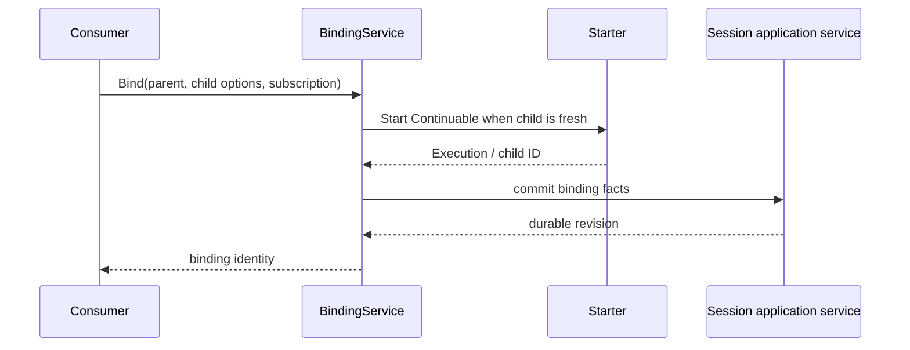
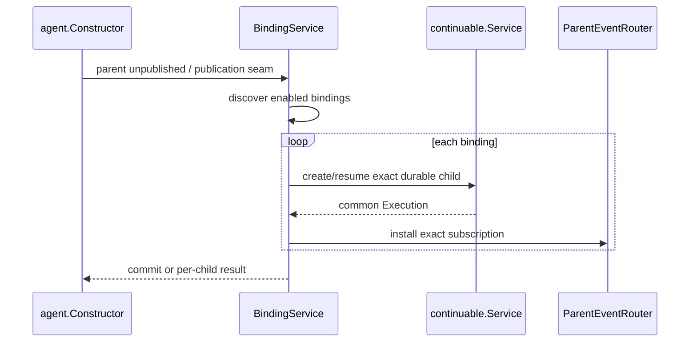
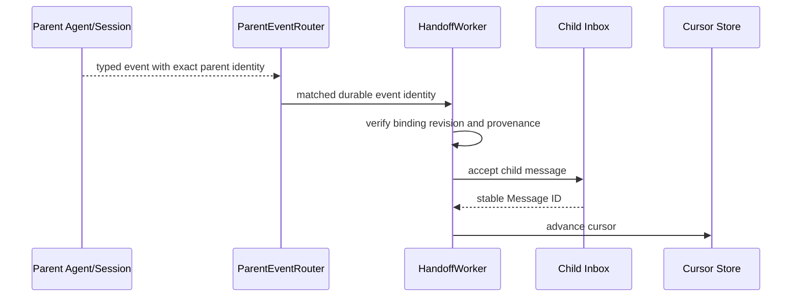

# Parent-bound Subagent 技术设计

状态：Proposed，等待需求 Open Items 确认后重审

## 1. 文档边界

本文给出 Parent-bound Subagent 基于当前架构的候选技术分层，不属于当前重构目标，也不代表已经实现。

- 需求和未决项见[Parent-bound Subagent 需求](./parent-bound-requirements.zh-CN.md)。
- 当前 OneShot/Continuable、common Execution 和 Agent/Session 边界见[Subagent 技术方案](../../zh-CN/Subagent架构与生命周期重构技术方案.md)。
- 当前实现状态见[进度矩阵](../../zh-CN/Subagent重构进度矩阵.md)。

旧版本建立在 Activation、Continuation Manager、Provider execution 和 Catalog 上。这些对象已经从当前设计删除，因此旧调用链、路径和状态模型全部失效。本设计只保留仍成立的需求推论。

## 2. 设计结论

1. Parent-bound 不是第三个 `Mode`；它扩展 Continuable 的 durable binding 和 settlement policy。
2. bound child 仍使用 common `Execution`，并与 exact Agent epoch 一一对应；不新增 residency object。
3. Agent lifecycle owner 继续唯一拥有 runtime parent、descendant admission 和 child-first close。
4. `SeedBuilder` 只参与 fresh create；resume 不重新运行创建策略。
5. binding、subscription definition 和 cursor 是 durable facts，不能只保存在 process-local registry。
6. parent event observation 需要位于能观察 exact parent 的共同 Runtime Scope；不能假设 child Scope listener 可以向上接收 parent event。
7. 每个 exact child Execution Scope 拥有自己的 subscription installation 和 worker disposer。
8. handoff 使用 child 的既有 Agent Inbox/Session path，不建立第二条 durable queue。
9. Parent-bound 实施前必须先决定 publication 原子性、delivery guarantee 和多 parent policy。

## 3. 当前基线

当前 Continuable 流程：

```text
Starter.Start / ChildControl.Send
  -> subagents.Service
  -> continuable.Service
  -> per-child slot
  -> agent.Constructor.Create/Resume
  -> common Execution
  -> idle settlement
```

已具备的可复用能力：

- durable Session Header、descriptor、Inbox 和 Persistence；
- exact RuntimeParent 与 Agent child-first close；
- common Execution terminal transaction；
- Continuable cold resume 和 direct-parent authority；
- `Extension` 在 unpublished child Scope 安装 exact effects；
- `ChildDirectory` 的 live/cold discovery 和 per-candidate diagnostic；
- report Tool 通过消费端窄 Agent Registry 调用 direct parent Agent 的 delivery。

当前缺少：

- durable binding schema/event/projection；
- parent create/resume 时的 binding discovery；
- root-visible parent event router；
- per-binding ordered handoff worker、provenance/dedupe 和 cursor；
- business handoff/report admission 与 parent closing 的 join seam；
- policy-controlled idle residency；
- binding-specific recovery diagnostics。

## 4. 候选模块与 owner

以下名称表示候选职责，不是已接受 API。

### 4.1 Binding

Binding 是 durable parent/child relationship。其 persisted event/record 至少需要：

- binding version/revision；
- parent Session ID；
- child Session ID；
- enabled state；
- residency policy；
- subscription definition identity/version；
- required/optional publication policy（若 O2 选择该模型）。

Binding facts 应由拥有该用例的 Session/application service 写入；storage adapter 只执行事务和编码。

### 4.2 BindingDirectory

候选 `BindingDirectory` 从 durable binding facts 构造 parent -> children read view，为 parent create/resume 和 diagnostics 提供 discovery。

它可以复用 Session Projection Registry，但不能从 ChildDirectory label、Activity 或 live Agent 反推 binding truth。ChildDirectory 可以组合其 read view做展示，但不成为 binding owner。

### 4.3 BindingService

候选 `BindingService` 负责：

- 建立、启用、禁用和删除 binding 的 application transaction；
- parent create/resume 时解析 enabled bindings；
- 请求 Continuable create/resume 原 child；
- 应用 residency policy；
- 创建每个 exact Execution 的 subscription installation；
- 把 child-specific failure 收敛为 diagnostic；
- 向 Agent lifecycle 注册 handoff/report admission participant（若最终需要新 seam）。

它不持有 Agent 运行时父子关系、不递归 close descendants、不执行 Session I/O adapter。

### 4.4 ParentEventRouter

候选 `ParentEventRouter` 位于能观察 parent Agent runtime events 的共同 Scope。它按 exact parent identity 和静态 subscription definition 把事件路由到相应 binding worker。

Router 只做 typed observation、matching 和定位；它不直接写 child Session、不调用模型、不保存 cursor。

### 4.5 HandoffWorker

每个 binding/installation 的 `HandoffWorker` 串行处理：

1. 接受 Router 交付的 exact parent event；
2. 检查 binding revision、enabled state 和 execution identity；
3. 确认 parent durable fact 已到 persistence boundary；
4. 构造带 parent event provenance 的 child message；
5. 通过 child Inbox 接受路径提交；
6. 成功后推进 durable cursor；
7. 对 retry/dedupe 按 O5 的最终 contract 处理。

Worker installation 属于 exact child Execution Scope。Scope release 或 binding removal 必须停止新 admission、join 已接受工作，再释放 listener/worker。

## 5. 与现有模块的关系

### 5.1 Continuable

Continuable 继续拥有 create/resume、Send、Report 和 Execution settlement。Parent-bound policy 只能改变 settlement trigger：

- ordinary：idle + empty Inbox + no descendants 时 `StopIdle`；
- bound resident：同一条件下保持 current Execution active/idle；
- binding disabled 或 parent closing：请求 common Execution stop。

policy 必须来自 durable binding，不得只缓存于 process-local slot。

### 5.2 Agent

Agent 不解释 binding 或 subscription。需要的通用 seam 只能表达“在 parent structural close cutoff 后，停止相关业务 admission 并 join 已接纳工作”。

若现有 Agent lifecycle 已能通过通用 Provisioning/ScopeResource 顺序满足该要求，则不新增接口。只有证明存在无法线性化的缺口后，才设计 consumer-neutral lifecycle participant；不能为 Parent-bound 添加专用 Quiesce。

### 5.3 Session

Session 继续保存 durable facts。建议顺序是：

```text
parent event committed
  -> parent persistence boundary confirmed
  -> child Inbox message accepted/committed
  -> cursor advanced
```

是否需要跨 parent/child Session 的原子事务取决于 O5。未确认前不能声称 exactly-once。

### 5.4 Extension

subscription installation 可通过一个 `Extension` 参与 child Agent publication，但 Extension 只负责安装 exact Scope effects；binding discovery、policy 和 worker durability 不能塞进 report Extension 或通用 extension Registry。

### 5.5 ChildDirectory

ChildDirectory 可展示 bound/enabled/corrupt 等 projection，但仍是只读。控制和 resume 必须重新读取 authority 与 binding truth。

## 6. 候选调用流程

### 6.1 建立 fresh binding



这只是候选顺序。若 O1 要求 binding 与 child create 原子化，需要明确 compensation 或同一 application transaction，不能把图示当作已决定行为。

### 6.2 Parent create/resume



是否全部 children 都是 parent publication required dependency 由 O2 决定。

### 6.3 Parent event handoff



### 6.4 Parent close

```text
Agent lifecycle installs descendant admission cutoff
  -> BindingService/installation stops handoff and report admission
  -> join accepted handoff/report
  -> Agent closes runtime descendants child-first
  -> each child common Execution completes terminal transaction
  -> child Scope releases installation/worker
  -> parent release completes
```

Subagent 和 BindingService 不自行遍历 Agent descendants。

## 7. 状态模型

Parent-bound 不能用一个枚举混合四类状态：

| State | Owner | 示例 |
| --- | --- | --- |
| binding lifecycle | Binding domain | enabled / disabled / removed / corrupt |
| child Execution | Subagent | starting / active / stopping / stopped |
| Agent lifecycle | Agent | publishing / published / closing / closed |
| handoff progress | binding installation | idle / processing / retrying / closing |

同一个 child idle 时可以同时是：binding enabled、Execution active、Agent idle、handoff worker idle。状态名字不能互相代替。

## 8. Failure 与恢复

- binding codec/version error：ChildDirectory/BindingDirectory 返回 diagnostic，禁止 silent downgrade；
- child resume failure：保留 identity 和 binding，按 O2 决定 parent publication；
- installation failure：该 child 不得以“已订阅”状态发布；已经取得的 effects 逆序回滚；
- parent event persistence failure：不执行依赖该 fact 的 handoff；
- child Inbox rejection：不推进 cursor；
- cursor write failure：按 O5 决定 replay/dedupe，必须带 provenance；
- process crash：由 binding、Session、Inbox 和 cursor 重建，不依赖旧 Execution/worker；
- Plugin removal：注销新的 binding work admission，并通过 exact disposers 收敛 installations。

## 9. 实施前置决策

必须先关闭需求 O1-O8 中至少以下核心项：

1. binding/fresh child create 的事务边界；
2. child failure 对 parent publication 的影响；
3. 单 parent 还是多 parent；
4. subscription filter 静态 schema；
5. handoff observable delivery guarantee；
6. config update 和 resident installation replacement 语义。

在这些决策完成前，不创建 production package、placeholder interface、persisted event 或 migration。

## 10. 候选实施切片

1. 锁定 binding vocabulary、wire/persistence schema 和 transaction owner。
2. 实现 binding application service、codec、storage port 和 projection。
3. 实现 parent create/resume discovery，先选择 required/optional publication semantics。
4. 实现 root-visible typed router 和 per-binding installation。
5. 实现 ordered handoff、provenance、dedupe 和 cursor。
6. 实现 policy-controlled Continuable residency。
7. 核对 Agent lifecycle admission/join；只有通用缺口确凿时扩展 Agent seam。
8. 完成 restart、failure、security、race 和 real workflow acceptance。

每个切片必须独立更新需求证据、设计、实现、测试和进度；不能从本 Proposed 文档直接推断“已实现”。
