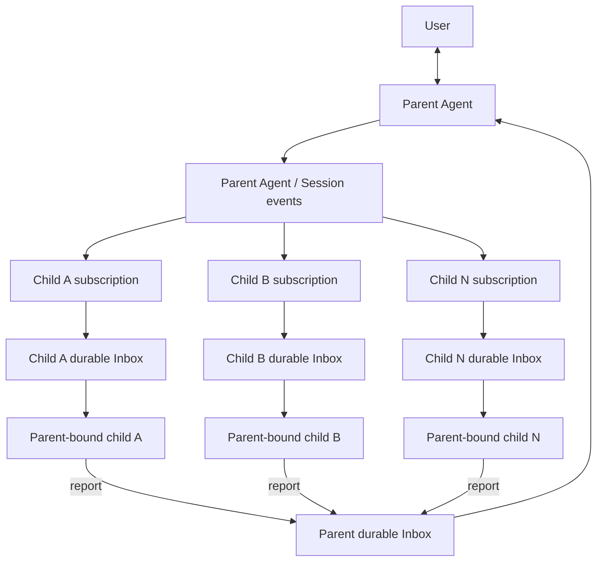
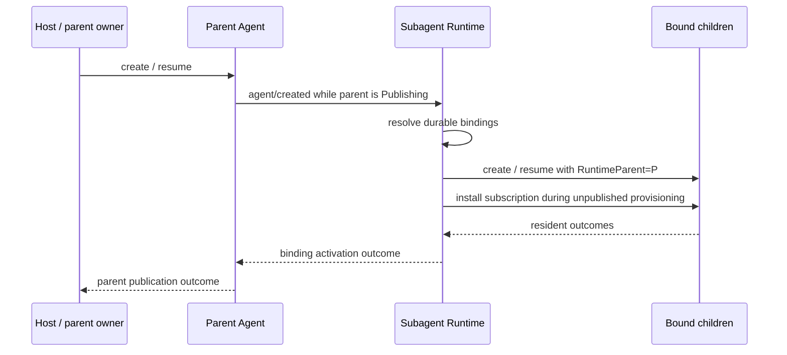

# Parent-bound Subagent 需求

状态：Draft Requirements

最后讨论：2026-08-25

## 0. 文档边界

本文收敛 parent-bound Subagent 的产品与领域需求，不声明已经实现，也不提前固定 Go 类型、接口签名、持久化字段或目录结构。现有 one-shot、continuable、Provider、Activation 与 Inbox 语义见[领域设计](./design.zh-CN.md)，兼容词汇约束见[术语规范](./terminology.zh-CN.md)。

配套的[技术设计](./parent-bound-design.zh-CN.md)分析当前调用链、架构缺口与推荐实现切片。本文继续拥有“系统必须表现成什么”；技术设计只解释“建议怎样实现”，两者存在冲突时以本文及其 Open Items 为准。

所有 Agent epoch、运行期父子关系、descendant admission、in-flight materialization join 和 child-first close 的 owner，以[Agent 生命周期与运行期父子所有权设计](../../zh-CN/Agent生命周期与运行期父子所有权设计.md)为准。Subagent 只拥有 durable binding、subscription、residency policy、授权与恢复语义，并通过 Agent 的 managed lifecycle 请求关闭；本文不再定义第二套 Subagent lifecycle graph。

已经确认：

- 正式概念名为 `parent-bound subagent`；
- 一个 parent 可以绑定多个 parent-bound children；
- 每个 child 只属于一个 exact direct parent；
- child 拥有独立状态和提示词；
- parent 不寻址或主动投递指定 child；每个 child 通过自己的订阅监听 exact direct parent 的事件；
- child 的上行模型可见内容只能到 exact direct parent，不能越过 parent 直接与用户交互；
- parent event 是下行触发源，不是 durable 业务消息队列；需要驱动 child 模型 turn 的事件必须先进入该 child 的 durable Inbox；
- 所有模型可见内容通过目标 Agent 的 durable Inbox 传递；进程内 channel 只协调生命周期和实时事件通知。

尚未确认的失败策略、删除语义、自主任务和热更新要求集中列在“Open Items”，不得从本文其他章节推断为已决定。

## 1. 系统定位

parent-bound Subagent 是严格受某个 parent Agent 所有、但脱离 parent 当前 turn 独立工作的长期协作 Agent。它不是独立用户入口，也不是脱离 owner 的后台进程。

它与 parent 共享 live lifecycle 上界：parent resident 时，其已绑定且启用的 children 应保持 resident；parent 开始关闭后，所有 children 停止接收新工作并先于 parent 完成释放。进程退出后双方都可以 non-resident，但各自的 Session 和 durable binding 继续存在，供下一次 parent 恢复时重建。

parent-bound 描述 ownership 与 residency policy，不改变 continuable 的 durable Session、Inbox 和多 turn 语义。需求不引入第三种 Subagent execution mode。

### 1.1 核心语义判断

parent-bound child **具备 continuable 的核心语义**：它有独立 durable Session、durable Inbox、可跨进程恢复的 child identity、多个独立 turn、direct-parent authority，以及 child-to-parent report。它不是 one-shot，也不需要新增第三个 `Mode`。

可以在 continuable 上增加“与 parent 绑定的 residency policy”，但该结论不等于只修改 idle watcher：

- residency policy 必须成为可恢复的 durable binding 事实；只有 `ParentSession` 不能区分普通 continuable 与 parent-bound child；
- 普通 continuable 缺省仍在 quiescent 后 settlement，历史 descriptor 缺少新 policy 时也必须按普通 continuable 解释；
- parent-bound policy 还要求共同 materialization、parent event subscription、parent closing admission cutoff、用户隔离和恢复对账；
- Provider 仍只贡献首次 creation data，不能因新增 policy 取得 binding 或 lifecycle ownership。

因此推荐的领域表达是：

```text
execution mode = continuable
residency policy = parent-bound
```

而不是：

```text
execution mode = parent-bound
```



图中 parent 不知道哪些 children 会响应某个事件，也不向 child 发送命令。每个 child 的 subscription 独立判断是否接受事件；同一事件可以匹配零个、一个或多个 children。图中没有 child 与 User 的直接边；所有上行用户交互都必须经过 Parent。

## 2. 统一语言

| 术语 | 定义 | 不表示 |
| --- | --- | --- |
| parent | durable binding 指向且当前授权操作使用的 exact live Agent | 只有相同 Session ID 的陈旧 Agent instance |
| parent-bound child | 受一个 direct parent 所有的长期 continuable child | root Agent、one-shot Run 或独立用户会话 |
| binding | parent Session 与一个 child Session 之间的 durable ownership 关系 | process-local Activation map entry |
| resident | 当前进程中存在 exact Agent instance、Activation 和 Handle | 模型正在执行 turn |
| Activation | child 的一次进程内 residency epoch | child 的 durable identity |
| parent event | exact direct parent 在正常运行中发布的 Agent 或 Session 事实 | 指向某个 child 的命令或消息 |
| subscription | 一个 child 对其 exact direct parent 事件的选择、过滤和映射规则 | parent 持有的 recipient list 或 broadcast target |
| business message | subscription 接受后写给 child，或 child 报告给 parent 的模型可见内容 | 原始实时事件、`wake`、closing、done 等控制信号 |
| lifecycle signal | 协调 admission、关闭和等待的进程内信号 | 第二条业务消息队列或事件历史 |
| report | child 投递给 exact direct parent 的模型可见消息 | 面向用户的回答或向 ancestor 广播 |
| role/binding key | 可选的 parent-local 稳定业务位置 | child Session ID、显示 label 或 authority credential |

## 3. Actors 与权限

| Actor | 目标与职责 | 可达边界 | 禁止行为 |
| --- | --- | --- | --- |
| 用户 | 与系统主 Agent 协作 | parent 的 Host/UI/API | 直接采用、恢复、投递或回答 child |
| parent Agent | 拥有并协调多个 children；其正常 Agent/Session 行为产生可观察事实 | 自己的 Session/Inbox、Catalog 与 interrupt；关闭由 Agent lifecycle 传播 | 枚举订阅者、寻址 child 或为某个 child 定制事件发布 |
| parent-bound child | 监听 exact parent 事件、独立处理任务、维护状态并向 parent 报告 | 自己的 subscription、Session/Inbox；exact parent 的 Inbox；作为 parent 时自己的 direct children | 向上越过 direct parent 联系用户或 ancestor；直接联系 sibling 或任意 recipient |
| Subagent Runtime | binding、subscription installation、residency policy、授权、恢复与 managed close 请求 | Agent、Session、Catalog、Provider 与 event seam | 持有 runtime parent graph、自行递归 teardown、实现 Agent Loop、让 parent 主动路由指定 child、建立第二条 durable queue 或执行 Session 持久化决策 |
| Agent Runtime | 所有 exact Agent epoch、runtime parent-child ownership、descendant admission、child-first close、Inbox、turn、cancel 与 managed Handle | Agent Registry、Agent Loop 与 lifecycle ports | 决定 parent-bound binding、subscription 或 residency policy |
| Session owner | append-only log、Header、LiveStore 与持久化 | owner-defined Session contract | 混合 parent 与 child 的可变状态 |
| Provider | 首次创建时贡献 spawn/fork creation data | Subagent Provider seam | 持有 binding、恢复、投递或 resident Handle |
| Host/Interaction Gateway | 用户交互与 carrier correlation | root Agent | 将 child 暴露成普通用户会话 |

## 4. Use Cases

### UC1：建立多个 durable bindings

一个 parent 可以拥有零个、一个或多个 parent-bound children。每个 child 有独立 Session ID，且只指向一个 direct parent。

建立 binding 必须满足：

- child identity 与 direct-parent relation 可跨重启重建；
- 同一 child 不得同时属于两个 parents；
- 并发创建不能重复发布同一个 child identity；
- 一个 child 的失败、释放或配置不得隐式修改 sibling；
- label 只用于显示，不能作为 identity 或 authority；
- 若使用稳定 role/binding key，其 parent-local 唯一性与重建语义必须在实现前明确。

### UC2：共同激活

parent create/resume 时，系统发现其已绑定且启用的 children，并为每个 child create 或 resume 一个 resident Activation。



恢复已有 child 时必须复用其 Session、Inbox 和 durable identity；不能重新调用首次 creation Provider 来替代恢复，也不能在原 child 损坏时静默创建新 child。

每个 child Activation 必须拥有自己的 subscription installation：它必须作为 child construction `Provisioner` 的 effect，在 child `AgentEpoch.Attach` 和 `agent.Created` publication 前完成安装，只接受 exact direct parent 的事件，并在 child release 前由 child Scope resource/disposer 撤销。installation 可以向位于 parent 与 child 实际共同祖先 Scope 的 Runtime router 注册，不能假定 child Scope 内的普通 Plugin listener 能向上观察 parent。安装失败属于该 child 的 activation failure，已经获得的 effects 必须逆序回滚，未发布 child 不得短暂漏收事件。

共同激活发生时 parent 处于 Agent lifecycle 的 `Publishing` epoch，而不是已经对原调用方可见的 `Live` epoch。同步、有序且可 veto 的 `agent.Created` listener 可以在该 parent 下 materialize children；若 required child 失败并 veto parent publication，Agent Lifecycle Coordinator 必须自动关闭本次 publication 中已经接纳的 descendants。Subagent 不自行保存或递归清理这棵运行期树。

全部 children 是否都是 parent Activation publication 的 required dependency，见 Open Item O1。

### UC3：child 监听 parent events

parent 的正常 Agent 与 Session 行为产生事件，由既有 event owner 发布；事件不含 child recipient，parent 也不等待任何 child 响应。每个 resident parent-bound child 安装自己的 subscription，只监听其 exact direct parent，并独立判断哪些事件需要成为 child 工作：

```text
exact parent performs normal work
  -> publishes Agent / Session event
  -> each bound child subscription independently filters
  -> replayable event waits for parent persistence barrier
  -> accepted event uses Agent-owned NextTurn admission
  -> child persistence barrier + Message ID
  -> child Agent Loop later claims one turn
```

监听语义：

- subscription 必须绑定 exact direct parent 与当前 lifecycle epoch；不能接受 sibling、ancestor、陌生 Agent 或陈旧 parent instance 的实时事件；
- parent 不维护本次事件的 child recipient set，也不调用 child Inbox；
- 同一 parent event 可被零个、一个或多个 children 的 subscription 独立接受，这属于多订阅者观察，不是 parent 发起 broadcast；
- subscription 接受且需要模型观察的事件，必须通过 Agent-owned message admission 映射成该 child 自己的 `NextTurn` Inbox message 并唤醒 Agent；原始实时 event、Router 或 Subagent worker 不得直接修改 Inbox 或成为第二条模型输入路径；
- child 正忙时，已接受消息按 child Inbox FIFO 等待，不 steer 当前 child turn；
- parent 的事件发布不得同步等待 child 模型 answer；`session.EventAppended` 的 best-effort listener 只能作为 catch-up wake，不能证明 handoff 完成。事件发布是否等待各 listener 完成 Inbox durable acceptance，见 Open Item O6；
- 对选择 durable replay 的 Session event，parent 事件必须先跨过自己的 persistence barrier，child message 才能被声明为 durable；随后 child message 必须跨过 child persistence barrier，才可推进 subscription checkpoint；
- 一个 child 的过滤、接受、积压或失败不代表其他 children 的结果，也不得阻塞 sibling 的独立处理；
- event filter、事件到 Inbox message 的映射、去重和重放边界必须由 child-owned subscription 明确定义，不能由 parent 临时指定。

### UC4：child 向 parent 报告

child-to-parent 内容必须进入 exact direct parent 的 `NextStep` Inbox：

```text
exact child
  -> resolve durable direct parent
  -> Agent-owned parent NextStep admission
  -> quiet Inject or next-step Steer
  -> persistence barrier when durable acceptance is promised
  -> Message ID
```

报告语义：

- child 不能提供 recipient；Runtime 从 binding 推导唯一 direct parent；
- MessageSource 记录 child identity，但不授予 authority；
- parent 用 sender identity 区分多个 children 的报告；
- report 不结束 child turn，不释放 child，也不表示 parent 已读；
- report 必须经过 exact live parent 的 Agent-owned admission；Subagent 不直接修改 parent Inbox；若 API 承诺 crash-durable acceptance，返回前还必须完成 parent Session flush；
- sibling children 不能直接互发内容；需要协作时由 parent 中转；
- report delivery 默认选择仍见 Open Item O5。

### UC5：idle 时保持 resident

parent-bound child 在 Agent idle、Inbox 暂无待处理消息且没有 resident descendants 时，仍保持 resident。它不走普通 continuable 的 quiescent settlement。

idle resident：

- 不发起 LLM 请求；
- 保留 exact Agent、Activation、Scope、提示词和 Tool policy；
- 后续匹配的 parent event 由现有 subscription 接受并进入现有 Inbox，不需要 cold resume；
- 仍受 parent closing、显式 interrupt 和 Runtime shutdown 控制。

### UC6：维护独立状态与提示词

每个 child 独立拥有：

- append-only Session history；
- durable Inbox；
- persona/system prompt；
- 模型与 token 等 Agent 配置；
- Tool visibility 与 delegation policy；
- 如业务需要，由 child owner 定义并投影的结构化状态事件。

parent 不直接修改 child 内部状态，也不通过 child-specific command 触发其业务工作。parent 只继续自己的正常行为并产生事件；child subscription 决定是否将事件转为模型可见消息。parent 仍可调用明确的 subtree 生命周期命令。Activation state 是 process-local 协调状态，不能代替 durable child state。

### UC7：共同关闭

Parent closing 是所有当前 resident Agent descendants 共用的 lifecycle hard boundary，不是 parent-bound residency policy 发明的第二种关闭算法：普通 continuable 如果此时仍 resident，也由 Agent Lifecycle Coordinator 按 child-first 顺序关闭；如果已因 quiescent settlement 而 non-resident，则没有当前 epoch 参与本次关闭。Parent-bound child 因 enabled binding 而预期保持 resident，并比普通 continuable 多出 subscription handoff、report 和 worker 的 quiesce 要求。

parent closing 时必须处理全部绑定的 resident children。结构性关闭由 Agent Lifecycle Coordinator 统一执行：

1. parent exact epoch 进入 `Closing`，原子关闭 descendant admission 并固定唯一 close transaction；
2. Agent-owned quiesce participation 关闭该 parent 的 event handoff、report 和 message admission，并等待已接纳的 in-flight 操作收敛；
3. Coordinator 等待已接纳的 child materialization，并按 runtime ownership 对全部 descendants 执行 child-first close；
4. 每个 child teardown 撤销 subscription、停止并 join handoff worker、flush，并释放单体 Agent effects；
5. 所有 descendant teardown 都已尝试并聚合结果后，才执行 parent 单体 teardown。

sibling children 可以独立收敛；一个 sibling 不能释放另一个 sibling 的 Handle。是否并行 teardown 是实现期选择，但不能破坏每棵树的 child-first 顺序和错误归属。Subagent 的 lifecycle participant 只负责关闭本领域 admission、join worker 和提交 managed close 请求；`agent.Disposed` 只做幂等残余清理，不能作为关闭事务起点。

无论 ordinary 还是 parent-bound，关闭当前 Agent epoch 都不自动删除 durable child Session。parent-bound durable binding 是否删除或禁用只由明确的 binding/delete 用例决定，不能从 parent close 推导。

### UC8：进程重启后恢复

进程退出后 parent 和 children 都可变为 non-resident。durable binding、parent Session 和各 child Session 保留。

下一次 parent resume：

- 发现全部启用的 bindings；
- 使用原 child ID 和 Session 恢复；
- 为每个 child 建立新的 exact Agent instance 与 Activation；
- 不因 Provider 已卸载而改变 child identity；
- 不重放已被 Inbox claim/discard 的工作。

### UC9：禁止直接用户交互

parent-bound child 需要用户输入、确认或授权时，只能向 parent 报告未决事项，由 parent 决定是否以及如何与用户交互。

禁止必须由多层运行时边界共同保证：

- child Session 不能被普通 Host Session API adopt/resume；
- human-question 服务只接受 root Agent，delegated child 得到稳定拒绝；
- child Scope 强制隐藏直接面向用户的 Tool，配置不能解除 mandatory fence；
- child 不能建立 Host correlation、WebSocket interaction 或用户问题；
- approval 必须服从 parent 授予的 delegation policy，不能绕过 parent 打开用户审批；
- 提示词说明只帮助模型理解职责，不能作为安全边界。

## 5. Invariants

### 5.1 Identity 与 ownership

- I1：一个 parent 可以绑定多个 parent-bound children。
- I2：每个 child 在任一 durable lifecycle 中只能有一个 direct parent。
- I3：每个 binding 由 durable child identity 精确区分；label 不是 identity。
- I4：旧 Agent instance、Activation 或 disposer 不能操作后来复用同一 Session ID 的新 instance。
- I5：一个 child 的失败、释放和配置不得隐式改变 sibling。

### 5.2 Lifecycle

- I6：child resident 时，其 exact direct parent 必须 resident。
- I7：parent-bound child idle 不触发普通 continuable settlement。
- I8：parent 进入 `Closing` 时，Agent lifecycle 必须原子关闭 descendant admission；同一 cutoff 之后不得再提交新的 report 或 parent-event handoff。
- I9：parent release 完成时，不得残留任何 bound child resident Activation。
- I10：每棵 child tree 必须在 parent 之前完成结构释放，且该顺序只由 Agent Lifecycle Coordinator 的 runtime ownership graph 决定。
- I11：冷恢复复用 durable identity；不得用新 child 静默替换损坏或不可恢复的 child。

### 5.3 State 与消息

- I12：parent 与每个 child 使用不同 Session、Inbox 和 mutable state。
- I13：所有模型可见内容必须经发送目标 Agent 的 durable Inbox。
- I14：进程内 event/channel 只能通知实时事实或协调生命周期，不能承载最终模型输入、提供 durability 或成为第二条消息队列。
- I15：parent 不寻址 child；每个 child subscription 只能监听其 exact direct parent，并独立过滤事件。
- I16：child-to-parent 内容只能到 exact direct parent；不能直接到 sibling、ancestor 或用户。
- I17：MessageSource 只做 attribution，不能替代 exact Agent authority。
- I18：一条 parent event 可以独立匹配零个、一个或多个 child subscriptions；不存在跨 children 的原子接受结果。
- I19：需要驱动 child 模型 turn 的已接受事件，必须在 child Inbox durable acceptance 后才算形成 child 工作。
- I20：parent event publication 不得同步等待 child 模型执行或回答。

### 5.4 用户隔离

- I21：parent-bound child 不是用户交互 root。
- I22：用户隔离必须由 Host、human interaction、Tool policy 与 Subagent authority 共同强制。
- I23：提示词不得成为用户隔离的唯一机制。
- I24：任何需要用户参与的事项必须先进入 parent Inbox，由 parent 作出交互决定。
- I25：`ParentSession` 只证明 durable direct-parent lineage，不能单独证明 parent-bound policy；policy 缺失时必须解释为普通 continuable。
- I26：subscription installation 由 exact child Activation 拥有，但其事件观察位置必须能够看到 exact parent 的发布 Scope；不得用 child Scope 无法接收的向上监听假装实现。
- I27：subscription installation 必须在 unpublished child 的 Provisioner 阶段完成，并先于 child `AgentEpoch.Attach` 与 `agent.Created` publication；失败时 child publication 必须整体回滚。
- I28：对声明 crash-durable 的 replayable handoff，parent event 的 persistence barrier 必须先于 child message 的 persistence barrier，后者又必须先于 checkpoint 推进。

## 6. Exceptions

| 编号 | 场景 | 当前需求处理 |
| --- | --- | --- |
| E1 | child 首次创建失败 | 不得返回成功 binding 或泄漏 Handle；是否阻止 parent Activation publication 见 O1 |
| E2 | 已绑定 child 恢复失败或 descriptor 损坏 | 不静默替换；报告精确 child diagnostic；parent Activation publication 语义见 O1 |
| E3 | child 单次模型/Tool turn 失败 | 保留 binding；是否保持 resident 并允许 parent 重试，暂列建议而非已确认决定 |
| E4 | parent closing 后 subscription 收到新 event，或收到新 child report | event 不形成新的 child 工作，report admission 拒绝；不得转发给用户、ancestor 或离线 mailbox |
| E5 | subscription 收到陈旧 parent epoch、错误 parent 或伪造来源的 event | 稳定丢弃或拒绝并记录 diagnostic，不进入 child Inbox |
| E6 | 同一 child identity 并发 create/resume | 串行化 admission；至多发布一个 resident Activation |
| E7 | 多个 siblings 中一个失败 | 失败归属于该 child；是否影响 parent Activation publication 由 required/optional policy 决定 |
| E8 | 进程异常退出 | 不承诺进程内清理完成；下次从 durable Session、Inbox 和 bindings 恢复 |
| E9 | child 尝试直接用户交互 | 稳定 delegated-caller/ownership rejection，并要求向 parent report |
| E10 | parent event、child message 或 final teardown flush 失败 | 不推进相应 durable checkpoint；独立报告 durability failure；关闭仍尝试其余 descendants 和 parent，具体 parent close outcome 待定 |
| E11 | lifecycle signal 迟到或重复 | 只影响 exact epoch；不得伪造、丢弃或代替 Inbox business message |
| E12 | child report 引发 parent event，而该 child 又订阅此类 event | 必须由 origin、filter 或去重规则阻断非预期反馈环；精确策略见 O9 |
| E13 | parent event 在 child non-resident、best-effort wake 丢失或进程中断期间发生 | live Agent event 可以按声明丢失；replayable Session event 必须由独立 cursor/catch-up 恢复，不能把进程内 event bus 当作持久化证据；最终范围见 O7 |
| E14 | 旧 continuable descriptor 不含 parent-bound policy | 继续按普通 continuable 恢复并允许 quiescent settlement；不得因升级自动变成 resident child |

## 7. Non-functional Requirements

| 项目 | 需求 |
| --- | --- |
| Deployment | 初期以单进程 exact ownership 为基线；多进程同时恢复同一 child 需要共享 lease，未提供 lease 时不得声称安全 |
| Startup latency | parent create/resume 成本包含 bound children 的发现和恢复；是否并发以及失败门槛由 O1/O2 决定 |
| Idle cost | idle resident child 不产生 LLM token 成本，但占用 Agent Scope、Prompt、Tool 和内存资源 |
| Capacity | children 数量不预设为 1；部署必须能观察数量与资源占用，是否设置上限见 O11 |
| Durability | binding、Session 与 Inbox 接受必须可跨进程重建；process-local Activation 不属于 durability 证明。对 replayable handoff，parent 事件先持久化、child message 后持久化、checkpoint 最后推进 |
| Ordering | 单个 Inbox 内保持 canonical FIFO；同一 parent event 对多个 subscriptions 的观察、接受和执行不提供跨 child 全局顺序或原子结果 |
| Isolation | sibling 状态、取消、失败和 teardown 相互隔离；共享 workspace 副作用仍需独立协调策略 |
| Observability | 能按 parent、child、binding、subscription、parent event identity、Activation epoch 和 Message ID 观察 create/resume、匹配、过滤、Inbox 接受、拒绝、失败与 close |
| Retention | parent clear/delete/archive 与 child history 的关系必须在实现前决定，见 O3 |
| Configuration | 每个 child 可有独立提示词、模型和 Tool policy；热更新边界见 O4 |

## 8. 对现有 Subagent 语义的修订要求

parent-bound 是尚未实现的需求，不得把现有 continuable 行为描述成已经满足：

- 保留 `one-shot` 与 `continuable` 两种 canonical execution mode；
- parent-bound 作为 continuable 上的 ownership/residency policy；
- 普通 continuable 继续在 quiescent 后 settlement；
- 缺少新 policy 的历史 continuable descriptor 按普通 continuable 解释，不改变既有恢复行为；
- parent-bound child 在 parent resident 时保持 resident；
- 复用 Agent Inbox 作为唯一模型消息路径；
- 复用 Agent/Session events 作为 parent 事实来源，但不把现有进程内 event dispatch 描述为 durable history；
- 不复用显式 `Followup` 作为 parent-bound 下行入口，因为 parent-bound 下行由 child subscription 发起观察，而不是 parent 寻址 child；
- 复用 direct-parent authority、Catalog、MessageSource，以及 Agent Lifecycle Coordinator 的 runtime parent ownership 和 child-first close；
- 扩展 binding discovery、construction-time subscription installation、共同 activation、handoff/report quiesce participation 与 mandatory user-interaction fence；
- Provider 仍只参与首次 creation，不升级为 lifecycle owner。

## 9. Open Items

| 编号 | 主题 | 未决风险 | 待确认方向 |
| --- | --- | --- | --- |
| O1 | parent Activation publication 原子性 | 一个 child 恢复失败时 parent 是否可用不明确 | 全部 required 并整体失败，或 binding 具有 required/optional policy |
| O2 | 多 child 激活并发 | 串行会放大启动延迟，并发会增加回滚复杂度 | 先决定 Activation publication 原子性，再决定并发与回滚 |
| O3 | clear/delete/archive | child history 可能孤立、误删或与 parent 状态漂移 | 分别定义 parent clear、durable delete、archive 的 binding 行为 |
| O4 | prompt/config 更新 | resident child 可能继续使用陈旧职责或能力 | 下一 Activation 生效，或支持 exact installation 热更新 |
| O5 | report scheduling | `Steer` 会唤醒/扩展 parent turn，`Inject` 可能延迟观察 | 确认默认 delivery；当前建议 next-step Steer |
| O6 | event listener acknowledgement | parent event 发布若等待 Inbox durable acceptance，慢 child 会反压 parent；若不等待，进程崩溃可能丢失通知 | 明确同步 durable handoff、异步 dispatcher，或结合 O7 的 durable replay |
| O7 | event durability 与重放 | 进程内 Agent event dispatch 不是历史；child non-resident 或重启窗口可能漏事件 | 明确 live-only，或基于 parent Session cursor 重放可恢复事件，并定义水位与去重 |
| O8 | event selection 与映射 | 订阅全部事件会产生噪声、泄漏内部数据或触发过多 turn | 为每个 child 定义 event kinds、predicate、模型可见映射与仅状态投影的边界 |
| O9 | feedback loop | child report 进入 parent 后可能产生又被同一 child 观察的事件，形成递归工作 | 使用 causation/origin、subscription exclusion 与 Message ID 去重定义闭环策略 |
| O10 | backpressure 与合并 | parent event 速率可能超过 child turn 消费速率 | 定义每类事件逐条入队、coalesce、限流、溢出和 diagnostic 语义 |
| O11 | child 数量与资源上限 | 无界 resident children 会扩大内存和恢复延迟 | 配置上限、按 role 配额或仅提供观测告警 |
| O12 | role/binding key | 只有 child ID 时配置与人类角色映射可能不稳定 | 确认是否需要 parent-local stable role key 及唯一性 |
| O13 | sibling 协作 | 全部经 parent 中转可能增加上下文与调用成本 | 初始禁止直接通信；未来若引入需单独 authority 设计 |
| O14 | approval fence | delegated approval 可能成为间接用户通道 | 审计并明确 parent delegation policy 与用户审批的分界 |

## 10. Acceptance Scenarios

在需求锁定并进入实现设计前，至少应能为以下观察行为建立验收证据：

1. 一个 parent 同时绑定并恢复多个独立 children；每个 child 有不同 Session、Inbox、提示词和状态。
2. parent 的正常行为产生一个 Agent/Session event 时，只有 subscription 匹配的 children 各自形成 durable Inbox message；未匹配 children 不改变，event 未携带 recipient。
3. 多个 children 向 parent report 时，parent Inbox 保留各自 sender identity 和接受顺序。
4. child idle 后保持 resident，且 idle 期间不产生模型调用。
5. parent 进入 `Closing` 后，所有当前 resident descendants 无论 ordinary 或 parent-bound 都按同一 Agent lifecycle child-first 关闭；parent-bound 的 subscription handoff 和 report admission 在可线性化 cutoff 后不再提交新工作，已经 non-resident 的普通 continuable durable identity 不受影响。
6. 进程重启后 parent 恢复原 children，而不是创建替代 identities。
7. subscription 只接受 exact direct parent 当前 lifecycle 的事件；陈旧 parent instance、sibling、ancestor 和陌生 Agent 的事件不能形成 child Inbox message。
8. child 无法通过 Session API、question、approval 或 Tool 绕过 parent 触达用户。
9. lifecycle channel 信号不会出现在模型上下文，也不能替代 durable Inbox message。
10. 单个 child create/resume/turn/flush 失败的诊断只归属于该 child，并遵循最终选定的 parent Activation publication policy。
11. 同一 parent event 可被多个匹配 children 独立接受；其中一个 child 的过滤、积压或失败不改变其他 children 的结果。
12. 重启窗口或 best-effort wake 丢失时，parent event 按最终选定的 live-only 或 durable replay 语义得到可验证结果；durable replay 能从 cursor catch up，且 parent event 持久化先于 child message 与 checkpoint。
13. child report 引发的 parent event 不会在未授权情况下形成无限反馈环。
14. 升级前创建的 continuable child 不会被误判成 parent-bound，并继续按既有 quiescent settlement 行为运行。
15. required child 在 parent `agent.Created` publication 中失败并 veto 时，Agent Lifecycle Coordinator 自动关闭已经创建的 sibling/descendant，不残留 Subagent 自建 lifecycle state。
16. child subscription 在其 `agent.Created` 前已经可观察 exact parent，且 disposer 随 exact child Scope 撤销；不存在先发布 child、后安装监听的丢事件窗口。

本文只有在 Open Items 中影响核心行为的决策得到确认后，才可改为 Locked-in Requirements；在此之前，配套技术设计只能保持 Proposed，不得据此声明实现承诺。
