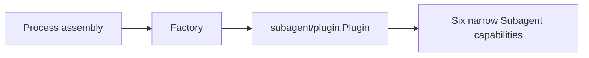

# Subagent Factory

本包是 Subagent Plugin 的静态构造边界。Factory 使用 canonical Plugin name `@deepseek-ai/dsh-subagent`，只接受严格的空 JSON object，然后构造尚未激活的 `plugin.Plugin`。运行期 Service 解析、投影注册和模块启停仍由该 Plugin 拥有。

本包不定义业务配置，不持有 Runtime Service，也不注册具体 spawn/fork SeedBuilder 或 Tool Consumer。

Factory 已进入默认静态 Factory Catalog 与默认 Plugin specs；这只装载 Subagent core，不表示具体 SeedBuilder 或模型可见 Tool 已经挂载。

跨包契约见[领域设计](../docs/design.zh-CN.md)，实现证据见[进度矩阵](../../zh-CN/Subagent重构进度矩阵.md)。
