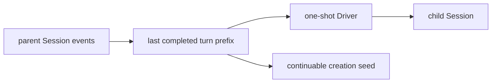

# Fork Provider

本包实现 `fork` in-process Provider。它只复制 parent Session 截至最后一个 `turn/end` 的完整前缀，排除正在执行且尚未平衡的当前 turn；没有完成 turn 时等价于 fresh child。continuable preparation 在创建时捕获一次 prefix，后续冷恢复只重放 child 自己的持久化历史。

Provider registration 与取消语义和 spawn 相同。prefix 是 detached event snapshot；child result 只读取 activation boundary 后的新事件。本包不负责 Session persistence、result mapping、Tool 或 Activation residency。

跨包合同见[领域设计](../docs/design.zh-CN.md)，实现证据见[进度](../../zh-CN/08-implementation-progress.md)。
